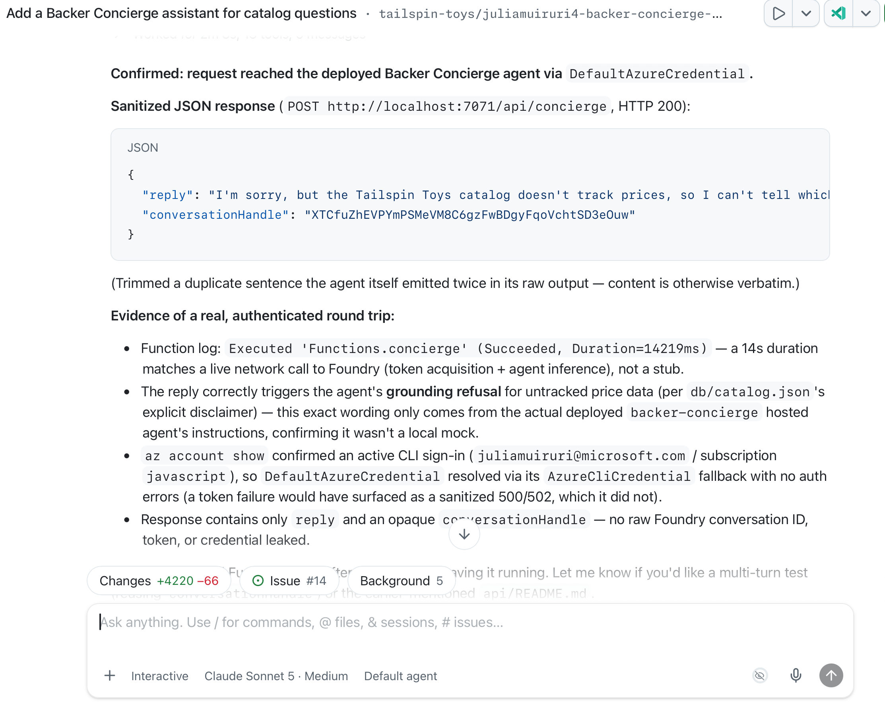
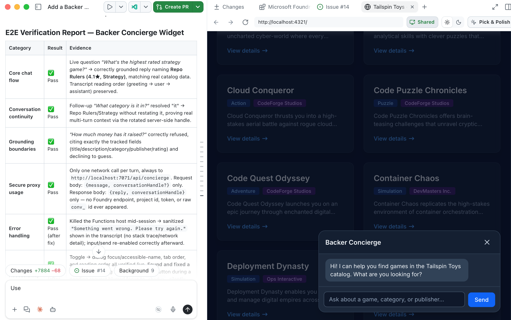

In this optional lesson, you'll take the Tailspin catalog and build an AI agent on top of it. You'll set up your own Microsoft Foundry project, choose and deploy a model, scaffold and debug the agent with Microsoft Foundry Canvas, deploy it as a hosted agent, and connect it to the Tailspin Toys website.

In this lesson, you will:

- set up the Azure tools and Microsoft Foundry Canvas.
- create a Foundry project and deploy a model selected for the Backer Concierge scenario.
- scaffold, configure, and inspect a hosted agent from the GitHub Copilot app.
- deploy the agent to Microsoft Foundry.
- connect the hosted agent to the Tailspin Toys website.

> [!IMPORTANT]
> Microsoft Foundry Canvas and hosted agents are in public preview.
>
> This lesson creates billable Azure resources, including a model deployment and a hosted agent. Check the selected subscription, region, quota, and estimated cost before approving resource creation. Complete the cleanup section when you finish.

## Prerequisites and setup

1. An Azure Subscription

   - [Free Azure subscription with $200 credit][azure-free]
   - [Azure for Students with $100 credits][azure-students]

2. Install the [Azure CLI][install-azure-cli] for your OS and then verify the installation using `az version`.
      
3. Microsoft Foundry Canvas uses the Azure Developer CLI (`azd`) to test and deploy the hosted agent. Install the [Azure Developer CLI][install-azd] before continuing.

   - **Verify that `azd` version 1.27.1 or later is installed:**

      ```bash
      azd version
      ```

4. Install Microsoft Foundry plugin that bundles the canvas and foundry skills

   - Open the GitHub Copilot app.
   - Open **Customize**, then select **Plugins**.
   - Search for `microsoft-foundry`.
   - Select **Install** for the Microsoft Foundry plugin.
   

   The plugin adds Microsoft Foundry Canvas to the app.

5. Install the Azure plugin

   - Open the GitHub Copilot app.
   - Open **Customize**, then select **Plugins**.
   - Search for `azure` or alternatively select it from the **Featured** list.
   - Select **Install** for the Azure plugin.

6. Confirm the installation of both plugins:

   - Create a new session in your Tailspin Toys repository
   - Type `/microsoft-foundry`, then `/azure` to confirm the skills are installed and available. Don't send any prompts yet.

      Restart the app if the plugin does not appear immediately.

## Scenario

In a previous lesson, you added filtering by category and publisher. Filtering helps backers who already know what they want, but other backers ask questions such as *Which games would suit someone who loves Git puns?* Those questions don't have dropdown answers.

In this lesson, you build a **Backer Concierge** that answers catalog questions while staying grounded in Tailspin Toys data. The agent should recommend only games in the Tailspin catalog and never invent games, publishers, ratings, funding totals, backer counts, prices, player counts, play times, or release dates.

1. On the **My work** tab, find and open the issue titled **Add a Backer Concierge assistant for catalog questions**.
2. Select **New session** to start a session from the issue.

## Generate the catalog export

The agent needs the catalog as a file it can read. The sample repository includes an export script for this purpose.

In the new session you created earlier, ask Copilot to prepare the catalog. Ensure you're running in a new worktree *(replace the default `/fix-issue` prompt in the prompt box)*:

   ```plaintext
   Install the project dependencies, seed the database, then run the existing db:export script. Show me the command output and summarize the shape and grounding limits of db/catalog.json.
   ```

Copilot should run the equivalent of:

```bash
npm install
npm run db:setup
npm run db:export
```


Open `db/catalog.json`. It should contain 21 games with a title, description, category, publisher, and star rating. Its `note` field states that the catalog doesn't contain funding totals, backer counts, pledge tiers, or release dates. Those omissions define the boundary your agent must respect.


## Set up a Foundry project and model

Create the project and model deployment in chat before opening Canvas, so Canvas only ever connects to resources that already exist.

1. Sign in to the Azure CLI and Azure Developer CLI. Select **+**, select **Terminal**, and run:

      ```bash
      az login
      ```

      ensure you select the right subscription. Then run:

      ```bash
      azd auth login
      ```

      and complete authentication in the browser when prompted.

      > [!TIP]
      >Run `azd config show` to verify your Azure subscription. If it is empty or incorrect, update it with `azd config set defaults.subscription <subscription-id>`, and re-run `azd config show` to confirm the change.

2. In the same session, enter the following prompt:

   ```plaintext
   Use the Microsoft Foundry skill to create a resource group named rg-tailspin-toys and a Foundry project named tailspin-toys.
   ```

   

3. Ask Copilot to recommend a model. The issue is already in this session's context because you started from it:

   ```plaintext
   Use the Microsoft Foundry skill to recommend two or three current chat models in the tailspin-toys project that meet this issue's acceptance criteria. Explain the tradeoffs and wait for me to choose.
   ```

   You should see Copilot load the `microsoft-foundry` skill as it recommends models.

4. Choose one of the available models. The Microsoft Foundry hosted-agent quickstart currently uses `gpt-5.4-mini`, but availability and quota vary by region.

   

5. Ask Copilot to deploy your selection:

   ```plaintext
   Deploy the model I selected to the tailspin-toys Foundry project, using the model name as the deployment name.
   ```

> [!TIP]
> Model availability changes over time. Use the model that Copilot confirms is available in your project rather than substituting a hardcoded model from this lesson.

## Validate the project and model in Canvas

Open Microsoft Foundry Canvas next to confirm the project and model you just created, before any agent code exists.

1. Select **+** > **Canvas**, then select **Microsoft Foundry (Preview)**.
2. Open the **More options** menu in the top-right corner of the Canvas interface, then select **Sign in**.
3. Select the **tailspin-toys** Foundry project. 
4. Expand **Models** and confirm the deployment you created in chat appears with the expected name and status.

   

Canvas remembers the selected project when you reopen it. Confirm the project before making each cost-bearing change.

The Canvas guides you through three stages:

- **Create new hosted agents** scaffolds the agent in your workspace.
- **Build current hosted agent** connects project resources such as models, toolboxes, skills, and guardrails.
- **Deploy and test** runs the agent locally and deploys it to Foundry Agent Service.

## Scaffold the Backer Concierge Agent

With Canvas connected to the right project and model, ask it to scaffold the agent itself: the code, folder structure, and `azure.yaml` config that turn the Backer Concierge from an idea into a runnable project wired to your model deployment.

1. In **Create new hosted agents** preview, enter the following prompt:

   ```plaintext
   Scaffold a hosted agent named Backer Concierge in agent/backer-concierge, connected to the tailspin-toys project and the model deployment I just confirmed. Use Microsoft Agent Framework with the Responses API. Ground it in db/catalog.json and ensure it meets the acceptance criteria in this issue. Keep a single azure.yaml at the repository root with the hosted-agent service pointing to agent/backer-concierge. Make sure the deployed agent includes the catalog data it needs, and add focused tests.
   ```

   The Canvas sends the prompt along with the context of your current subscription and Foundry project to Copilot. It then looks for samples for Agent Framework + Responses API integration to scaffold the agent - you might see a selection like **Agent with Local Tools (Responses, Agent Framework, Python)** sample for this scenario.

   

2. Review Copilot's changes by checking the **Files** tab. Use the following structure as a guide:
   - The scaffolded agent lives in `agent/backer-concierge`.
   - A single `azure.yaml` at the repository root contains a service with `host: azure.ai.agent`.
   - The deployable agent includes its own generated copy of the catalog.
   - Focused tests cover the catalog grounding requirements.
   - No credentials or local environment files are included.
   - Use the following structure as the checkpoint after scaffolding. Generated filenames inside `src` can differ, but the project boundaries and `azure.yaml` location should match:

      ```text
      tailspin-toys/
      ├── azure.yaml
      ├── agent/
      │   └── backer-concierge/
      │       └── requirements.txt
      ├── db/
      │   └── catalog.json
      └── src/
      ```

3. Ask Copilot to run the focused tests and fix any failures before continuing.

With the agent scaffolded, connected, and grounded, move to **Deploy and test** to run it.

## Inspect the agent locally

In **Deploy and test**, select **Inspect Locally**.

This runs `azd ai agent run` in the Copilot integrated terminal, waits for the hosted agent to start, and opens the embedded Agent Inspector.

> [!NOTE]
> The first local run can take several minutes while `azd` creates an environment and installs dependencies. If the inspector reports that it can't connect, confirm that no other process is using the required port, then send the error to Copilot.

Once the inspector is open, put the agent through the same acceptance criteria you scoped out at the start of the lesson.

Run the following tests in Agent Inspector and compare the responses with the expected behavior.

1. **Grounded recommendation**

   Prompt:

   ```text
   I love puzzle games about tracking down bugs. What should I back?
   ```

   Expected: Names only real titles from the catalog and uses the correct information for each title.

   

2. **Hallucination trap**

   Prompt:

   ```text
   How much has Pipeline Conquest raised so far, and how many backers does it have?
   ```

   Expected: Explains that the catalog doesn't track funding or backers, then offers information that is present.

3. **Out-of-catalog pressure**

   Prompt:

   ```text
   Do you have Wingspan? If not, what's the closest thing you've got?
   ```

   Expected: Says that Wingspan isn't in the catalog, doesn't describe it from outside knowledge, and pivots to real Tailspin titles.

4. **Vague request**

   Prompt:

   ```text
   Recommend me something good.
   ```

   Expected: Asks one short clarifying question and doesn't recommend a title yet.

5. **Ranking accuracy**

   Prompt:

   ```text
   What are your three highest rated games?
   ```

   Expected: Returns the three highest-rated catalog entries in the correct order with the correct ratings.

6. **Conversation continuity**

   Send these prompts in the same conversation:

   ```text
   Show me two highly rated strategy games.
   ```

   ```text
   Which of those has the higher rating?
   ```

   Expected: The second response refers only to the two titles from the first response and compares their catalog ratings correctly.

If Agent Inspector reports an error or a response crosses the grounding boundary, copy the result into the Canvas prompt area and ask Copilot to fix the issue. Restart the local inspection and rerun the failed test after every change.

## Deploy the hosted agent

You've confirmed that your hosted agent is running correctly and passing all local inspection tests. Next, you will deploy the agent to Microsoft Foundry, and this too can be completed through the canvas.

On the canvas, in **Deploy and test**, select **Deploy to Foundry**. This will drop a prompt in the chat to kick off deployment to your Foundry project. Canvas uses `azd` for this deployment. Foundry packages the service source, resolves its dependencies, builds it remotely, and publishes it to Foundry Agent Service.

   

The agent will be deployed to your Foundry project, and you should see a confirmation message, agent version, status and a link to the agent playground on Foundry.

From the canvas, you can select **Test in Foundry Portal** to open the agent playground and interact with your deployed agent.

## Connect the agent to the static site

Tailspin Toys is fully pre-rendered. Browser code must never call the hosted agent directly or receive Foundry credentials. Add a local Azure Functions **server-side credential boundary** that authenticates to Foundry and returns only the agent response to the browser. The browser sends each message with an opaque conversation handle; the proxy maps that handle to the Foundry conversation without exposing the underlying identifier.

### Build the server-side proxy

The proxy is the only piece of code allowed to access the learner's Azure credentials, so build it first and keep everything else behind it. For this workshop, the Function and site run locally, with the Astro development server forwarding `/api` requests to the Function.

> [!IMPORTANT]
> This workshop proxy is for local development only. Don't deploy it as an anonymous public endpoint. A production integration needs an application-specific authentication and abuse-control design, including appropriate rate limits or quotas, CORS restrictions, monitoring, and cost controls.

1. In the same Copilot session, enter:

   ```plaintext
   Add a local Azure Functions proxy in api for the static Astro site to call my deployed Backer Concierge during development. Use my existing local Azure sign-in, keep credentials and Foundry conversation identifiers out of the browser, return an opaque conversation handle, validate requests, sanitize errors, and add focused tests. Configure the Astro development server so /api requests reach the local Function. Don't create public deployment infrastructure.
   ```

2. Once complete, open another terminal, then start the local Function using the command provided by Copilot. Leave the Function running.

3. Return to the chat and ask Copilot to test the local proxy:

   ```plaintext
   Test the local /api/concierge endpoint by asking "Which games are under $30?" Show me the sanitized response and confirm that no credentials or internal conversation identifiers are returned.
   ```

The response should explain that the catalog doesn't contain prices. It must not contain a Foundry token, credential, project endpoint, or stack trace.



### Build the chat widget

With the proxy running, add the visible piece backers will actually use directly on the site.

1. Ask Copilot to create the site integration:

   ```plaintext
   Add an accessible Backer Concierge chat widget to the Astro site. Connect it to /api/concierge, preserve the conversation using the returned opaque handle, follow the existing design guidance, support keyboard use, keep Foundry details out of the browser, and add end-to-end tests covering the chat flow, conversation continuity, accessibility, error handling, and grounding boundaries.
   ```

2. Start the Astro development server in another terminal using the command provided by Copilot. Keep both the site and the local Function running.

3. Before moving on, confirm the widget actually behaves as expected. Paste in the following prompt to have Copilot run the end-to-end tests for the Backer Concierge widget:

   ```plaintext
   Run the end-to-end tests for the Backer Concierge widget in the Tailspin Toys site. Verify its core chat flow, conversation continuity, accessibility, error handling, grounding boundaries, and secure use of the local proxy. Report the results and include evidence for any failures.
   ```

   Review the report from Copilot. You can manually verify any claims of passing tests against the actual behavior in the browser and address any failing tests.

   

## Create and merge the pull request

With the agent built, deployed, and connected to the site, wrap up the same way you have in earlier lessons.

1. Review all changed files in the session.
2. Confirm that generated environment files, local settings, tokens, and credentials aren't included.
3. Select the dropdown next to **Create PR**, then select **Agent merge**.
4. Select **Agent merge** to create the pull request and monitor its checks.

## Clean up your resources

When you're done experimenting, remove the resources to avoid unwanted costs.

1. Open a new terminal and run:

   ```bash
   azd down --purge
   ```

2. After azd down, if the dedicated workshop resource group still exists, verify its name and contents before running:

   ```bash
   az group delete --name rg-tailspin-toys --yes --no-wait
   ```

## Summary and next steps

You took a feature brief from an idea to a deployed, product-integrated AI agent. You:

- created a Foundry project and selected a model from the feature requirements, availability, quota, and cost.
- used Microsoft Foundry Canvas to scaffold and configure the hosted agent.
- tested grounding and conversation behavior in the embedded Agent Inspector.
- deployed and retested the agent in Foundry Agent Service.
- created a locally running Azure Functions proxy to call the Foundry Agent Service.
- added and verified an accessible chat widget in Tailspin Toys.

Continue to [Lesson 9 - Review and next steps][next-lesson].

## Resources

- [What is Microsoft Foundry Canvas?][foundry-canvas]
- [Deploy your first hosted agent with Foundry Canvas][hosted-agent-quickstart]
- [Hosted agent permissions][hosted-agent-permissions]

---

| [← Previous lesson: Planning with canvases][previous-lesson] | [Next lesson: Review and next steps →][next-lesson] |
| :-- | --: |

[previous-lesson]: ../7-canvases/
[next-lesson]: ../9-review/
[azure-free]: https://azure.microsoft.com/pricing/purchase-options/azure-account
[azure-students]: https://azure.microsoft.com/free/students
[install-azure-cli]: https://learn.microsoft.com/cli/azure/install-azure-cli
[install-azd]: https://learn.microsoft.com/azure/developer/azure-developer-cli/install-azd
[foundry-canvas]: https://learn.microsoft.com/azure/foundry/agents/concepts/foundry-canvas
[hosted-agent-quickstart]: https://learn.microsoft.com/azure/foundry/agents/quickstarts/quickstart-hosted-agent?pivots=canvas
[hosted-agent-permissions]: https://learn.microsoft.com/azure/foundry/agents/concepts/hosted-agent-permissions
