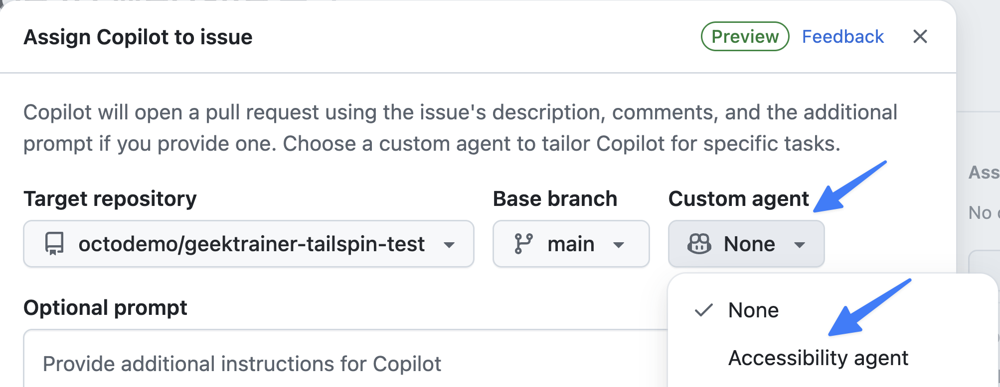

You've assigned work to Copilot cloud agent. Now define a reusable specialist role to guide its accessibility work.

In this exercise, you will:

- create and review a custom-agent profile.
- assign a task to the custom agent.

## Scenario

Tailspin Toys is committed to ensuring their crowdfunding platform is accessible to all users, regardless of their visual abilities or preferences. Recent user feedback has highlighted that some users find the current dark theme difficult to read due to insufficient contrast between text and background colors. To address this accessibility concern, the design team has requested the implementation of a high-contrast mode that users can toggle on and off.

Because accessibility is critical, you want to ensure this is implemented as quickly as possible. You're going to utilize a custom agent to generate the functionality.

## What are custom agents?

[Custom agents][custom-agents-concept] in GitHub Copilot allow you to create specialized AI assistants tailored to specific tasks or domains within your development workflow. By defining agents through markdown files in the `.github/agents` folder of your repository, you can provide Copilot with focused instructions, best practices, coding patterns, and domain-specific knowledge that guide it to perform particular types of work more effectively. Teams can codify their expertise into reusable agents — an accessibility agent that enforces [WCAG][wcag] compliance, a security agent that follows secure coding practices, or a testing agent that maintains consistent test patterns.

Repository custom agents are defined by `.agent.md` files in the `.github/agents` folder. Each file has YAML frontmatter with a required `description`, followed by a Markdown prompt that defines the agent's behavior, expertise, and instructions. This exercise also supplies an optional, readable `name` so you can recognize the agent in the picker.

### Custom agents compared with agent skills

There's some logical overlap between custom agents and [agent skills][agent-skills-concept]. A **custom agent** defines a specialized role, instructions, and available tools. A **skill** packages task-specific instructions and can include scripts and supporting resources.

Agents can run scripts directly through available tools, or follow a skill when one is available. Selecting a custom agent does not inherently create a separate context window or require orchestration of other agents. In this lab, you'll create an accessibility profile and use the project's existing npm checks directly; no skill from another workshop harness is required.

> [!NOTE]
> There's no single "right" way to author a custom agent. As with anything in AI, test and iterate to find what works for your environments and scenarios.

[custom-agents-concept]: https://docs.github.com/copilot/concepts/agents/cloud-agent/about-custom-agents
[agent-skills-concept]: https://docs.github.com/copilot/concepts/agents/about-agent-skills
[wcag]: https://www.w3.org/WAI/standards-guidelines/wcag/

## Creating and reviewing the accessibility custom agent

The template does not supply custom agents or skills. Before assigning the high-contrast issue, create an accessibility profile using GitHub's [custom-agent creation flow][creating-custom-agents]. The profile must reach your repository's **default branch** before you select it for an issue.

1. Open the [Copilot agents page][agents-page] and select your Tailspin Toys repository in the prompt box's repository dropdown.
2. Select your repository's default branch (`main` for this workshop).
3. Open **Select a custom agent**, then select **Create an agent**. GitHub opens a template at `.github/agents/my-agent.agent.md` in its file editor.
4. Rename the file to `.github/agents/accessibility.agent.md`. Replace the template with this profile:

   ```markdown
   ---
   name: Accessibility agent
   description: Implement and review accessible Astro UI changes, including contrast, keyboard access, and user preference controls.
   ---

   Follow the user's requirements and repository instructions. Inspect existing components, styles, package.json, and tests before making focused accessibility changes.

   Use semantic HTML, keyboard-accessible controls, visible focus, accessible names and states, and WCAG contrast guidance. Preserve existing behavior and persist user preferences when requested.

   Add or update relevant tests. Run npm run lint, npm run test:unit, npm run test:e2e, and npm run typecheck:all directly using the existing project setup. Do not depend on supplied agents or skills.

   Report changes and evidence, with accurate pass/fail/blocked check results. Distinguish automated checks from browser observations and identify any accessibility checks not performed. Report missing prerequisites or access rather than claiming success.
   ```

5. Review the profile against the repository's instructions and existing npm scripts. Confirm it guides accessibility work without prescribing an unrelated feature. `description` is required; `name` is optional but intentionally supplied here. Omitting `tools` makes the available tools accessible within the cloud agent's normal permissions.
6. Save the reviewed profile to the default branch. Commit directly **only if** your permissions and branch rules allow it. Otherwise commit on a setup branch, open a pull request, review it, and merge it into the default branch before continuing.
7. Open `.github/agents/accessibility.agent.md` on the default branch and confirm the reviewed contents are present. Return to the agents page, refresh it if needed, and confirm **Accessibility agent** appears in the custom-agent dropdown.

> [!IMPORTANT]
> A profile that exists only in an unmerged branch is not ready for this issue-assignment flow. If you cannot merge it or select it, resolve that access or discovery blocker before assigning the issue. Asking the default agent to read the profile is not a substitute for selecting the custom agent.

## Create and assign an issue

Mission control is the central location for working with all agents for your environment. You can assign tasks to Copilot cloud agent, monitor tasks, and even redirect and provide additional guidance. Let's start by assigning a task to create the high contrast mode to Copilot.

1. Navigate to your repository.
2. Select the issues tab.
3. Select **New issue** to open the new issue dialog.
4. Select **Blank issue** to create the new issue.
5. Set the **Title** to `Add high contrast mode to website`.
6. Set the **Description** to:

    ```plaintext
    We need a high contrast mode for the site. There should be a toggle for high contrast which the user can set. It should store the setting in local storage on the browser.
    ```

7. Select **Create** to create the issue.
8. On the right side, select **Assign to Copilot** to open the assignment dialog.
9. Select **Accessibility agent** from the custom-agent dropdown and confirm that it is the selected agent in the assignment dialog before proceeding.

    

10. Select **Assign**.
11. Copilot gets to work on the task in the background! When its pull request appears, check the description for the custom agent used and confirm it names your accessibility agent.

## Summary and next steps

This lesson explored [custom agents][custom-agents] in GitHub Copilot, specialized AI assistants tailored to specific tasks and domains. With custom agents you can codify your team's expertise and standards into reusable agents that guide Copilot to perform particular types of work more effectively.

You explored these concepts:

- creating, reviewing, and publishing a custom-agent profile to the default branch before assignment.
- assigning a task to a custom agent.

With Copilot working on implementing the high contrast mode, we can now turn our attention to [monitoring and steering the agent session][next-lesson] from mission control.

## Resources

- [About custom agents][custom-agents]
- [Creating custom agents for Copilot cloud agent][creating-custom-agents]
- [Custom agents configuration][custom-agents-config]
- [Preparing to use custom agents in your organization][org-custom-agents]
- [Preparing to use custom agents in your enterprise][enterprise-custom-agents]

---

| [← Previous lesson: GitHub Copilot cloud agent][previous-lesson] | [Next lesson: Monitoring and managing agents →][next-lesson] |
|:--|--:|

[previous-lesson]: ../2-cloud-agent/
[next-lesson]: ../4-managing-agents/
[custom-agents]: https://docs.github.com/copilot/concepts/agents/cloud-agent/about-custom-agents
[creating-custom-agents]: https://docs.github.com/copilot/how-tos/copilot-on-github/customize-copilot/customize-cloud-agent/create-custom-agents
[custom-agents-config]: https://docs.github.com/copilot/reference/custom-agents-configuration
[agents-page]: https://github.com/copilot/agents
[org-custom-agents]: https://docs.github.com/copilot/how-tos/administer-copilot/manage-for-organization/prepare-for-custom-agents
[enterprise-custom-agents]: https://docs.github.com/copilot/how-tos/administer-copilot/manage-for-enterprise/manage-agents/prepare-for-custom-agents
