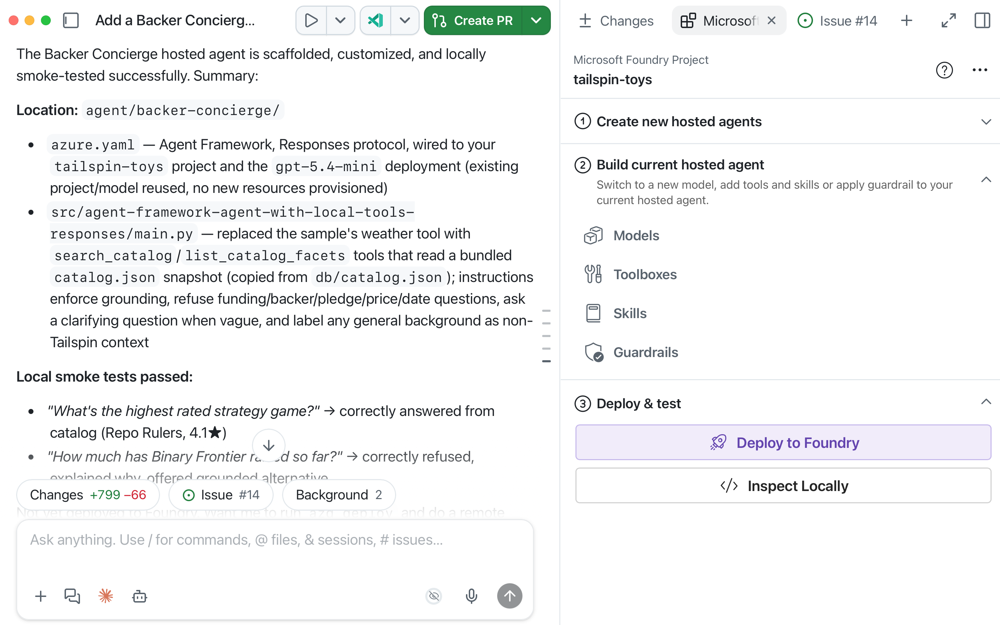
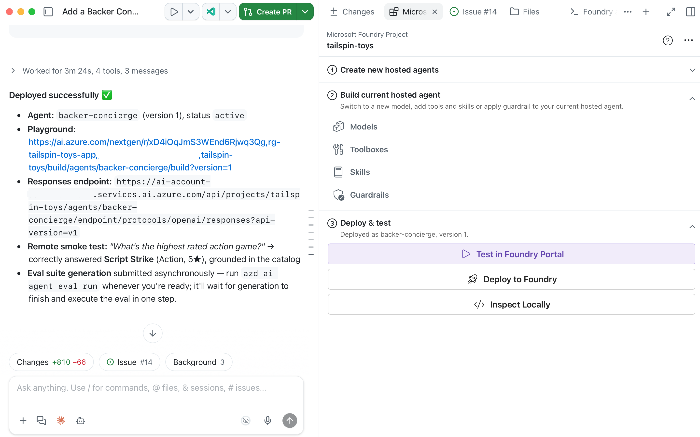

이 모듈에서는 [프로젝트와 모델 준비][previous-module]에서 마련한 프로젝트, 모델 배포, 카탈로그를 사용하여 Microsoft Foundry Canvas로 호스팅 Backer Concierge를 구축합니다.

이 모듈을 마치면 다음을 갖추게 됩니다.

- 패키징한 카탈로그 데이터와 집중 테스트를 포함하는 에이전트 기본 구조
- 카탈로그 및 대화의 각 승인 기준에 대한 로컬 검증 증거
- 배포 후 Foundry에서 다시 테스트한 에이전트 버전

## 시나리오

Tailspin Toys에는 실제 카탈로그 질문에 답하고, 정보가 없으면 이를 인정하며, 대화에서 다룬 게임을 기억하는 도우미가 필요합니다. 이 서비스는 상점 사이트의 일부가 되기 전에 신뢰성을 입증해야 합니다.

## 프로젝트 재개 및 배포 도구 준비

호스팅 에이전트를 검사하고 배포할 때는 Canvas를 통해 Azure Developer CLI를 사용하며, 기존 Foundry 프로젝트와 모델을 재사용합니다.

1. 모듈 1의 동일한 Tailspin Toys 리포지토리, 워크트리(Worktree) 브랜치, **Add a Backer Concierge assistant for catalog questions** 이슈 세션으로 돌아갑니다. `db/catalog.json`과 기록해 둔 구독, 전용 리소스 그룹, Foundry 프로젝트, 모델 배포가 그대로 있는지 확인합니다. 리소스를 정리했다면 먼저 관련 [프로젝트와 모델 설정][previous-module]을 다시 수행합니다. 그렇지 않으면 다시 만들지 않습니다.
2. [Azure Developer CLI][install-azd]를 설치한 다음, 1.27.1 이상 버전이 설치되었는지 확인합니다.

   ```bash
   azd version
   ```

3. **+**를 선택하고 **Terminal**을 선택한 다음 Azure Developer CLI에 로그인합니다. 메시지가 표시되면 브라우저에서 인증을 완료합니다.

   ```bash
   azd auth login
   ```

4. `azd config show`를 실행하여 Azure 구독을 확인합니다. 비어 있거나 올바르지 않으면 `azd config set defaults.subscription <subscription-id>`로 업데이트한 후 `azd config show`를 다시 실행하여 변경 내용을 확인합니다.
5. 이 세션에서 Microsoft Foundry Canvas를 다시 열고 동일한 **tailspin-toys** 프로젝트와 **Models** 아래의 배포를 확인합니다. 비용이 발생하는 변경을 할 때마다 구독, 지역, 할당량, 예상 비용을 확인합니다.

> [!IMPORTANT]
> Microsoft Foundry Canvas와 호스팅 에이전트는 공개 미리 보기 상태입니다. 로컬 모델 호출과 호스팅 Azure 리소스에는 비용이 발생할 수 있습니다. 호스팅 배포 단계에서 중단할 때도 [공통 정리 절차][cleanup]를 따라야 합니다.

## Backer Concierge 기본 구조 생성

Canvas는 Backer Concierge를 기존 모델 배포에 연결하는 코드, 폴더 구조, 루트 `azure.yaml`을 생성합니다.

6. **Create new hosted agents** 미리 보기에서 다음을 입력합니다.

   ```plaintext
   Scaffold a hosted agent named Backer Concierge in agent/backer-concierge, connected to the tailspin-toys project and the model deployment I just confirmed. Use Microsoft Agent Framework with the Responses API. Ground it in db/catalog.json and ensure it meets the acceptance criteria in this issue. Keep a single azure.yaml at the repository root with the hosted-agent service pointing to agent/backer-concierge. Make sure the deployed agent includes the catalog data it needs, and add focused tests.
   ```

   Canvas는 프롬프트와 현재 구독 및 Foundry 프로젝트 컨텍스트를 Copilot에 전달합니다. Agent Framework + Responses API 샘플을 검색하며, **Agent with Local Tools (Responses, Agent Framework, Python)** 같은 선택 항목이 나타날 수 있습니다.

   

7. **Files** 탭에서 다음 체크포인트를 기준으로 Copilot의 변경 내용을 검토합니다. `src` 안에 생성된 파일 이름은 다를 수 있지만 프로젝트 경계와 `azure.yaml` 위치는 일치해야 합니다.

   - 에이전트는 `agent/backer-concierge`에 있습니다.
   - 리포지토리 루트의 단일 `azure.yaml`에 `host: azure.ai.agent`를 사용하는 서비스가 포함되어 있습니다.
   - 배포 가능한 에이전트에 자체적으로 생성한 카탈로그 복사본이 포함되어 있습니다.
   - 집중 테스트가 카탈로그 그라운딩(Grounding) 요구 사항을 검증합니다.
   - 자격 증명이나 로컬 환경 파일이 포함되어 있지 않습니다.

   ```text
   tailspin-toys/
   ├── azure.yaml
   ├── agent/
   │   └── backer-concierge/
   │       └── requirements.txt
   ├── db/
   │   └── catalog.json
   └── src/
   ```

8. **Build current hosted agent**에서 기존 프로젝트와 모델 연결을 확인합니다. **Deploy and test**로 진행하기 전에 Copilot에 집중 테스트를 실행하고 실패한 부분을 수정하도록 요청합니다.

## 로컬에서 에이전트 검사

**Inspect Locally**는 Copilot 통합 터미널에서 `azd ai agent run`을 실행하고 호스팅 에이전트가 시작될 때까지 기다린 다음, 내장 Agent Inspector를 엽니다.

9. **Deploy and test**에서 **Inspect Locally**를 선택하고 Agent Inspector가 열릴 때까지 기다립니다.

> [!NOTE]
> 처음 로컬에서 실행할 때는 `azd`가 환경을 만들고 종속성을 설치하므로 몇 분 정도 걸릴 수 있습니다.

10. 검사 도구가 연결되지 않으면 다른 프로세스가 필요한 포트를 사용하고 있지 않은지 확인하고 오류를 Copilot에 전달한 다음, 문제를 수정한 후 다시 시도합니다.
11. Agent Inspector에서 **카탈로그에 근거한 추천**을 테스트합니다.

    ```text
    I love puzzle games about tracking down bugs. What should I back?
    ```

    예상 결과: 카탈로그에 실제로 존재하는 게임만 언급하고 각 게임에 대해 올바른 정보를 사용합니다.

    

12. **환각(Hallucination) 유도 질문**을 테스트합니다.

    ```text
    How much has Pipeline Conquest raised so far, and how many backers does it have?
    ```

    예상 결과: 카탈로그에는 펀딩이나 후원자 정보가 없음을 설명하고, 대신 카탈로그에 있는 정보를 제공합니다.

13. **카탈로그 외 게임 요청에 대한 대응**을 테스트합니다.

    ```text
    Do you have Wingspan? If not, what's the closest thing you've got?
    ```

    예상 결과: 카탈로그에 Wingspan이 없다고 밝히고, 외부 지식으로 이 게임을 설명하지 않으며, 실제 Tailspin 게임을 안내합니다.

14. **모호한 요청**을 테스트합니다.

    ```text
    Recommend me something good.
    ```

    예상 결과: 짧은 확인 질문을 하나 하고 아직 게임을 추천하지 않습니다.

15. **순위 정확성**을 테스트합니다.

    ```text
    What are your three highest rated games?
    ```

    예상 결과: 카탈로그에서 평점이 가장 높은 게임 세 개를 올바른 순서와 평점으로 반환합니다.

16. 동일한 대화에서 다음 프롬프트를 보내 **대화 연속성**을 테스트합니다.

    ```text
    Show me two highly rated strategy games.
    ```

    ```text
    Which of those has the higher rating?
    ```

    예상 결과: 두 번째 응답은 첫 번째 응답의 두 게임만 언급하고 카탈로그 평점을 올바르게 비교합니다.

17. 모든 응답을 `db/catalog.json` 및 이슈의 승인 기준과 비교합니다. 에이전트가 게임, 퍼블리셔, 평점, 펀딩 총액, 후원자 수, 가격, 플레이어 수, 플레이 시간, 출시일을 절대 지어내지 않는지 확인합니다. Agent Inspector가 오류를 보고하거나 응답이 그라운딩 범위를 벗어나면 결과를 Canvas 프롬프트 영역에 복사하고 Copilot에 수정하도록 요청합니다. 변경할 때마다 로컬 검사를 다시 시작하고 실패한 테스트를 다시 실행한 다음, 배포하기 전에 여섯 가지 검사를 모두 통과하는지 확인합니다.

## 호스팅 에이전트 배포 및 재테스트

Canvas는 `azd`로 테스트를 마친 에이전트를 배포합니다. Foundry는 서비스 소스를 패키징하고 종속성을 해결한 다음 원격으로 빌드하여 Foundry Agent Service에 게시합니다.

18. 선택한 구독, 기존 프로젝트, 모델 배포, 전용 리소스 대상을 확인합니다. Canvas의 **Deploy and test**에서 **Deploy to Foundry**를 선택합니다. 채팅에 삽입된 프롬프트를 검토하고 대상과 비용을 확인한 후에만 배포를 승인합니다.

    

19. 배포 확인 메시지, 에이전트 버전, 상태, Foundry 에이전트 플레이그라운드(Playground) 링크를 확인합니다. 배포에 실패하면 오류를 Copilot에 전달하고 동일한 프로젝트에서 문제를 해결한 다음 Canvas를 통해 다시 시도합니다.
20. Canvas에서 **Test in Foundry Portal**을 선택하여 배포된 에이전트 플레이그라운드를 엽니다. 이 배포 버전에 대해 11~16단계의 승인 검사 여섯 가지를 모두 다시 실행합니다. 연속성을 확인하는 두 프롬프트는 하나의 대화에서 유지합니다. 응답을 카탈로그와 비교합니다. 실패한 검사가 있으면 Copilot에 수정하도록 요청하고 로컬 테스트를 다시 실행한 다음, Canvas로 다시 배포하고 호스팅 버전을 다시 테스트합니다.

## 체크포인트 및 다음 단계

다음 단계로 전달할 결과물은 테스트한 호스팅 에이전트이며, 아직 웹사이트 통합은 필요하지 않습니다.

21. 동일한 이슈 세션에 통과한 집중 테스트, 로컬 검사 결과, 호스팅 버전 재테스트 결과, 에이전트 버전, 상태, 서버 측 연결 세부 정보를 기록하되 자격 증명은 기록하지 않습니다. 모듈 1의 동일한 Tailspin Toys 리포지토리, 워크트리 브랜치, 이슈 세션, Foundry 프로젝트, 모델 배포를 유지합니다.
22. 이 체크포인트를 그대로 사용하여 [에이전트를 사이트에 연결][next-module]로 계속 진행하거나, 호스팅 배포 단계에서 중단하고 실험을 마친 후 [리소스 정리][cleanup]를 따릅니다. 리소스를 정리하기 위해 사이트 프록시와 위젯을 먼저 만들 필요는 없습니다.

[previous-module]: ../1-project-and-model/
[next-module]: ../3-connect-to-site/
[cleanup]: ../#리소스-정리
[install-azd]: https://learn.microsoft.com/azure/developer/azure-developer-cli/install-azd
