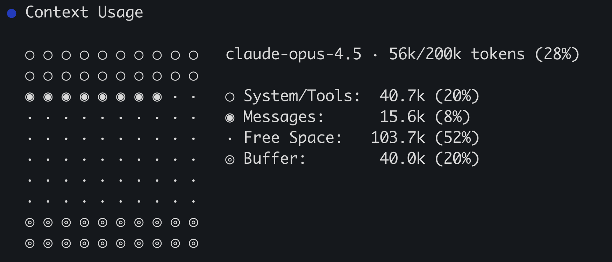

Jak każde dobre narzędzie CLI, GitHub Copilot CLI zawiera wiele poleceń slash pozwalających wchodzić w zaawansowane interakcje. Te polecenia udostępniają zaawansowane funkcje, informacje „za kulisami” lub dodatkowe opcje konfiguracji. Już poznałeś kilka z nich: `/clear` do czyszczenia kontekstu i `/mcp` do przeglądania serwerów MCP. Przyjrzyjmy się kilku bardziej zaawansowanym, w tym `/context`, `/model`, `/share` i `/delegate`.

## Scenariusz

Zakończyłeś podstawowe przepływy CLI. Spójrzmy teraz na kilka dodatkowych możliwości — udostępnianie sesji, przełączanie modeli i delegowanie zadań do [agentów chmurowych Copilot][about-cloud-agent].

Podczas tego ćwiczenia użyjesz:

- `/share` do utworzenia gista GitHub, aby udostępnić sesję zespołowi.
- `/context`, aby zobaczyć kontekst, którego obecnie używa Copilot CLI.
- `/model`, aby przejrzeć listę dostępnych modeli i w razie potrzeby wybrać nowy.
- `/delegate`, aby opcjonalnie przekazać zadanie do cloud agent. Wymaga to cloud agent, dostępnego w planach Copilot Student, Pro, Pro+, Business lub Enterprise — w każdym planie oprócz Copilot Free.

## Udostępnianie sesji

Korzystanie z dowolnego narzędzia, w tym AI, to umiejętność, którą trzeba nabyć. Wspólna praca w zespole i dzielenie się wnioskami to najlepszy sposób na poprawę doświadczenia wszystkich i generowanie kodu wyższej jakości. W tym celu Copilot CLI oferuje polecenie `/share`. Polecenie `/share` może wygenerować plik markdown lub gist GitHub ze szczegółami sesji, w tym użytymi poleceniami i logiką, którą podążał Copilot.

Utwórzmy gist GitHub, który moglibyśmy udostępnić zespołowi.

1. Wróć do codespace. Jeśli go zamknąłeś, przejdź do repozytorium na GitHub.com, wybierz **Code** > **Codespaces**, a następnie ponownie otwórz istniejący codespace.
2. Wróć do otwartej sesji Copilot CLI. Jeśli terminal jest zamknięty lub wyszedłeś z Copilot CLI, otwórz terminal. Użyj kombinacji <kbd>Ctrl</kbd>+<kbd>\`</kbd>, a następnie uruchom go z katalogu głównego repozytorium poleceniem `copilot --yolo --enable-all-github-mcp-tools`. Zaufaj folderowi projektu, jeśli zostaniesz o to poproszony, potem uruchom `/model` i wybierz **Auto**.
3. W interfejsie Copilot CLI wyślij poniższe polecenie:

    ```
    /share gist
    ```

4. Po chwili Copilot utworzy gist i wyświetli link.
5. Skopiuj tekst linku.
6. W nowej karcie przeglądarki wklej link, aby przejrzeć gist. Zwróć uwagę, jak gist podkreśla wysłane polecenia, użyte skille i agentów, tok myślenia Copilota, a nawet kod i wyniki lokalnie uruchomionych poleceń.

Gisty i pliki markdown generowane przez `/share` mogą służyć do dokumentowania sposobu generowania kodu albo do dzielenia się z zespołem tym, jak wykonano określone działania, które dały pożądane wyniki od Copilota.

## Przegląd kontekstu Copilot CLI

Przy większych lub bardziej złożonych zadaniach możesz dojść do maksymalnego okna kontekstu modelu. Dokładny rozmiar okna zależy od używanego modelu i wersji Copilot CLI. Gdy okno kontekstu się zapełni, Copilot CLI automatycznie je skompaktuje, podsumowując informacje i usuwając to, co uzna za nieistotne dla bieżącego zadania. Możesz zarówno zobaczyć bieżący stan kontekstu, jak i ręcznie skompaktować kontekst poleceniami slash. Przyjrzyjmy się oknu kontekstu.

1. W interfejsie Copilot CLI wyślij poniższe polecenie:

    ```
    /context
    ```

2. W ciągu chwili Copilot CLI wygeneruje wizualną reprezentację bieżącego kontekstu:

    

3. Zwróć uwagę na wyświetlony model (może różnić się od tego na obrazku) oraz bieżący procent użytych tokenów. Pozostałe informacje podkreślają:

    | Tytuł                  | Opis                                                   |
    | ---------------------- | ------------------------------------------------------ |
    | System/Tools (system/narzędzia) | Pliki instrukcji, zawartość plików i definicje narzędzi |
    | Messages (wiadomości)  | Historia rozmowy między Tobą a Copilotem               |
    | Buffer (bufor)         | Zarezerwowane miejsce przez Copilot CLI na generowanie odpowiedzi |
    | Free space (wolne)     | Pozostałe wolne miejsce                                |

4. Skompaktuj historię rozmowy, wysyłając do Copilot CLI poniższe polecenie slash:

    ```
    /compact
    ```

5. Po zakończeniu wyślij poniższe polecenie, aby ponownie wyświetlić bieżące statystyki kontekstu:

    ```
    /context
    ```

6. Zwróć uwagę na zmianę kontekstu. Może nie być drastyczna, ponieważ okno kontekstu jest obecnie prawdopodobnie stosunkowo małe.

> [!NOTE]
> Copilot CLI automatycznie kompaktuje kontekst, gdy się zapełni. Gdy zbliża się do 100% pojemności, wyświetla procent tuż nad interfejsem. Zwykle kompaktuje asynchronicznie, pozwalając Ci dalej wchodzić w interakcję z Copilotem podczas pracy. Może jednak zablokować działającą operację na kilka sekund na czas kompaktowania.

### Dobre praktyki dotyczące kontekstu

W większości sesji z Copilotem kontekst jest efektywnie zarządzany przez samego Copilota bez szczególnych wskazówek. Czasem jednak zdecydujesz się ręcznie polecić Copilotowi wyczyszczenie lub skompaktowanie historii:

- Jeśli przechodzisz do innej części aplikacji albo do niezwiązanego zadania, możesz użyć `/clear`, aby zacząć od nowa i uniknąć zmylenia Copilota starszym, niepowiązanym kontekstem.
- Jeśli zbliżasz się do maksymalnego okna kontekstu, możesz ręcznie wykonać `/compact`, aby kontrolować moment kompaktowania.

> [!CAUTION]
> Ponownie — w większości przypadków Copilot zarządza kontekstem bez Twojej bezpośredniej interakcji. Jeśli zauważysz, że Copilot jest nieco zdezorientowany starszymi informacjami, albo zamierzasz przejść do niezwiązanego zadania, rozważ użycie tych poleceń samodzielnie.

## Wybór modelu

Różne modele mają różne mocne strony, a różni deweloperzy mają różne preferencje. Copilot CLI pozwala wyświetlać listę modeli i wybierać model, którego chcesz użyć!

1. Wyświetl listę modeli, wysyłając do Copilot CLI poniższe polecenie slash:

    ```
    /model
    ```

2. Zwróć uwagę na listę modeli. Każdy model ma nazwę oraz mnożnik kosztu na żądanie.
3. Jeśli chcesz, wybierz nowy model! Albo wciśnij <kbd>Esc</kbd>, aby wyjść z listy modeli.

> [!CAUTION]
> Wybór modelu jest zapamiętywany w Copilot CLI.

## Delegowanie do agenta w chmurze (opcjonalne)

Czasem chcesz dalej pracować w terminalu, ale przekazać dłuższe zadanie do agenta Copilot w chmurze. Polecenie `/delegate` wysyła bieżącą sesję Copilot CLI na GitHub.com, gdzie agent chmurowy ją przejmuje, będzie nad nią pracować asynchronicznie i po zakończeniu otwiera pull request.

> [!NOTE]
> `/delegate` wymaga agentów chmurowych, dostępnych w planach Copilot Student, Pro, Pro+, Business lub Enterprise — w każdym planie oprócz Copilot Free. Jeśli nie masz dostępu, przeczytaj tę sekcję i pomiń kroki treningowe.

1. Najpierw wyczyść bieżącą sesję, aby nie delegować zgromadzonego kontekstu tych warsztatów:

    ```
    /clear
    ```

2. Wyślij małe, dobrze określone polecenie. Na przykład możesz oddelegować paginację z dodatkowych celów (stretch goal) z backlogu:

    ```
    Implement pagination on the game list page so it shows a fixed number of games per page with Previous and Next controls, and add tests.
    ```

3. Wyślij poniższe polecenie slash, aby przekazać sesję do agenta w chmurze, i przejrzyj polecenie, które chcesz oddelegować:

    ```
    /delegate
    ```

4. Otwórz [Copilot agents](https://github.com/copilot/agents) w przeglądarce, aby monitorować postęp.
5. Nie musisz czekać na ukończenie pull requestu w tym środowisku; możesz wrócić do niego później. Jeśli chcesz głębiej poznać zarządzanie asynchroniczną pracą agentów, kontynuuj ze [środowiskiem Cloud agent](../../cloud/).

## Podsumowanie i kolejne kroki

Polecenia slash w Copilot CLI pozwalają konfigurować jego zachowanie, udostępniać sesje i uzyskiwać wewnętrzne informacje o tym, jak Copilot pracuje. Podczas tego ćwiczenia użyłeś lub poznałeś:

- `/share` do utworzenia gista GitHub, aby udostępnić sesję zespołowi.
- `/context`, aby zobaczyć kontekst, którego obecnie używa Copilot CLI.
- `/model`, aby przejrzeć listę dostępnych modeli i w razie potrzeby wybrać nowy.
- `/delegate` jako opcjonalny most do cloud agent.

Jest oczywiście więcej dostępnych poleceń slash i więcej do odkrycia z Copilot CLI! W następnym kroku [przejrzyj to, czego się nauczyłeś][next-lesson], oraz kolejne kroki pozwalające na dalszą naukę.

## Zasoby

- [Korzystanie z Copilot CLI][using-copilot-cli]
- [O Copilot CLI][about-copilot-cli]
- [Zarządzanie kontekstem w Copilot CLI][context-management]
- [Udostępnianie sesji z Copilot CLI][share-sessions]
- [Wybór modeli w Copilot CLI][selecting-models]

[previous-lesson]: ../6-custom-agents/
[next-lesson]: ../8-review/
[using-copilot-cli]: https://docs.github.com/copilot/how-tos/use-copilot-agents/use-copilot-cli
[about-copilot-cli]: https://docs.github.com/copilot/concepts/agents/about-copilot-cli
[about-cloud-agent]: https://docs.github.com/copilot/concepts/agents/cloud-agent/about-cloud-agent
[context-management]: https://docs.github.com/copilot/how-tos/use-copilot-agents/use-copilot-cli#context-management
[share-sessions]: https://docs.github.com/copilot/how-tos/use-copilot-agents/use-copilot-cli#share-sessions
[selecting-models]: https://docs.github.com/copilot/how-tos/use-copilot-agents/use-copilot-cli#select-an-llm
