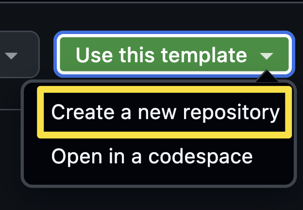
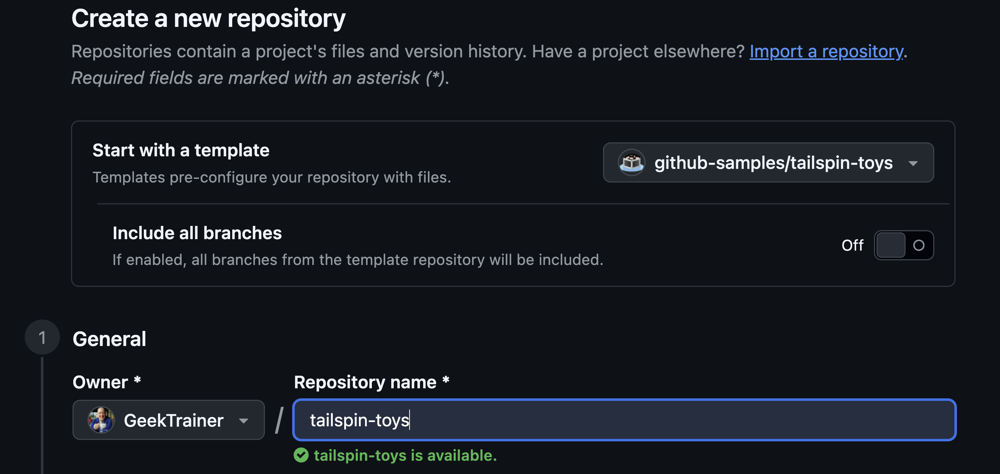

Aplikacja GitHub Copilot to aplikacja desktopowa — centralny hub zarówno dla Copilota, jak i GitHuba. Zapewnia szybki dostęp do zgłoszeń i pull requestów oraz pozwala budować z użyciem GitHub Copilot. Podczas tego warsztatu będziesz pracować lokalnie, aktualizując aplikację Tailspin Toys opartą na Astro za pomocą aplikacji GitHub Copilot. Zanim zaczniesz, upewnijmy się, że Node.js jest zainstalowany lokalnie, a potem zainstalujemy aplikację Copilot.

Podczas tej lekcji:

- zainstalujesz Node.js, aby testy projektu mogły działać na Twoim komputerze.
- utworzysz własną kopię projektu Tailspin Toys na podstawie szablonu.

## Zainstaluj Node.js

W kilku lekcjach agent buduje funkcje i uruchamia lokalnie zestaw testów Tailspin Toys, co wymaga **[Node.js][nodejs]** — jedynego środowiska uruchomieniowego (runtime), którego projekt potrzebuje. Zainstaluj bieżące wydanie **LTS**.

Najprostsza opcja na każdej platformie to oficjalny instalator:

1. W systemie operacyjnym otwórz okno terminala: Windows Terminal, terminal macOS lub to, czego zwykle używasz.
2. Uruchom poniższe polecenie, aby sprawdzić zainstalowaną wersję Node.js:

    ```shell
    node --version
    ```

3. Jeśli spełnia wymagania z pliku README projektu i `package.json`, możesz przejść do następnej sekcji.

> [!TIP]
> Te kroki wykonaj tylko wtedy, gdy nie masz zainstalowanego Node albo potrzebujesz aktualizacji.

4. Otwórz [stronę pobierania Node.js][node-download].
5. Pobierz wersję **LTS** dla swojego systemu operacyjnego.
6. Uruchom instalator i zaakceptuj domyślne ustawienia. W Windows pozostaw zaznaczoną opcję **Add to PATH**.
7. Po instalacji otwórz nowe okno terminala.
8. Potwierdź instalację w nowym oknie terminala, uruchamiając:

    ```bash
    node --version
    ```

9. Powinieneś zobaczyć zainstalowaną wersję.

> [!IMPORTANT]
> Każdy worktree potrzebuje też zależności projektu oraz Chromium Playwright do sprawdzeń E2E. Przygotowując worktree, postępuj zgodnie z README repozytorium Tailspin Toys i przed zatwierdzeniem przejrzyj każdą prośbę o instalację.

## Skonfiguruj repozytorium warsztatowe

Będziesz pracować na własnej kopii projektu Tailspin Toys. Utwórz ją teraz z [repozytorium szablonu][template-repository]. Nowe repozytorium zawiera wszystkie pliki potrzebne w warsztacie — podłączysz je przy instalacji aplikacji.

1. W nowym oknie przeglądarki przejdź do repozytorium GitHub tego warsztatu: `https://github.com/github-samples/tailspin-toys`.
2. Utwórz własną kopię repozytorium, wybierając przycisk **Use this template** na stronie repozytorium. Następnie wybierz **Create a new repository**.

    

3. Jeśli uczestniczysz w warsztacie w ramach wydarzenia prowadzonego przez GitHuba lub Microsoft, postępuj zgodnie z instrukcjami mentorów. W przeciwnym razie możesz utworzyć nowe repozytorium w organizacji, w której masz dostęp do GitHub Copilot.

    

4. Zanotuj ścieżkę utworzonego repozytorium (**organization-or-user-name/repository-name**) — będziesz się do niej odwoływać później w trakcie warsztatu.

> [!NOTE]
> Gdy tworzysz repozytorium z szablonu, backlog zgłoszeń (issues) GitHub jest tworzony automatycznie. Będziesz pracować na tych zgłoszeniach przez cały warsztat — nie musisz nic zgłaszać samodzielnie.

Użyj świeżej kopii szablonu warsztatu. Zawiera instrukcje repozytorium, kod aplikacji, testy, skill quality-checks oraz istniejące rozszerzenie kanwy. Podczas warsztatu dostosujesz skill i utworzysz agenta QA. Jeśli używasz starszej kopii, sprawdź u prowadzącego, czy ma pliki, których będziesz potrzebować.

## Podsumowanie i kolejne kroki

Jesteś gotowy! Podczas tej lekcji:

- zainstalowałeś Node.js, aby projekt mógł się budować i być testowany na Twoim komputerze.
- utworzyłeś własną kopię repozytorium Tailspin Toys na podstawie szablonu.

Następnie [zainstalujesz aplikację GitHub Copilot][next-lesson], podłączysz właśnie utworzone repozytorium i zapoznasz się z obszarem roboczym.

## Zasoby

- [Pobierz Node.js][node-download]
- [Tworzenie repozytorium z szablonu][template-repository]
- [O aplikacji GitHub Copilot][about-copilot-app]

[next-lesson]: ../1-install-copilot-app/
[nodejs]: https://nodejs.org/
[node-download]: https://nodejs.org/en/download
[template-repository]: https://docs.github.com/repositories/creating-and-managing-repositories/creating-a-template-repository
[about-copilot-app]: https://docs.github.com/copilot/concepts/agents/github-copilot-app
