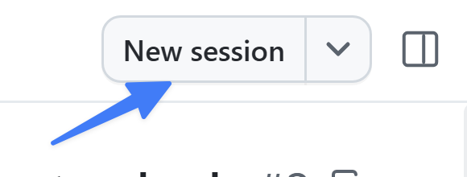

Zaczęliśmy od dodania małej funkcji do projektu. Większe zmiany wymagają jednak bardziej solidnego procesu. Na szczęście aplikacja GitHub Copilot jest zbudowana tak, by współpracować z istniejącym przepływem organizacji i zapewniać, że budujemy właściwe rzeczy we właściwy sposób. To pierwsza z kilku lekcji, w których przejdziesz typowy proces rozwoju sterowanego agentami: zaczniesz od zgłoszenia, wygenerujesz nową funkcję, upewnisz się, że kod jest poprawny, funkcja działa zgodnie z oczekiwaniami, a na końcu zostanie pomyślnie scalona z projektem.

> [!NOTE]
> W trakcie pracy nad funkcją będziesz korzystać z tej samej sesji. Zwykle miałbyś różne sesje lub PR dla różnych typów plików, ale skrócimy drogę, aby skupić się na kluczowych koncepcjach.

Na początek, podczas tej lekcji:

- rozpoczniesz nową sesję agenta na podstawie zgłoszenia GitHub.
- zdefiniujesz wymagania w trybie **Plan**.
- zaimplementujesz nową funkcję w trybie **Autopilot**.
- przejrzysz kod.
- zweryfikujesz funkcję ręcznie w kanwie przeglądarki.

Kontynuując pracę nad tą funkcją, zaktualizujesz instrukcje repozytorium, dostosujesz istniejący skill quality-checks, dodasz walidację MCP, utworzysz agenta QA i otworzysz PR funkcji.

## Scenariusz

Katalog Tailspin Toys rośnie, a odwiedzający muszą zawężać gry według kategorii i wydawcy. Zgłoszenie w backlogu opisuje funkcję, ale szczegóły takie jak łączenie kategorii wymagają uzgodnienia przed kodowaniem. Użyjesz trybu Plan, aby rozstrzygnąć te decyzje, a następnie zatwierdzisz ograniczoną implementację z Autopilot.

## Kontekst

Wprowadzenie agentów kodujących AI do przepływu deweloperskiego nie zmienia podstaw. Jeśli już, stają się one jeszcze ważniejsze! Większość programistów stosuje przepływ zbliżony do:

1. Otwarcie złożonego zgłoszenia ze szczegółami tego, co trzeba zrobić.
2. Utworzenie planu tego, co trzeba zbudować.
3. Zbudowanie i przegląd kodu.
4. Uruchomienie testów w celu walidacji kodu.
5. Ręczna walidacja nowej funkcjonalności.
6. Utworzenie pull requesta (PR).
7. Gdy kod zostanie przejrzany i proces ciągłej integracji zakończy się sukcesem — scalenie kodu.

> [!NOTE]
> W zależności od zespołu i organizacji dokładne szczegóły będą się różnić. Większość będzie jednak wariacją powyższego motywu.

Trzymając się tego standardowego podejścia, zapewniasz, że kod wygenerowany przez AI spełnia wymagania i przechodzi ten sam proces weryfikacji co kod napisany ręcznie.

## Tryby sesji

**Tryb sesji** kontroluje, ile autonomii ma agent. Ustawisz go z listy rozwijanej pod polem promptu i możesz zmienić w dowolnym momencie:

- **Interactive**: Ty i agent pracujecie razem. Agent sugeruje zmiany i czeka na Twoje dane przed kontynuacją.
- **Plan**: Agent najpierw tworzy plan. Przeglądasz i zatwierdzasz plan, zanim agent go wykona.
- **Autopilot**: Agent pracuje w pełni autonomicznie — pisze kod, uruchamia testy i iteruje bez czekania na dane wejściowe.

Zacznij w trybie Plan, przejrzyj plan, a następnie użyj Autopilot do jego implementacji.

## Rozpocznij sesję na podstawie zgłoszenia

Przed startem upewnij się, że PR z ocenami w gwiazdkach jest scalony, a lokalny `main` jest aktualny.

1. Wybierz **My work** i otwórz **Allow users to filter games by category and publisher**.
2. Wybierz **New session** i wybierz **new working tree** na podstawie zaktualizowanego `main`.

    

3. Potwierdź, że zgłoszenie jest dołączone do sesji, i wybierz **Plan** z selektora trybu.

## Zaplanuj funkcję filtrowania

Planowanie daje szansę przejrzeć podejście, zanim Copilot napisze kod. Ponieważ zacząłeś od zgłoszenia, Copilot ma już prośbę o funkcję w kontekście. Wyślij:

```plaintext
Build this feature.
```

Odpowiadaj na pytania Copilota i porównaj plan z kryteriami akceptacji ze zgłoszenia. Sprawdź, czy obejmuje filtrowanie według kategorii i wydawcy, dostępne kontrolki, zmiany dostępu do danych oraz testy. Omów wszelkie niejasne zachowania, na przykład jak łączą się wiele kategorii albo co się dzieje, gdy żadna gra nie pasuje.

Plan powinien obejmować lint, testy jednostkowe, testy E2E i sprawdzanie typów z użyciem istniejącego zestawu narzędzi projektu. Skup go na implementacji i testowaniu filtrowania — PR utworzysz po ukończeniu przepływu jakości. Poproś o zmiany w planie przed jego zatwierdzeniem i miej pod ręką URL zgłoszenia oraz uzgodnione doprecyzowania na późniejszą walidację.

## Jawnie zatwierdź Autopilot

Gdy plan Ci odpowiada, wybierz **Approve and implement with autopilot** lub równoważną opcję w swojej wersji. Potwierdź, że wskaźnik trybu pokazuje **Autopilot**.

Copilot zabierze się za implementację! Zobaczysz, jak będzie iterować przez proces, realizując ustalony plan, generując kod i nawet uruchamiając testy.

> [!NOTE]
> Zatwierdzenie może natychmiast rozpocząć implementację, więc najpierw przejrzyj plan. Jeśli Copilot zgłosi brakujące zależności lub konflikt portu, rozwiąż problem konfiguracji, zanim uznasz sprawdzenia za zakończone. Zatrzymuj tylko serwery, które sam uruchomiłeś.

## Przejrzyj i zweryfikuj implementację

Gdy kod jest wygenerowany, trzeba go przejrzeć przed scaleniem — jak każdy inny kod. Przejrzyjmy kod i uruchommy witrynę, by upewnić się, że wszystko wygląda dobrze.

1. Otwórz **Changes** i zbadaj implementację filtrowania oraz testy.
2. Porównaj wynik ze zgłoszeniem i zatwierdzonymi doprecyzowaniami, w tym wieloma kategoriami i kombinacjami wydawców. Sprawdź, czy zmiany są zgodne z istniejącymi instrukcjami repozytorium.
3. Zbadaj wynik lintu, testów jednostkowych, testów E2E i sprawdzania typów. Pominięte sprawdzenie to nie sukces.
4. Rozwiąż awarie i ponownie uruchom dotknięte sprawdzenia, zanim zaakceptujesz implementację. Konfiguracja E2E Playwright buduje i serwuje podgląd oraz może ponownie użyć lokalnego serwera; upewnij się, że testowany serwer należy do tego worktree, a nie do wcześniejszej lekcji.

## Zbadaj nową funkcjonalność

OK, kod wygląda dobrze — ale czy działa? Uruchommy aplikację jak wcześniej, otwierając witrynę w kanwie przeglądarki.

1. Użyj poniższego polecenia, aby poprosić Copilota o uruchomienie aplikacji i otwarcie strony w kanwie przeglądarki:

    ```plaintext
    Start the app and open it in the browser canvas.
    ```

2. Po chwili aplikacja się uruchomi i w aplikacji Copilot otworzy się okno przeglądarki.
3. Potwierdź, że karty gier z oceną wyświetlają wartość w skali do pięciu.
4. Gdy skończysz, poproś Copilota o zatrzymanie serwera deweloperskiego uruchomionego dla tej sesji, używając poniższego polecenia:

    ```plaintext
    Stop the dev server and close the browser canvas.
    ```

## Podsumowanie i kolejne kroki

Użyłeś różnych trybów agenta do zbudowania i przeglądu funkcji. Podczas tej lekcji:

- rozpocząłeś nową sesję agenta na podstawie zgłoszenia GitHub.
- zdefiniowałeś wymagania w trybie **Plan**.
- zaimplementowałeś nową funkcję w trybie **Autopilot**.
- przejrzałeś kod.
- zweryfikowałeś funkcję ręcznie w kanwie przeglądarki.

Następnie zagłębimy się nieco w to, jak powstaje kod i jak zapewnić zgodność z udokumentowanymi praktykami, [korzystając z instrukcji niestandardowych][next-lesson].

## Zasoby

- [Praca z sesjami agenta w aplikacji GitHub Copilot][agent-sessions]

[next-lesson]: ../4-custom-instructions/
[agent-sessions]: https://docs.github.com/copilot/how-tos/github-copilot-app/agent-sessions
