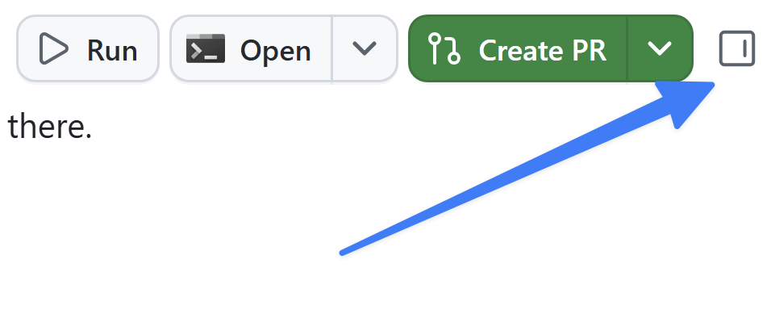
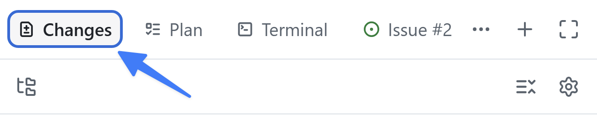

Kontekst jest kluczowy przy pracy z generatywną AI. Jeśli zadanie ma być wykonane w określony sposób, chcesz, by te wskazówki były dostępne dla Copilota. [Pliki instrukcji][instruction-files] opisują nie tylko *co* ma powstać, ale *jak* powinno być ustrukturyzowane. Skoro zbudowałeś filtrowanie, poznasz instrukcje, z których korzystał Copilot, dodasz standard dokumentacji i zastosujesz go do kodu.

Podczas tej lekcji:

- poznasz, jak instrukcje repozytorium i pliki instrukcji ograniczone do ścieżek docierają do agenta.
- zaktualizujesz plik instrukcji, aby zapewnić przestrzeganie standardów kodowania.
- zobaczysz wpływ plików instrukcji na kod.

## Scenariusz

Jak każdy dobry zespół deweloperski, Tailspin Toys ma zestaw wytycznych i wymagań dotyczących praktyk tworzenia oprogramowania. Obejmują one:

- Komentarze powinny wyjaśniać intencję i nieoczywiste decyzje, a nie powtarzać kod.
- Eksportowane funkcje w `db/` i `src/lib/` powinny dokumentować cel, parametry i wartości zwracane za pomocą TSDoc/JSDoc, w tym wstrzykiwany argument `db`, gdy jest obecny.
- Wielokrotnego użytku komponenty Astro powinny dokumentować kontrakty `Props`, a komentarze powinny być aktualne, gdy zmienia się powiązany kod.
- Istniejące wskazówki dotyczące formatowania i lintingu powinny zostać zachowane.

Dzięki plikom instrukcji zapewnisz, że Copilot ma właściwe informacje, by wykonywać zadania zgodnie z tymi praktykami.

## Pliki instrukcji

Instrukcje niestandardowe pozwalają przekazać Copilotowi kontekst i preferencje, aby lepiej rozumiał styl pisania kodu i wymagania. To potężna funkcja, która pomaga kierować Copilota ku bardziej trafnym sugestiom i fragmentom kodu. Możesz określić preferowane konwencje kodowania, biblioteki, a nawet typy komentarzy, które lubisz w kodzie. Możesz tworzyć instrukcje dla całego repozytorium albo dla określonych typów plików — jako kontekst na poziomie zadania.

Są dwa typy plików instrukcji:

- `.github/copilot-instructions.md` — pojedynczy plik instrukcji wysyłany do Copilota przy **każdym** żądaniu dla repozytorium. Powinien zawierać informacje na poziomie projektu — kontekst istotny dla większości żądań czatu lub CLI wysyłanych do Copilota. Może obejmować używany stos technologiczny, przegląd tego, co budujesz, dobre praktyki i inne globalne wskazówki.
- Pliki `.github/instructions/*.instructions.md` można tworzyć dla konkretnych zadań lub typów plików. Użyj ich, by podać wytyczne dla określonych języków (np. TypeScript lub Astro) albo zadań takich jak tworzenie komponentu UI czy nowego zestawu testów jednostkowych.

> [!NOTE]
> Inne formaty instrukcji i wsparcie różnią się w zależności od środowiska. Przed poleganiem na konkretnym formacie zapoznaj się z [referencją wsparcia instrukcji niestandardowych][custom-instructions-support].

## Zbadaj pliki instrukcji niestandardowych w tym projekcie

Aby ułatwić start, zestaw plików instrukcji jest już dołączony do projektu startowego. Zbadajmy, co już jest, zanim wprowadzimy zmianę i zobaczymy jej wpływ.

1. Wróć do sesji z poprzedniej lekcji.
2. Jeśli panel przeglądu nie jest jeszcze widoczny, otwórz go, wybierając **Toggle review panel** w prawym górnym rogu.

   

3. Wybierz ikonę **+** z etykietą „Open in panel”, aby otworzyć nową kanwę.
4. Wybierz **Files**.
5. Wybierz ikonę **Gear** i upewnij się, że obok **Show hidden files** jest zaznaczenie.
6. Przejdź do `.github/copilot-instructions.md`.
7. Zbadaj plik, zwracając uwagę na krótki opis projektu oraz sekcje takie jak **Agent notes**, **Code standards**, **Scripts** i **Repository Structure**. W **Code standards** zwróć uwagę na zagnieżdżone wskazówki **GitHub Actions Workflows**. Dotyczą one wszelkich interakcji z Copilotem.
8. Przejdź do folderu `.github/instructions` i zbadaj pliki. Zwróć uwagę, że są instrukcje dla plików Astro, warstwy danych Drizzle, testów i innych.
9. Otwórz `.github/instructions/unit-tests.instructions.md`. Zwróć uwagę na pole `applyTo` na górze — ustawia glob (względem katalogu głównego repozytorium), który określa, do których plików instrukcje się stosują. Tutaj pasuje każdy plik testów TypeScript (na przykład pasujący do `**/*.test.ts`).
10. Zwróć uwagę na instrukcje dotyczące tworzenia testów jednostkowych dla tego projektu.
11. Na koniec otwórz `.github/instructions/drizzle.instructions.md` i przewiń na dół. Zwróć uwagę na odnośniki do innych plików instrukcji (np. `unit-tests.instructions.md`) i istniejących plików w projekcie. Dzięki temu możesz dzielić większe zestawy instrukcji na mniejsze, wielokrotnego użytku pliki i wskazywać Copilotowi przykłady do naśladowania przy generowaniu kodu. (Ścieżki tam są względne wobec pliku instrukcji, a nie katalogu głównego repozytorium.)

## Zaktualizuj pliki instrukcji zgodnie z wytycznymi zespołu

Choć istniejące pliki to dobry start, wciąż są luki. Zmodyfikujmy główny plik `copilot-instructions.md`, aby zapewnić dodawanie [komentarzy TSDoc][tsdoc] do nowo generowanych plików TypeScript.

> [!NOTE]
> Ponieważ pliki instrukcji mają duży wpływ na kod generowany przez Copilota, należy zadbać, by jasno go prowadziły. Zawsze możesz poprosić Copilota o pierwszą wersję, a potem sam ją przejrzeć, by upewnić się, że aktualizacje spełniają wymagania. Możesz też znaleźć [kolekcję plików instrukcji w Awesome Copilot][awesome-copilot], która stanowi świetny punkt wyjścia.

1. W tej samej kanwie plików przejdź do `.github/copilot-instructions.md`.
2. Znajdź nagłówek **Code formatting requirements**, który powinien znajdować się mniej więcej w połowie pliku.
3. Dodaj poniższy punkt jako ostatni element listy pod tym nagłówkiem:

   ```plaintext
   All new TypeScript should contain TSDocs comments for documentation purposes.
   ```

Plik jest automatycznie zapisywany i gotowy do użycia!

## Użyj zaktualizowanych wskazówek

Gdy plik instrukcji jest zaktualizowany, zobaczmy, jaki wpływ ma na kod generowany przez Copilota — poprośmy go o przejrzenie aktualizacji i wprowadzenie niezbędnych zmian.

> [!NOTE]
> Wyraźnie powiemy Copilotowi, by użył pliku instrukcji, bo właśnie go zmieniliśmy. Przy tworzeniu kodu, gdy pliki instrukcji już są na miejscu, Copilot używa ich automatycznie — bez potrzeby o to prosić.

1. Wyślij Copilotowi poniższe polecenie, aby użył plików instrukcji i zaktualizował kod zgodnie z nowo dodanymi wymaganiami:

   ```plaintext
   We just updated our instructions and code guidance. Can you please update the code you generated to match that guidance?
   ```

2. Wybierz **Changes** w prawym górnym rogu, aby otworzyć zmiany w kodzie.

   

3. Przeczytaj pliki TypeScript. Zwróć uwagę na nowo wygenerowane komentarze TSDoc.

## Podsumowanie i kolejne kroki

Poznałeś, jak aplikacja zbiera kontekst z plików instrukcji, i zastosowałeś nowy standard do swojej funkcji. Konkretnie:

- zbadałeś `copilot-instructions.md` repozytorium oraz pliki `*.instructions.md` ograniczone do ścieżek.
- zaktualizowałeś plik instrukcji, aby zapewnić przestrzeganie standardów kodowania.
- zobaczyłeś wpływ plików instrukcji na wygenerowany kod.

Następnie [dostosujesz i uruchomisz wielokrotnego użytku skill quality-checks][next-lesson], aby linting i testy były uruchamiane spójnie.

## Zasoby

- [Pliki instrukcji do dostosowania GitHub Copilot][instruction-files]
- [Dostosowywanie aplikacji GitHub Copilot][customize-app]
- [Dobre praktyki tworzenia instrukcji niestandardowych][instructions-best-practices]
- [Awesome Copilot — kolekcja plików instrukcji i innych zasobów][awesome-copilot]

[next-lesson]: ../5-agent-skills/
[instruction-files]: https://docs.github.com/copilot/customizing-copilot/about-customizing-github-copilot-chat-responses
[customize-app]: https://docs.github.com/copilot/how-tos/github-copilot-app/customize-github-copilot-app
[instructions-best-practices]: https://docs.github.com/copilot/concepts/prompting/response-customization#writing-effective-custom-instructions
[awesome-copilot]: https://awesome-copilot.github.com/
[custom-instructions-support]: https://docs.github.com/copilot/reference/custom-instructions-support
[tsdoc]: https://tsdoc.org/
[ui-instructions]: https://github.com/github-samples/tailspin-toys/blob/main/.github/instructions/ui.instructions.md
[astro-instructions]: https://github.com/github-samples/tailspin-toys/blob/main/.github/instructions/astro.instructions.md
[managing-issues-prs]: https://docs.github.com/copilot/how-tos/github-copilot-app/managing-issues-and-pull-requests
