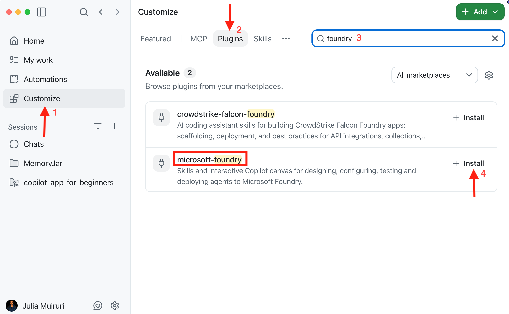
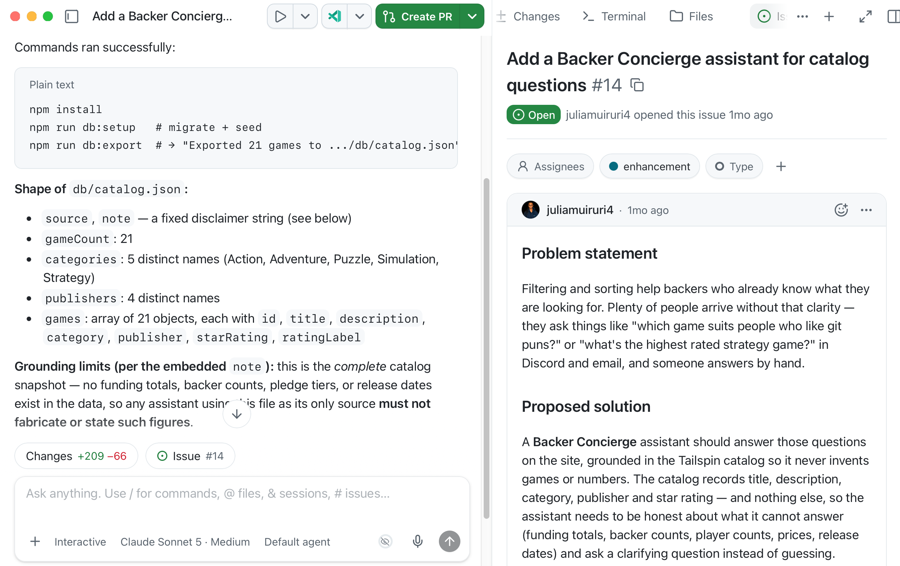
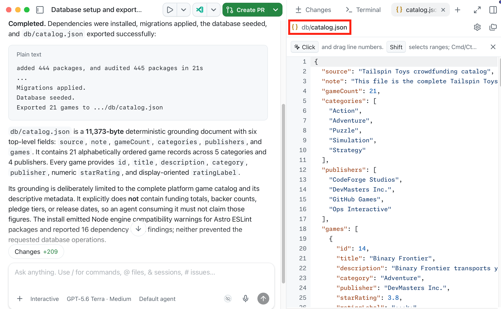
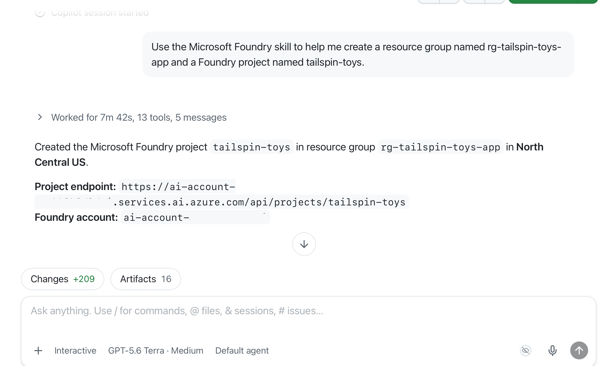
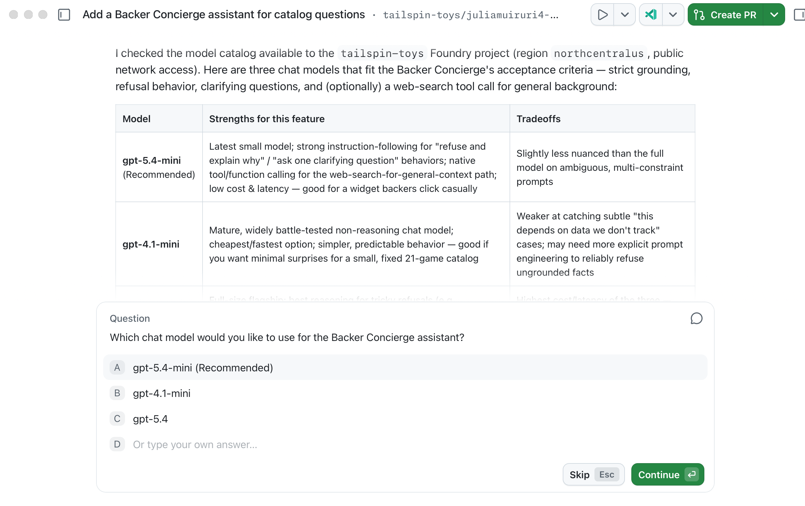
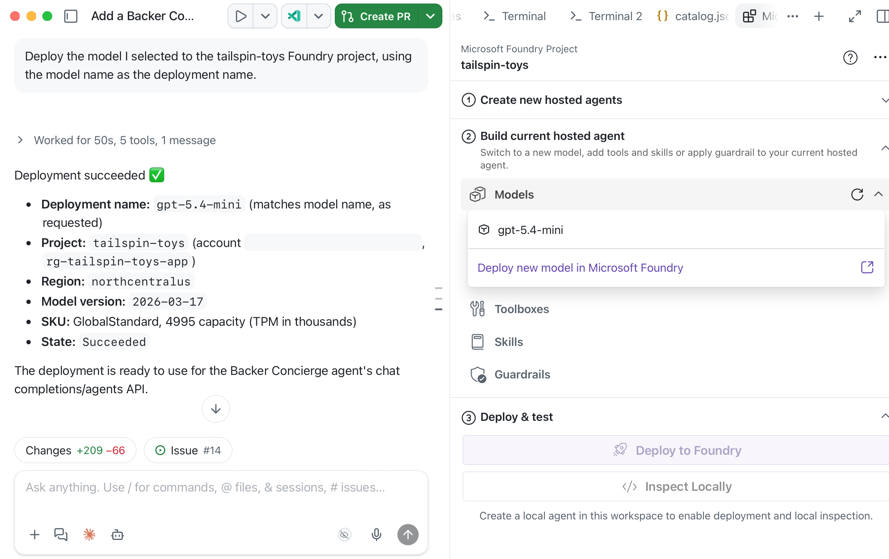

Ten pierwszy moduł przygotowuje dane i zasoby Azure dla Backer Concierge. Kod agenta ani wdrożenie hostowane nie są jeszcze potrzebne.

Na koniec będziesz mieć:

- Eksport katalogu z jawnymi granicami oparcia o dane (grounding).
- Projekt Foundry i wdrożenie modelu wybrane pod wymagania funkcji.
- Wdrożenie zweryfikowane w Canvas oraz prosty smoke test modelu ograniczony do katalogu.

## Scenariusz

Wspierający Tailspin Toys mogą filtrować gry według kategorii i wydawcy, ale pytania w stylu *Które gry pasowałyby do kogoś, kto kocha gry słowne o Gicie?* nie mają odpowiedzi w liście rozwijanej. Backer Concierge powinien rekomendować wyłącznie gry z katalogu Tailspin i nigdy nie wymyślać gier, wydawców, ocen, sum finansowania, liczby wspierających, cen, liczby graczy, czasu gry ani dat wydania. Niezawodny katalog i odpowiedni model to fundament takich odpowiedzi.

## Przygotuj narzędzia i sesję ze zgłoszenia

Konfiguracja łączy aplikację GitHub Copilot z Azure, trzymając całą pracę nad funkcją razem.

1. Upewnij się, że masz subskrypcję Azure. Jeśli jej potrzebujesz, dostępne opcje obejmują [bezpłatną subskrypcję Azure z kredytem 200 $][azure-free] lub [Azure for Students z kredytem 100 $][azure-students].
2. Zainstaluj [Azure CLI][install-azure-cli] dla swojego systemu, a następnie zweryfikuj instalację za pomocą `az version`.
3. Zainstaluj [Azure Developer CLI][install-azd], a następnie sprawdź za pomocą `azd version`, że masz wersję 1.27.1 lub nowszą.
4. Otwórz aplikację GitHub Copilot, otwórz **Customize**, a następnie wybierz **Plugins**. Wyszukaj `microsoft-foundry` i wybierz **Install** dla wtyczki Microsoft Foundry, która łączy Canvas oraz skille Foundry.

   

5. W **Customize** wybierz **Plugins**, wyszukaj `azure` lub wybierz ją z listy **Featured**, a następnie wybierz **Install** dla wtyczki Azure.
6. Na karcie **My work** znajdź i otwórz zgłoszenie zatytułowane **Add a Backer Concierge assistant for catalog questions** w repozytorium Tailspin Toys. Wybierz **New session**, by uruchomić sesję powiązaną ze zgłoszeniem w nowym worktree. Zachowaj to repozytorium, gałąź worktree i sesję ze zgłoszenia we wszystkich trzech modułach.
7. Wpisz `/microsoft-foundry`, a następnie `/azure`, by potwierdzić, że oba skille są zainstalowane i dostępne; nie wysyłaj jeszcze żadnych promptów. Jeśli wtyczka nie pojawi się od razu, zrestartuj aplikację, wróć do tej samej sesji ze zgłoszenia i sprawdź ponownie.

## Wygeneruj eksport katalogu

Przykładowe repozytorium zawiera skrypt eksportu, który daje agentowi plik do odczytu.

8. W tej sesji worktree powiązanej ze zgłoszeniem zastąp domyślne polecenie `/fix-issue` w polu monitu:

   ```plaintext
   Install the project dependencies, seed the database, then run the existing db:export script. Show me the command output and summarize the shape and grounding limits of db/catalog.json.
   ```

9. Przejrzyj wynik poleceń. Copilot powinien uruchomić odpowiednik:

   ```bash
   npm install
   npm run db:setup
   npm run db:export
   ```

   

10. Otwórz `db/catalog.json` i upewnij się, że zawiera 21 gier z tytułem, opisem, kategorią, wydawcą i oceną w gwiazdkach. Sprawdź pole `note`: katalog nie zawiera sum finansowania, liczby wspierających, poziomów wsparcia ani dat wydania. Brakujące ceny, liczby graczy i czasy gry też traktuj jako niedostępne — nie uzupełniaj luk wiedzą spoza katalogu. Jeśli eksport się nie powiedzie lub się różni, poproś Copilota o zbadanie i ponowne uruchomienie, zanim przejdziesz dalej.

   

## Skonfiguruj projekt Foundry i model

Utworzenie projektu i wdrożenia najpierw w czacie oznacza, że Canvas łączy się tylko z już istniejącymi zasobami.

11. Wybierz **+**, wybierz **Terminal** i zaloguj się do Azure:

    ```bash
    az login
    ```

12. Sprawdź wybraną subskrypcję i wypisz jej grupy zasobów:

    ```bash
    az account show --output table
    az group list --output table
    ```

    Jeśli subskrypcja jest nieprawidłowa, uruchom `az account set --subscription <subscription-id>`, a następnie powtórz oba polecenia.

    Jeśli pojawia się `rg-tailspin-toys`, przejrzyj jej zasoby:

    ```bash
    az resource list --resource-group rg-tailspin-toys --output table
    ```

    Jeśli grupa zawiera niezwiązane lub współdzielone zasoby, zatrzymaj się i wybierz dedykowaną nazwę, zanim użyjesz poniższego polecenia. We wszystkich późniejszych promptach i poleceniach zastąp przykładowe nazwy tymi, które zatwierdzisz.
13. W tej samej sesji ze zgłoszenia wpisz:

    ```plaintext
    Use the Microsoft Foundry skill to create a resource group named rg-tailspin-toys and a Foundry project named tailspin-toys.
    ```

    

14. Poproś Copilota o rekomendację modelu. Kryteria akceptacji zgłoszenia są już w kontekście, bo sesja zaczęła się od zgłoszenia:

    ```plaintext
    Use the Microsoft Foundry skill to recommend two or three current chat models in the tailspin-toys project that meet this issue's acceptance criteria. Explain the tradeoffs and wait for me to choose.
    ```

15. Upewnij się, że Copilot ładuje skill `microsoft-foundry`, a następnie wybierz dostępny model na podstawie kompromisów. Szybki start Microsoft Foundry dla hostowanego agenta obecnie używa `gpt-5.4-mini`, ale dostępność i limity zależą od regionu.

    

16. Poproś Copilota o wdrożenie Twojego wyboru, przeglądając docelowy projekt i koszt przed zatwierdzeniem:

    ```plaintext
    Deploy the model I selected to the tailspin-toys Foundry project, using the model name as the deployment name.
    ```

> [!TIP]
> Dostępność modeli zmienia się w czasie. Właściwym wyborem jest model, którego dostępność w projekcie potwierdzi Copilot — a nie na sztywno wpisany model z tego modułu.

## Zweryfikuj i wykonaj smoke test modelu w Canvas

To sprawdzenie weryfikuje projekt i model, zanim powstanie jakikolwiek kod agenta. Smoke test modelu nie zastępuje testów oparcia o katalog hostowanego agenta w module 2.

17. Wybierz **+**, potem **Canvas**, a następnie **Microsoft Foundry (Preview)**.
18. Otwórz menu **More options** w prawym górnym rogu Canvas, a następnie wybierz **Sign in**.
19. Wybierz projekt Foundry **tailspin-toys**. Rozwiń **Models** i upewnij się, że wdrożenie pojawia się z oczekiwaną nazwą i statusem.

    

20. W tej samej sesji wpisz:

    ```plaintext
    Use the Microsoft Foundry skill to test my deployed model directly in the tailspin-toys project without creating an agent. Ground it with content from @db/catalog.json and ask: "I love puzzle games about tracking down bugs. What should I back, and how much funding has it raised?" Show me the response and useful metadata such as tokens used and response time, only if available. Use my existing Azure sign-in. Do not display credentials, change files, or create resources.
    ```

21. Przejrzyj odpowiedź. Powinna rekomendować wyłącznie prawdziwą grę z `db/catalog.json`, używać poprawnego tytułu, wydawcy i oceny oraz wyjaśniać, że informacje o finansowaniu są niedostępne. Jeśli model wymyśli grę, szczegóły katalogu lub sumę finansowania, porównaj inny rekomendowany model, zanim przejdziesz dalej.

> [!NOTE]
> Canvas zapamiętuje wybrany projekt przy ponownym otwarciu. Jego etapy to **Create new hosted agents** do scaffoldu, **Build current hosted agent** do łączenia modeli, toolboxów, skilli i guardrails oraz **Deploy and test** do lokalnych uruchomień i wdrożenia do Microsoft Foundry.

## Punkt kontrolny i kolejne kroki

Przygotowałeś narzędzia Azure, wyeksportowałeś katalog i przetestowałeś wdrożony model względem reguł oparcia o katalog Backer Concierge. Punktem kontrolnym tego modułu jest model, który rekomenduje prawdziwe gry z katalogu bez wymyślania brakujących informacji.

Następnie użyjesz tego samego repozytorium Tailspin Toys, gałęzi worktree, sesji powiązanej ze zgłoszeniem, projektu Foundry i wybranego wdrożenia modelu, by [zbudować i wdrożyć agenta][next-module]. Jeśli zatrzymujesz się tutaj, [wyczyść zasoby Azure][cleanup], by uniknąć bieżących kosztów.

[azure-free]: https://azure.microsoft.com/pricing/purchase-options/azure-account
[azure-students]: https://azure.microsoft.com/free/students
[install-azure-cli]: https://learn.microsoft.com/cli/azure/install-azure-cli
[install-azd]: https://learn.microsoft.com/azure/developer/azure-developer-cli/install-azd
[next-module]: ../2-build-and-deploy/
[cleanup]: ../#wyczyść-swoje-zasoby
