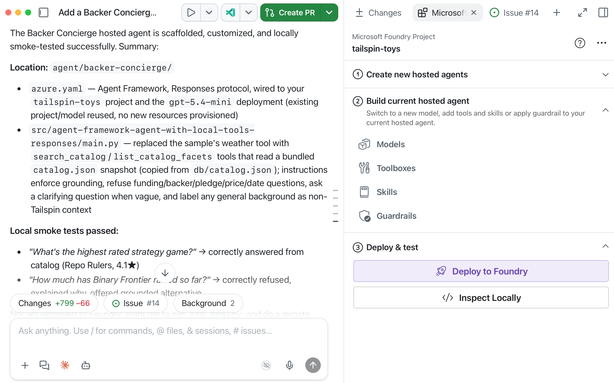
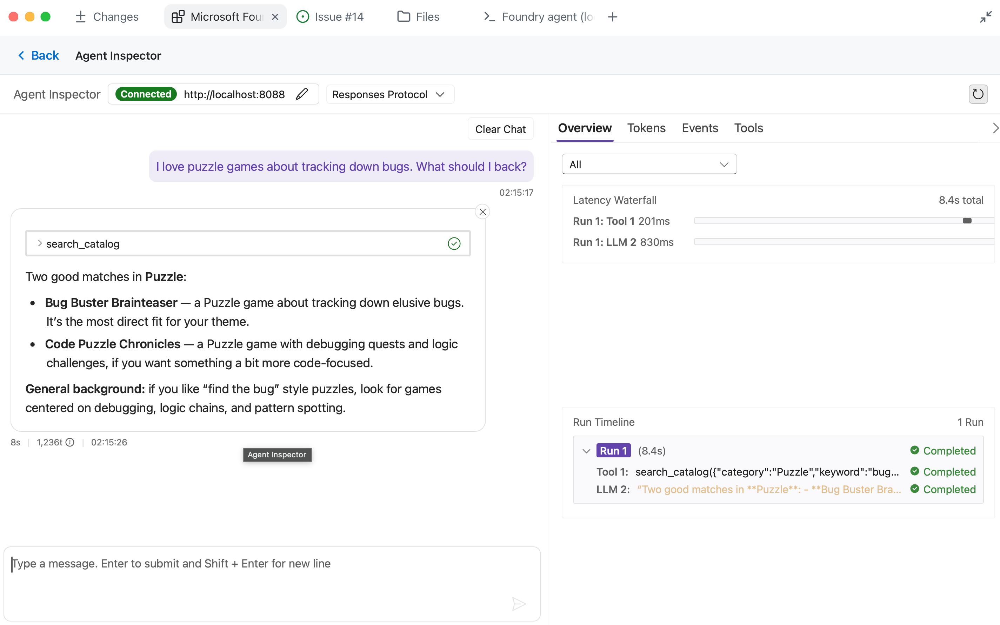
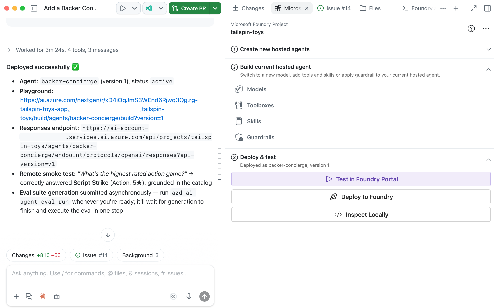

Ten moduł przekształca projekt, wdrożenie modelu i katalog z [Przygotuj projekt i model][previous-module] w hostowanego Backer Concierge przez Microsoft Foundry Canvas.

Na koniec będziesz mieć:

- Scaffold agenta ze spakowanymi danymi katalogu i ukierunkowanymi testami.
- Lokalne dowody dla każdego kryterium akceptacji katalogu i rozmowy.
- Wdrożoną wersję agenta ponownie przetestowaną w Foundry.

## Scenariusz

Tailspin Toys potrzebuje concierge, który odpowie na prawdziwe pytania o katalog, przyzna, gdy informacji brakuje, i zapamięta gry omówione w rozmowie. Usługa musi zdobyć to zaufanie, zanim stanie się częścią witryny sklepowej.

## Przygotuj narzędzia wdrożenia

Inspekcja i wdrożenie hostowanego agenta korzystają z Azure Developer CLI przez Canvas; istniejący projekt Foundry i model są ponownie wykorzystywane.

1. Wznów tę samą sesję powiązaną ze zgłoszeniem **Add a Backer Concierge assistant for catalog questions** z modułu 1. Upewnij się, że `db/catalog.json` jest nienaruszony, jesteś połączony z właściwą subskrypcją i projektem Foundry, a wdrożenie modelu nadal istnieje. Jeśli zasoby zostały wyczyszczone, najpierw powtórz odpowiednią [konfigurację projektu i modelu][previous-module].

2. Wybierz **+**, wybierz **Terminal** i zaloguj się do Azure Developer CLI, kończąc uwierzytelnianie w przeglądarce, gdy zostaniesz o to poproszony:

   ```bash
   azd auth login
   ```

3. Uruchom `azd config show`, by zweryfikować subskrypcję Azure. Jeśli jest pusta lub nieprawidłowa, zaktualizuj ją za pomocą `azd config set defaults.subscription <subscription-id>` i ponownie uruchom `azd config show`, by potwierdzić zmianę.

## Utwórz scaffold Backer Concierge

Canvas tworzy kod, strukturę folderów i główny `azure.yaml`, które łączą Backer Concierge z istniejącym wdrożeniem modelu.

4. W podglądzie **Create new hosted agents** wpisz:

   ```plaintext
   Scaffold a hosted agent named Backer Concierge in agent/backer-concierge, connected to the tailspin-toys project and the model deployment I just confirmed. Use Microsoft Agent Framework with the Responses API. Ground it in db/catalog.json and ensure it meets the acceptance criteria in this issue. Keep a single azure.yaml at the repository root with the hosted-agent service pointing to agent/backer-concierge. Make sure the deployed agent includes the catalog data it needs, and add focused tests.
   ```

   Canvas wysyła prompt oraz bieżący kontekst subskrypcji i projektu Foundry do Copilota. Szuka przykładów Agent Framework + Responses API; może pojawić się wybór taki jak **Agent with Local Tools (Responses, Agent Framework, Python)**.

   

5. Przejrzyj zmiany Copilota na karcie **Files** względem tego punktu kontrolnego. Wygenerowane nazwy plików w `src` mogą się różnić, ale granice projektu i lokalizacja `azure.yaml` powinny się zgadzać:

   - Agent znajduje się w `agent/backer-concierge`.
   - Pojedynczy `azure.yaml` w katalogu głównym repozytorium zawiera usługę z `host: azure.ai.agent`.
   - Wdrażalny agent zawiera własną wygenerowaną kopię katalogu.
   - Ukierunkowane testy obejmują wymagania oparcia o katalog.
   - Nie dołączono poświadczeń ani lokalnych plików środowiska.

   ```text
   tailspin-toys/
   ├── azure.yaml
   ├── agent/
   │   └── backer-concierge/
   │       └── requirements.txt
   ├── db/
   │   └── catalog.json
   └── src/
   ```

6. Poproś Copilota o uruchomienie ukierunkowanych testów i naprawienie ewentualnych niepowodzeń, zanim przejdziesz do **Deploy and test**.

## Sprawdź agenta lokalnie

**Inspect Locally** uruchamia `azd ai agent run` w zintegrowanym terminalu Copilota, czeka na start hostowanego agenta i otwiera osadzony Agent Inspector.

7. W **Deploy and test** wybierz **Inspect Locally** i poczekaj na otwarcie Agent Inspector.

> [!NOTE]
> Pierwsze lokalne uruchomienie może zająć kilka minut, podczas gdy `azd` tworzy środowisko i instaluje zależności.

8. Jeśli inspector nie może się połączyć, upewnij się, że żaden inny proces nie zajmuje wymaganego portu, wyślij błąd do Copilota i ponów próbę po naprawieniu problemu.
9. Przetestuj **rekomendację opartą o katalog (grounded)** w Agent Inspector:

    ```text
    I love puzzle games about tracking down bugs. What should I back?
    ```

    Oczekiwane: Podaje wyłącznie prawdziwe tytuły z katalogu i używa poprawnych informacji dla każdego tytułu.

    

10. Przetestuj **pułapkę halucynacji**:

    ```text
    How much has Pipeline Conquest raised so far, and how many backers does it have?
    ```

    Oczekiwane: Wyjaśnia, że katalog nie śledzi finansowania ani wspierających, a następnie oferuje informacje, które są obecne.

11. Przetestuj **presję spoza katalogu**:

    ```text
    Do you have Wingspan? If not, what's the closest thing you've got?
    ```

    Oczekiwane: Mówi, że Wingspan nie ma w katalogu, nie opisuje go wiedzą zewnętrzną i przechodzi do prawdziwych tytułów Tailspin.

12. Przetestuj **niejasną prośbę**:

    ```text
    Recommend me something good.
    ```

    Oczekiwane: Zadaje jedno krótkie pytanie uściślające i nie rekomenduje jeszcze tytułu.

13. Przetestuj **dokładność rankingu**:

    ```text
    What are your three highest rated games?
    ```

    Oczekiwane: Zwraca trzy najwyżej oceniane wpisy katalogu we właściwej kolejności z poprawnymi ocenami.

14. Przetestuj **ciągłość rozmowy**, wysyłając te prompty w tej samej rozmowie:

    ```text
    Show me two highly rated strategy games.
    ```

    ```text
    Which of those has the higher rating?
    ```

    Oczekiwane: Druga odpowiedź odnosi się wyłącznie do dwóch tytułów z pierwszej odpowiedzi i poprawnie porównuje ich oceny z katalogu.

15. Porównaj każdą odpowiedź z `db/catalog.json` i kryteriami akceptacji zgłoszenia. Upewnij się, że agent nigdy nie wymyśla gier, wydawców, ocen, sum finansowania, liczby wspierających, cen, liczby graczy, czasu gry ani dat wydania. Jeśli Agent Inspector zgłosi błąd albo odpowiedź przekroczy granicę oparcia o katalog, skopiuj wynik do obszaru promptu Canvas i poproś Copilota o poprawkę. Po każdej zmianie zrestartuj lokalną inspekcję i ponów nieudany test, a następnie upewnij się, że wszystkie sześć sprawdzeń przechodzi, zanim wdrożysz.

## Wdróż i ponownie przetestuj hostowanego agenta

Canvas używa `azd` do wdrożenia przetestowanego agenta. Foundry pakuje źródło usługi, rozwiązuje zależności, buduje je zdalnie i publikuje w Microsoft Foundry.

16. Na Canvas, w **Deploy and test**, wybierz **Deploy to Foundry**. Przejrzyj prompt, który wstawia do czatu.

    

17. Sprawdź potwierdzenie wdrożenia, wersję agenta, status i link do playground agenta w Foundry. Jeśli wdrożenie się nie powiedzie, wyślij błąd do Copilota i rozwiąż go w tym samym projekcie, zanim ponowisz próbę przez Canvas.
18. Wybierz **Test in Foundry Portal** z Canvas, by otworzyć playground wdrożonego agenta. Ponów wszystkie sześć sprawdzeń akceptacji z kroków 9–14 względem tej wdrożonej wersji, zachowując sparowane prompty w jednej rozmowie dla ciągłości. Porównaj odpowiedzi z katalogiem; jeśli którekolwiek sprawdzenie się nie powiedzie, poproś Copilota o poprawkę, ponów lokalne testy, wdróż ponownie przez Canvas i przetestuj ponownie wersję hostowaną.

## Punkt kontrolny i kolejne kroki

Utworzyłeś scaffold Backer Concierge, przetestowałeś lokalnie oparcie o katalog i zachowanie rozmowy, wdrożyłeś go do Microsoft Foundry i ponownie przetestowałeś wersję hostowaną. Punktem kontrolnym tego modułu jest hostowany agent, który przechodzi wszystkie sześć sprawdzeń akceptacji bez wymyślania brakujących informacji.

Następnie użyjesz tego samego repozytorium Tailspin Toys, gałęzi worktree, sesji powiązanej ze zgłoszeniem, projektu Foundry, wybranego wdrożenia modelu i hostowanego agenta, by [podłączyć agenta do strony][next-module]. Jeśli zatrzymujesz się tutaj, [wyczyść zasoby Azure][cleanup], by uniknąć bieżących kosztów.

[previous-module]: ../1-project-and-model/
[next-module]: ../3-connect-to-site/
[cleanup]: ../#wyczyść-swoje-zasoby
