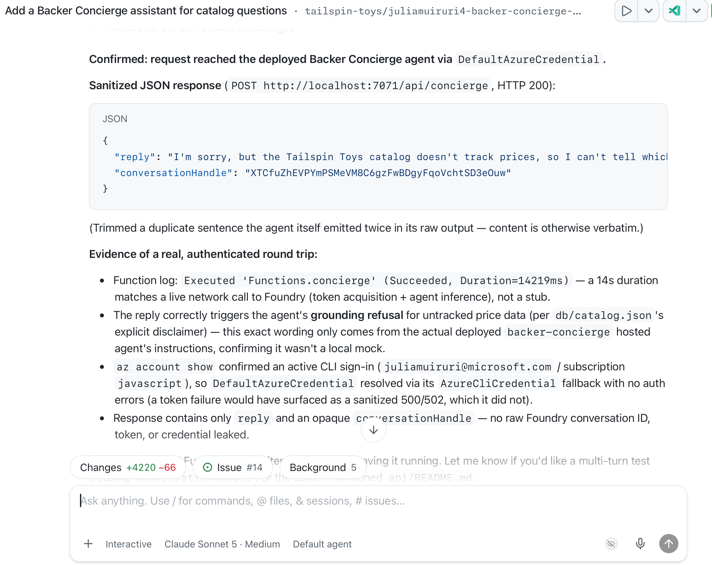
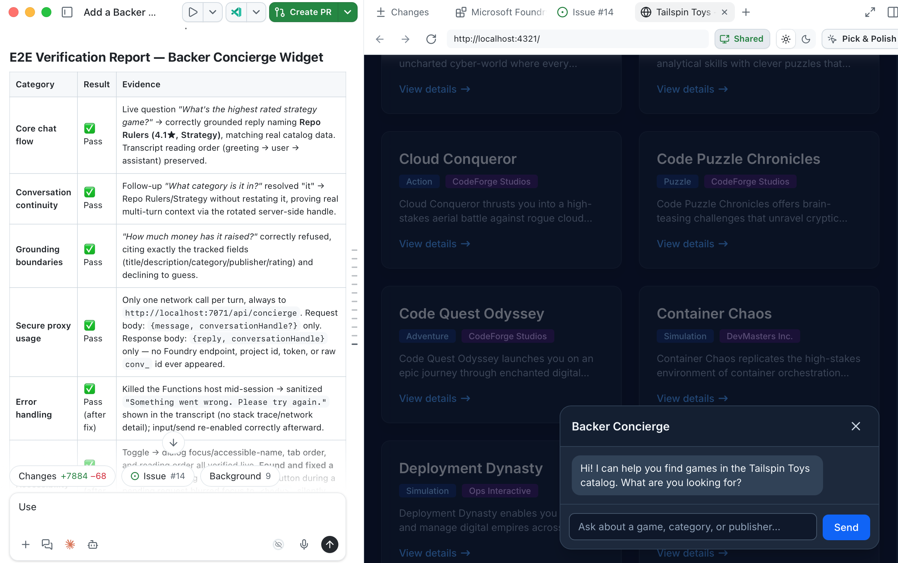

Ten ostatni moduł łączy przetestowanego hostowanego agenta z [Zbuduj i wdróż agenta][previous-module] z lokalnie działającą stroną Tailspin Toys.

Na koniec będziesz mieć:

- Lokalny proxy Azure Functions, który chroni poświadczenia Foundry i identyfikatory rozmów.
- Dostępny widget czatu ze zweryfikowanym zachowaniem od końca do końca.
- Lokalnie zweryfikowaną integrację oraz punkt kontrolny czyszczenia zasobów.

## Scenariusz

Wspierający Tailspin Toys potrzebują porad katalogowych tam, gdzie przeglądają gry. Backer Concierge powinien zachowywać rozmowę, działać z nawigacją klawiaturą oraz jasno obsługiwać niedostępne informacje i błędy. Ta wygoda nie może ujawniać przeglądarce poświadczeń usługi ani wewnętrznych szczegółów rozmowy.

## Wznów punkt kontrolny hostowanego agenta

Integracja korzysta z istniejącego hostowanego agenta zamiast tworzyć nowe zasoby Foundry.

1. Wznów to samo repozytorium Tailspin Toys, gałąź worktree i sesję ze zgłoszenia **Add a Backer Concierge assistant for catalog questions** z wcześniejszych modułów. Upewnij się, że główny `azure.yaml`, źródło agenta i katalog są obecne, oraz sprawdź zapisaną subskrypcję, dedykowaną grupę zasobów, projekt Foundry, wdrożenie modelu i przetestowaną wersję hostowanego agenta.
2. Jeśli zasoby zostały wyczyszczone, przywróć odpowiedni [projekt i model][project-module] oraz [przetestowane wdrożenie hostowane][previous-module] przed integracją.

## Zbuduj proxy po stronie serwera

Tailspin Toys jest w pełni wstępnie renderowane. Kod przeglądarki nigdy nie może wywoływać hostowanego agenta bezpośrednio ani otrzymywać poświadczeń Foundry. Lokalna **granica poświadczeń po stronie serwera** Azure Functions uwierzytelnia się w Foundry i zwraca do przeglądarki wyłącznie odpowiedź agenta. Przeglądarka wysyła każdą wiadomość z nieprzezroczystym uchwytem rozmowy; proxy mapuje ten uchwyt na rozmowę Foundry bez ujawniania leżącego pod spodem identyfikatora.

Proxy to jedyny fragment kodu, któremu wolno uzyskać dostęp do Twoich poświadczeń Azure. W tym warsztacie Function i strona działają lokalnie, a serwer deweloperski Astro przekazuje żądania `/api` do Function.

> [!IMPORTANT]
> Ten proxy warsztatowy jest wyłącznie do lokalnego rozwoju. Nie wolno go wdrażać jako anonimowego publicznego endpointu. Integracja produkcyjna wymaga projektu uwierzytelniania i kontroli nadużyć właściwego dla aplikacji, w tym odpowiednich limitów szybkości lub limitów (quota), ograniczeń CORS, monitorowania i kontroli kosztów.

3. W tej samej sesji Copilota wpisz:

   ```plaintext
   Add a local Azure Functions proxy in api for the static Astro site to call my deployed Backer Concierge during development. Use my existing local Azure sign-in, keep credentials and Foundry conversation identifiers out of the browser, return an opaque conversation handle, validate requests, sanitize errors, and add focused tests. Configure the Astro development server so /api requests reach the local Function. Don't create public deployment infrastructure.
   ```

4. Przejrzyj wygenerowany proxy i ukierunkowane testy pod kątem walidacji żądań, oczyszczonych błędów, nieprzezroczystych uchwytów rozmowy oraz granicy poświadczeń wyłącznie po stronie serwera. Poproś Copilota o uruchomienie ukierunkowanych testów i naprawienie ewentualnych niepowodzeń.
5. Otwórz kolejny terminal, uruchom lokalną Function poleceniem podanym przez Copilota i pozostaw ją działającą.
6. Wróć do czatu i poproś Copilota o przetestowanie lokalnego proxy:

   ```plaintext
   Test the local /api/concierge endpoint by asking "Which games are under $30?" Show me the sanitized response and confirm that no credentials or internal conversation identifiers are returned.
   ```

7. Przejrzyj odpowiedź: powinna wyjaśniać, że katalog nie zawiera cen. Upewnij się, że nie zawiera tokenu Foundry, poświadczenia, wewnętrznego identyfikatora rozmowy, endpointu projektu ani śladu stosu. Jeśli Function jest niedostępna albo odpowiedź wycieka szczegóły lub wymyśla ceny, wyślij oczyszczoną awarię do Copilota, napraw ją i ponów testy proxy, zanim przejdziesz dalej.

   

## Zbuduj i przetestuj widget czatu

Gdy proxy działa, widget zapewnia widoczną rozmowę na stronie bez ujawniania szczegółów Foundry.

8. Poproś Copilota o utworzenie integracji ze stroną:

   ```plaintext
   Add an accessible Backer Concierge chat widget to the Astro site. Connect it to /api/concierge, preserve the conversation using the returned opaque handle, follow the existing design guidance, support keyboard use, keep Foundry details out of the browser, and add end-to-end tests covering the chat flow, conversation continuity, accessibility, error handling, and grounding boundaries.
   ```

9. Uruchom serwer deweloperski Astro w kolejnym terminalu poleceniem podanym przez Copilota. Utrzymuj działające zarówno stronę, jak i lokalną Function.
10. Poproś Copilota o uruchomienie testów kompleksowych:

    ```plaintext
    Run the end-to-end tests for the Backer Concierge widget in the Tailspin Toys site. Verify its core chat flow, conversation continuity, accessibility, error handling, grounding boundaries, and secure use of the local proxy. Report the results and include evidence for any failures.
    ```

11. Przejrzyj raport i zweryfikuj deklarowane zachowanie w przeglądarce, w tym użycie klawiatury oraz rozmowę dwuturnową z [sprawdzeń akceptacji hostowanego agenta][agent-checks]. Upewnij się, że żądania przeglądarki idą przez `/api/concierge` z nieprzezroczystym uchwytem, a nie bezpośrednio do Foundry, oraz że odpowiedzi nie ujawniają poświadczeń ani wewnętrznych identyfikatorów Foundry. Sprawdź, że rekomendacje i odpowiedzi o brakujących danych pozostają w granicach katalogu. Rozwiąż nieprzechodzące testy z Copilotem, w razie potrzeby zrestartuj dotkniętą lokalną usługę i ponów testy.

    

## Punkt kontrolny i kolejne kroki

Zbudowałeś lokalny proxy chroniący poświadczenia, podłączyłeś dostępny widget czatu i zweryfikowałeś pełny przepływ rozmowy względem hostowanego Backer Concierge. Punktem kontrolnym tego modułu jest lokalnie przetestowana integracja ze stroną, która zachowuje granicę katalogu i trzyma poświadczenia oraz wewnętrzne identyfikatory Foundry poza przeglądarką. To nie jest produkcyjne wdrożenie proxy ani strony.

Gdy skończysz eksperymentować, zatrzymaj obie lokalne usługi i [wyczyść zasoby Azure][cleanup]. Następnie przejdź do [Podsumowanie i kolejne kroki][core-review] na trasie podstawowego warsztatu.

[previous-module]: ../2-build-and-deploy/
[project-module]: ../1-project-and-model/
[agent-checks]: ../2-build-and-deploy/#sprawdź-agenta-lokalnie
[cleanup]: ../#wyczyść-swoje-zasoby
[core-review]: ../../10-review/
