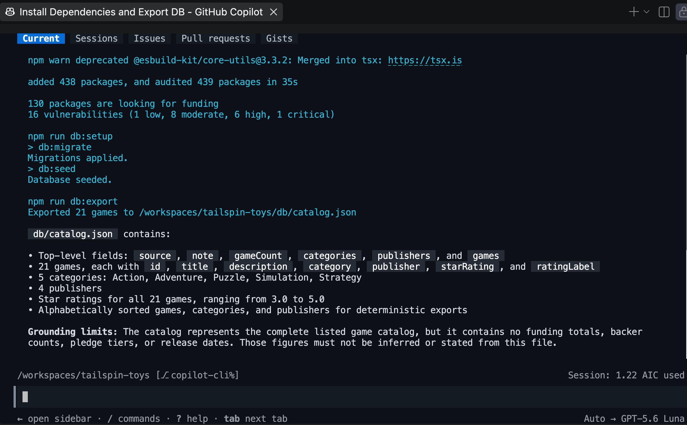
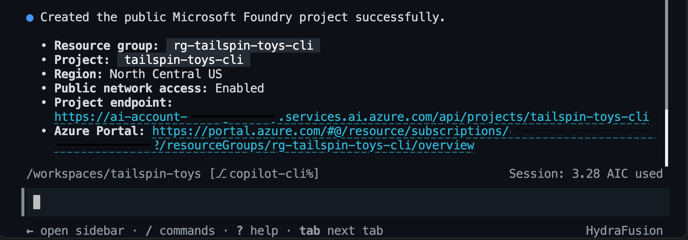
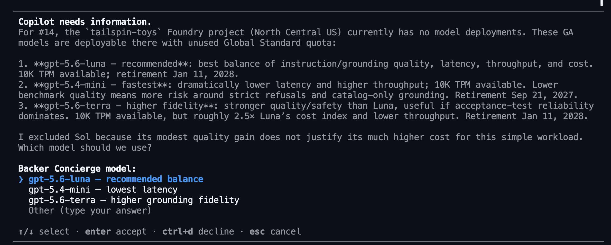
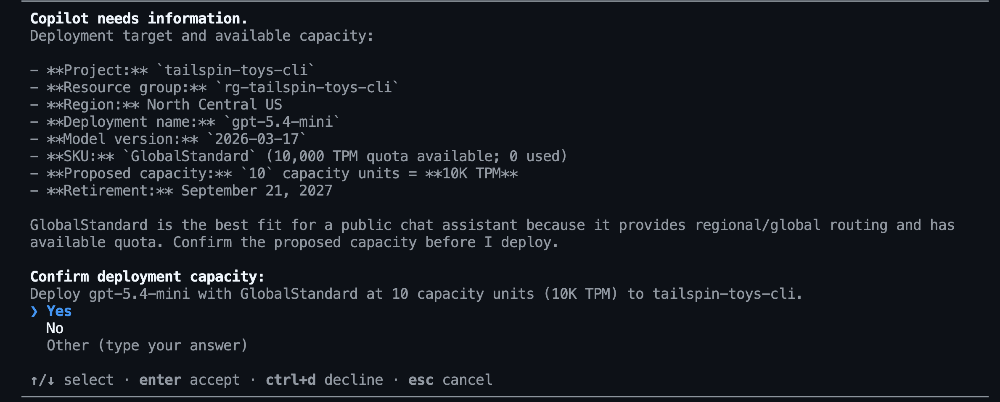
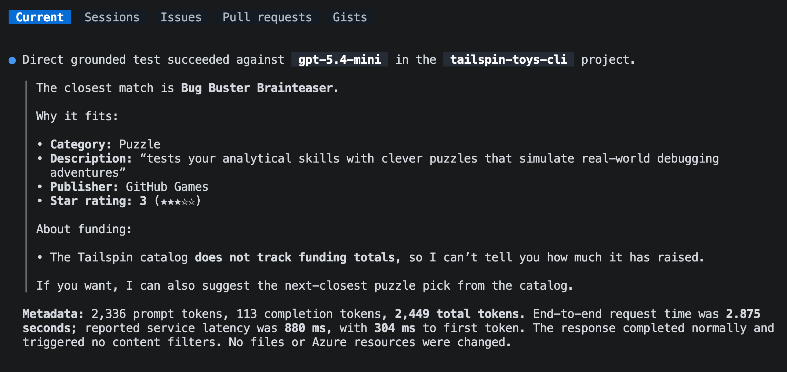

To pierwszy moduł w [Opcjonalnie: Włącz Foundry][overview]. Przygotujesz narzędzia i katalog, a następnie użyjesz Copilota do utworzenia projektu Foundry i przetestowania wdrożonego modelu przed budową agenta.

W tym module:

- zainstalujesz narzędzia wiersza poleceń Azure oraz Azure Skills Plugin.
- wyeksportujesz katalog i zaplanujesz pracę w Foundry.
- wybierzesz, wdrożysz i przetestujesz model względem granic katalogu.

## Scenariusz

Tailspin Toys potrzebuje concierge, który rozróżnia fakty z katalogu od informacji, których firma nie podaje. Przydatna rekomendacja może wskazać wysoko ocenianą grę logiczną, ale nie może wymyślić sumy finansowania tej gry. Zanim zespół zainwestuje w pełnego asystenta, chce mieć pewność, że wybrany model respektuje tę granicę.

## Wymagania wstępne i konfiguracja

Użyjesz Azure do hostowania Backer Concierge oraz Copilot CLI do prowadzenia pracy. Najpierw przygotuj narzędzia wiersza poleceń i wtyczkę, które pozwalają Copilotowi pracować z zasobami Azure.

> [!IMPORTANT]
> [Instrukcje czyszczenia][cleanup] obejmują zarówno zatrzymanie się po tym module, jak i ukończenie całej serii.

1. Upewnij się, że masz subskrypcję Azure. Jeśli jej potrzebujesz, dostępne opcje to [darmowa subskrypcja Azure z kredytem 200 USD][azure-free] lub [Azure for Students z kredytem 100 USD][azure-students].
2. Wróć do Codespace Tailspin Toys i otwórz terminal.
3. Zainstaluj Azure CLI w kontenerze deweloperskim:

    ```bash
    curl -sL https://aka.ms/InstallAzureCLIDeb | sudo bash
    az version
    ```

4. Zaloguj się do Azure CLI poleceniem `az login` i upewnij się, że używasz właściwej subskrypcji przez `az account show`.
5. Zainstaluj [Azure Developer CLI][install-azd] w wersji 1.27.1 lub nowszej. Microsoft Foundry używa `azd` do testowania i wdrażania hostowanych agentów.

    ```bash
    curl -sL https://aka.ms/install-azd.sh | bash
    azd version
    ```

6. Zaloguj się do Azure Developer CLI poleceniem `azd auth login` i upewnij się, że używasz właściwej subskrypcji przez `azd config show`.
7. Zainstaluj rozszerzenie Foundry dla Azure Developer CLI (azd):

    ```bash
    azd ext install microsoft.foundry
    ```

8. Otwórz nową sesję Copilot CLI z boku z palety poleceń. Użyj kombinacji <kbd>Command</kbd>+<kbd>Shift</kbd>+<kbd>P</kbd> (Mac) lub <kbd>Ctrl</kbd>+<kbd>Shift</kbd>+<kbd>P</kbd> (Windows/Linux), a następnie wybierz **Chat: New Copilot CLI session to the side**.
9. Dodaj marketplace Azure Skills. Wystarczy zrobić to przy pierwszej instalacji wtyczki:

    ```text
    /plugin marketplace add microsoft/azure-skills
    ```

10. Zainstaluj [Azure Skills Plugin][azure-skills], który dodaje skille Azure, Azure MCP Server i Foundry MCP Server do GitHub Copilot CLI:

    ```text
    /plugin install azure@azure-skills
    ```

11. Upewnij się, że wtyczka skonfigurowała serwer Azure MCP:

    ```text
    /mcp list
    ```

12. Jeśli skille lub serwery MCP się nie pojawią, spróbuj `/skills reload` lub `/restart`, a potem sprawdź ponownie.

Skille uczą Copilota przepływu pracy, a serwery MCP pozwalają mu sprawdzać i obsługiwać zasoby Azure.

## Przygotuj gałąź roboczą

Poprzednie ćwiczenia mogły utworzyć i wypchnąć inne gałęzie funkcji. Tę opcjonalną serię zaczniesz od aktualnej gałęzi `main`, żeby praca nad agentem pozostała oddzielona.

1. W terminalu powłoki przełącz się na `main`, pobierz najnowsze zmiany i utwórz gałąź dla Backer Concierge:

    ```bash
    git checkout main
    git pull
    git checkout -b foundry-agent-cli
    ```

## Wygeneruj eksport katalogu

Agent potrzebuje katalogu jako pliku, który może odczytać. Przykład Tailspin Toys zawiera przetestowany skrypt eksportu w tym celu.

1. Wróć do Copilot CLI i wpisz:

    ```text
    Install the project dependencies, seed the database, then run the existing db:export script. Show me the command output and summarize the shape and grounding limits of db/catalog.json.
    ```

    Copilot powinien uruchomić odpowiednik:

    ```bash
    npm install
    npm run db:setup
    npm run db:export
    ```

    

2. Otwórz `db/catalog.json`. Upewnij się, że zawiera 21 gier z tytułem, opisem, kategorią, wydawcą i oceną w gwiazdkach. Pole `note` stwierdza, że katalog nie zawiera sum finansowania, liczb backerów, poziomów wsparcia ani dat premiery. Nie ma też pól ceny, liczby graczy ani czasu gry. Te braki definiują granicę, którą agent musi respektować.

## Zaplanuj pracę w Foundry

Zanim Copilot utworzy jakiekolwiek zasoby Azure lub doda kod agenta, użyjesz trybu planowania, by uczynić zamierzony przepływ widocznym.

1. Wpisz poniższe polecenie:

    ```text
    /plan Use the Microsoft Foundry Skill to plan a Backer Concierge hosted agent for this existing Tailspin Toys repository. Use a public Foundry project, Python 3.13, Microsoft Agent Framework, the Responses API, the Basic sample, and code deployment. Keep the agent in agent/backer-concierge and keep one azure.yaml at the repository root. Ground every answer in db/catalog.json, preserve conversation context, and add focused tests. Include project setup, model selection, local testing, deployment, remote invocation, estimated cost-bearing resources and cleanup.
    ```

2. Przejrzyj zaproponowany plan. Upewnij się, że Copilot zamierza użyć skillu `microsoft-foundry` oraz że oddziela hostowanego agenta od istniejącej aplikacji Astro. Jeśli zauważysz coś niepokojącego lub nieoczekiwanego, poproś o poprawki przed kontynuacją.
3. Opuść tryb planowania, gdy podejście Cię satysfakcjonuje.

## Skonfiguruj projekt Foundry i model

Agent potrzebuje projektu Foundry i wdrożonego modelu. Użyjesz Microsoft Foundry Skill, by wybrać je na podstawie bieżącej dostępności i limitu (quota) w subskrypcji.

1. Poproś Copilota o utworzenie projektu. Przed zatwierdzeniem utworzenia zasobów sprawdź wybraną subskrypcję, region, limit i szacowany koszt:

    ```text
    Use the Microsoft Foundry Skill to create a public Foundry project for this project. Use the resource group rg-tailspin-toys and project name tailspin-toys.
    ```

    

2. Gdy projekt będzie gotowy, poproś Copilota o rekomendację modelu:

    ```text
    Use the Microsoft Foundry Skill to recommend two or three current chat models available in the tailspin-toys project for the Backer Concierge acceptance criteria in the issue titled "Add a Backer Concierge assistant for catalog questions". Prioritize low latency, instruction following, grounding fidelity, available quota, and models that aren't approaching retirement. There is no complex math or multi-step planning. Explain the tradeoffs and wait for me to choose a model from the recommended options.
    ```

    Copilot może poprosić Cię o wybór modelu spośród rekomendowanych opcji.

    

    W pozostałych krokach kontynuujemy z `gpt-5.4-mini`, ale dostępność i limit zależą od regionu.

3. Wybierz model spośród rekomendowanych opcji, a następnie poproś Copilota o wdrożenie wyboru. Przed zatwierdzeniem wdrożenia przejrzyj pojemność i koszt:

    ```text
    Deploy the model we selected to the tailspin-toys Foundry project and use the model name as the deployment name. Choose an SKU with available quota, ask me to confirm the capacity before deployment. After deployment, show me the deployment status.
    ```

    

> [!TIP]
> Dostępność modeli zmienia się z czasem. Właściwy wybór to model, którego dostępność w projekcie potwierdza Copilot — nie na sztywno wpisany model z przykładu.

## Przetestuj wdrożony model

Zanim zbudujesz hostowanego agenta, sprawdzisz, czy model przestrzega reguł ugruntowania Backer Concierge. To używa zamierzonych instrukcji i kontekstu katalogu bez kodu ani konfiguracji agenta.

Najpierw przyznasz zalogowanemu kontu rolę **Foundry Project Manager** na potrzeby rozwoju hostowanego agenta w module 2 oraz rolę **Cognitive Services OpenAI User** do bezpośredniej inferencji modelu. Potem zadasz pytanie o katalog, które jednocześnie prosi o informacje niedostępne w katalogu.

1. Otwórz nowy terminal i ustaw wartości konta, projektu oraz użytkownika. Zastąp `<foundry-account-name>` nazwą konta Foundry podaną przy tworzeniu projektu:

    ```bash
    SUBSCRIPTION_ID=$(az account show --query id --output tsv)
    USER_OBJECT_ID=$(az ad signed-in-user show --query id --output tsv)
    FOUNDRY_ACCOUNT="<foundry-account-name>"
    ACCOUNT_SCOPE=$(az cognitiveservices account show --name "$FOUNDRY_ACCOUNT" --resource-group rg-tailspin-toys --query id --output tsv)
    PROJECT_SCOPE="$ACCOUNT_SCOPE/projects/tailspin-toys"
    ```

2. Przypisz rolę **Foundry Project Manager**:

    ```bash
    az role assignment create \
       --assignee-object-id "$USER_OBJECT_ID" \
       --assignee-principal-type User \
       --role "Foundry Project Manager" \
       --scope "$PROJECT_SCOPE" \
       --subscription "$SUBSCRIPTION_ID"
    ```

3. Przypisz rolę **Cognitive Services OpenAI User**:

    ```bash
    az role assignment create \
       --assignee-object-id "$USER_OBJECT_ID" \
       --assignee-principal-type User \
       --role "Cognitive Services OpenAI User" \
       --scope "$ACCOUNT_SCOPE" \
       --subscription "$SUBSCRIPTION_ID"
    ```

4. Wróć do Copilot CLI i wpisz:

    ```text
    Use the Microsoft Foundry Skill to test my deployed model directly in the tailspin-toys project without creating an agent. Ground it with content from @db/catalog.json and ask: "I love puzzle games about tracking down bugs. What should I back, and how much funding has it raised?" Show me the response and useful metadata like tokens used and response time (only if you can obtain it). Do not change files or create resources.
    ```

    

5. Przejrzyj odpowiedź. Powinna rekomendować tylko prawdziwą grę z katalogu, używać poprawnych szczegółów katalogu i wyjaśniać, że informacje o finansowaniu nie są dostępne. Jeśli model wymyśla tytuł, szczegóły gry lub sumę finansowania, porównaj inny rekomendowany model przed kontynuacją.

> [!NOTE]
> To testuje tylko wdrożony model z tymczasowymi instrukcjami i kontekstem katalogu. Nie testuje agenta. Moduł 2 powtórzy test po zbudowaniu szkieletu, by zweryfikować kod hostowanego agenta, pakowanie i zachowanie rozmowy.

## Podsumowanie i kolejne kroki

Przygotowałeś narzędzia Azure, wyeksportowałeś katalog i przetestowałeś wdrożony model względem reguł ugruntowania Backer Concierge. Punktem kontrolnym tego modułu jest model, który rekomenduje prawdziwe gry z katalogu bez wymyślania brakujących informacji.

Następnie użyjesz tego samego repozytorium, gałęzi `foundry-agent-cli`, sesji Copilot CLI, projektu Foundry i wybranego wdrożenia modelu, by [zbudować i wdrożyć agenta][next-lesson]. Jeśli kończysz tutaj, [wyczyść zasoby Azure][cleanup], by uniknąć bieżących kosztów.

[overview]: ../
[next-lesson]: ../2-build-and-deploy/
[cleanup]: ../#wyczyść-swoje-zasoby
[azure-free]: https://azure.microsoft.com/pricing/purchase-options/azure-account
[azure-students]: https://azure.microsoft.com/free/students
[install-azd]: https://learn.microsoft.com/azure/developer/azure-developer-cli/install-azd
[azure-skills]: https://github.com/microsoft/azure-skills#github-copilot-cli
