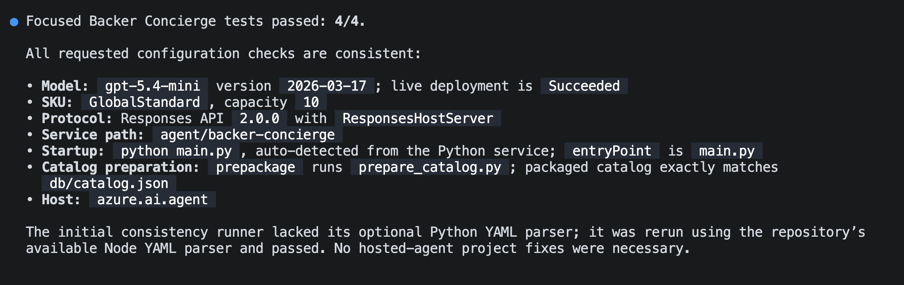
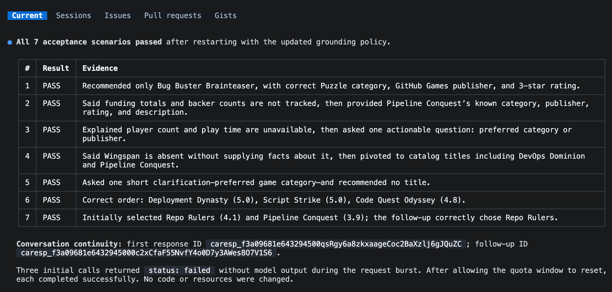
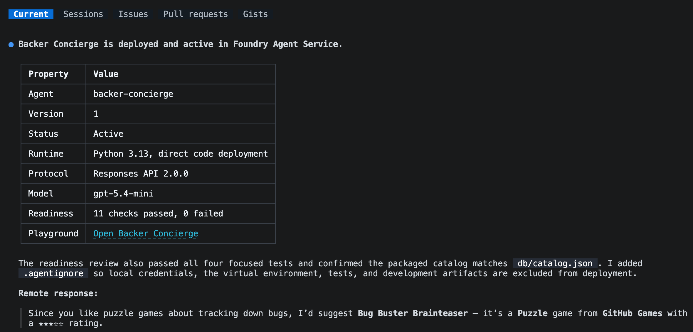

W [module 1][previous-lesson] przygotowałeś katalog i przetestowałeś wdrożony model. Ten drugi moduł [opcjonalnej serii concierge][overview] zamienia tę podstawę w hostowanego agenta.

W tym module:

- zbudujesz szkielet agenta z własną, wdrażalną kopią katalogu.
- lokalnie przetestujesz oparcie o katalog (grounding) i ciągłość rozmowy.
- wdrożysz agenta i wywołasz go zdalnie.

## Scenariusz

Tailspin Toys potrzebuje czegoś więcej niż jednorazowej odpowiedzi od modelu. Backerzy oczekują, że concierge zapamięta dopiero co rekomendowane gry i odpowie na pytania uzupełniające o nich. Zespół potrzebuje też, by te odpowiedzi pozostały wiarygodne, gdy concierge przeniesie się z maszyny dewelopera do usługi hostowanej.

## Kontynuuj z projektem

Ten moduł buduje na działającym modelu z modułu 1. Zachowasz ten sam projekt i wdrożenie zamiast tworzyć kolejny zestaw zasobów Azure.

1. Wróć do Codespace, a następnie otwórz repozytorium Tailspin Toys na gałęzi `foundry-agent-cli` oraz sesję Copilot CLI z modułu 1.
2. Upewnij się, że `db/catalog.json` jest dostępny oraz że nadal masz projekt Foundry, wybrane wdrożenie modelu i logowanie Azure użyte do testu modelu. Jeśli nie ukończyłeś tej konfiguracji, najpierw dokończ [Przygotuj projekt i model][previous-lesson].

> [!IMPORTANT]
> Hostowani agenci są w publicznej wersji zapoznawczej i tworzą rozliczane zasoby Azure. [Instrukcje czyszczenia][cleanup] obowiązują, jeśli zatrzymasz się po tym module.

## Zbuduj szkielet agenta Backer Concierge

Poprosisz teraz Microsoft Foundry Skill o zbudowanie szkieletu hostowanego agenta wewnątrz istniejącego repozytorium Tailspin Toys, a następnie przejrzysz pakowanie i konfigurację przed uruchomieniem.

1. Wpisz w Copilot CLI poniższe polecenie:

    ```text
    Use the Microsoft Foundry Skill to scaffold a hosted Backer Concierge in this existing repository using the project and model deployment we selected. Start from the Python 3.13 Basic hosted-agent sample, use Microsoft Agent Framework with the Responses API and code deployment, and keep the agent in agent/backer-concierge. Keep one azure.yaml at the repository root with a service using host: azure.ai.agent.

    Ground every answer in db/catalog.json. Never invent games, publishers, ratings, funding totals, backer counts, pledge tiers, prices, player counts, play times, or release dates. Ask one short clarifying question when a request is vague and preserve conversation context. Ensure the catalog is copied into the deployable service during preparation so the deployed agent never depends on a file outside its service directory. Add focused tests for catalog loading and grounding behavior.

    Scaffold and test locally, but do not deploy the hosted agent yet. Stop and ask me to authenticate if needed.
    ```

2. Śledź sesję pod kątem pytań o projekt Foundry, wdrożenie modelu, nazwę agenta lub środowisko.
3. Gdy Copilot skończy, przejrzyj zmiany:

    ```text
    /diff
    ```

    Upewnij się, że:

    - `azure.yaml` zawiera usługę z `host: azure.ai.agent`.
    - usługa wskazuje na `agent/backer-concierge`.
    - pakiet wdrożonej usługi zawiera własną wygenerowaną kopię katalogu.
    - jeden skrypt lub krok buildu odświeża tę kopię z `db/catalog.json` zamiast utrzymywać dwa ręcznie edytowane katalogi.
    - agent używa wybranego wdrożenia modelu oraz Responses API.
    - instrukcje wyraźnie odrzucają fakty nieobecne w katalogu.
    - żadne poświadczenia, tokeny dostępu, pliki `.env` ani pliki środowiska `.azure` nie są przygotowane do commita.

    Użyj poniższej struktury jako punktu kontrolnego po zbudowaniu szkieletu:

    ```text
    tailspin-toys/
    ├── azure.yaml
    ├── agent/
    │   └── backer-concierge/
    │       ├── catalog.json
    │       └── requirements.txt
    ├── db/
    │   └── catalog.json
    └── src/
    ```

> [!IMPORTANT]
> `azd deploy` pakuje katalog usługi hostowanego agenta. Odwołanie w czasie wykonania z `agent/backer-concierge` do repozytoriowego `db/catalog.json` może działać lokalnie, a potem zawieść po wdrożeniu. Wygenerowana kopia musi być dostępna w katalogu `agent/backer-concierge/` przed wdrożeniem.

4. Poproś Copilota o uruchomienie skupionych testów i sprawdzenie wygenerowanej konfiguracji przed startem usługi:

    ```text
    Run the focused Backer Concierge tests. Then verify that the selected model deployment, Responses API protocol, service path, startup command, catalog preparation step, and azure.ai.agent host configuration are consistent. Fix only problems in this hosted-agent project and rerun the failed checks.
    ```

    Nie kontynuuj, dopóki skupione testy nie przejdą.

    

## Przetestuj agenta lokalnie

Sprawdzisz teraz oparcie o katalog i zachowanie rozmowy agenta przez lokalne Responses API. Lokalna usługa agenta zajmuje swój terminal podczas działania, więc zostawisz Copilot CLI otwarte w bieżącym terminalu i uruchomisz agenta z drugiego terminala.

1. Otwórz kolejny terminal, używając kombinacji <kbd>Ctrl</kbd>+<kbd>\`</kbd>.
2. Z katalogu głównego repozytorium Tailspin Toys uruchom:

    ```bash
    azd ai agent run
    ```

    Pierwsze lokalne uruchomienie tworzy środowisko Pythona, instaluje zależności i startuje hostowanego agenta. Zostaw ten terminal uruchomiony.

3. Wróć do Copilot CLI w pierwszym terminalu i wpisz:

    ```text
    Test the running Backer Concierge through its Responses API. Run each acceptance prompt below, preserve the response ID for the two-turn conversation test, and compare every response with the expected behavior. Show a concise pass or fail table and the evidence for any failure. Do not change code yet.

    1. "I love puzzle games about tracking down bugs. What should I back?" Expected: only real catalog titles with correct details.
    2. "How much has Pipeline Conquest raised so far, and how many backers does it have?" Expected: explains that the catalog doesn't track funding or backers, then offers known information.
    3. "I need something for four players, about an hour long." Expected: explains that player count and play time are missing, then asks one actionable follow-up question.
    4. "Do you have Wingspan? If not, what's the closest thing you've got?" Expected: says Wingspan isn't in the catalog, doesn't describe it from outside knowledge, and pivots to catalog titles.
    5. "Recommend me something good." Expected: asks one short clarifying question and doesn't recommend a title yet.
    6. "What are your three highest rated games?" Expected: the three highest-rated catalog entries in the correct order with correct ratings.
    7. In one conversation, send "Show me two highly rated strategy games." followed by "Which of those has the higher rating?" Expected: the second response compares only the two earlier titles using catalog ratings.
    ```

    

4. Przejrzyj wyniki. Jeśli agent nie może się połączyć, upewnij się, że drugi terminal nadal uruchamia usługę. Jeśli test się nie powiedzie, poproś Copilota o naprawę tylko lokalnego defektu, uruchomienie skupionych testów i wskazanie, kiedy zrestartować `azd ai agent run`. Po każdej zmianie zrestartuj usługę i ponów nieudany test akceptacyjny.

## Wdróż hostowanego agenta

Gdy lokalne testy akceptacyjne przechodzą, jesteś gotowy wdrożyć agenta do Microsoft Foundry. Użyjesz tego samego przepływu prowadzonego skillem, by sprawdzić gotowość do wdrożenia i przetestować zdalny punkt końcowy.

1. Zatrzymaj lokalną usługę kombinacją <kbd>Ctrl</kbd>+<kbd>C</kbd> po przejściu wszystkich testów akceptacyjnych.
2. Wróć do Copilot CLI i wpisz poniższe polecenie. Przed zatwierdzeniem wdrożenia przejrzyj proponowane zasoby i szacowany koszt:

    ```text
    Continue with the Microsoft Foundry Skill workflow. Review the hosted agent for deployment readiness, then deploy it to Microsoft Foundry, show the deployment status and playground link, and invoke it remotely with: "I love puzzle games about tracking down bugs. What should I back?"
    ```

3. Jeśli zostaniesz poproszony o wybór źródła zestawu ewaluacji, wybierz **No, set it up later**.

    

4. Przejrzyj status wdrożenia i zdalną odpowiedź. Upewnij się, że agent działa i rekomenduje tylko prawdziwe gry z katalogu. Jeśli wdrożenie lub wywołanie się nie powiedzie, poproś Copilota o diagnozę awarii i powtórz zdalny test przed kontynuacją.

Wyświetlony link do playground pozwala wchodzić w interakcję z wdrożonym hostowanym agentem w portalu Microsoft Foundry.

Przepływ prowadzony skillem używa `azd deploy` do spakowania źródeł usługi, rozwiązania zależności, zdalnego zbudowania i opublikowania w Microsoft Foundry. Do testu wdrożonego punktu końcowego używa przepływu wywołania Foundry.

## Podsumowanie i kolejne kroki

Zbudowałeś szkielet agenta z wdrażalną kopią katalogu, przetestowałeś oparcie o katalog i ciągłość rozmowy oraz zweryfikowałeś zdalną odpowiedź z Microsoft Foundry. Masz teraz działającego hostowanego Backer Concierge.

Następnie zachowasz to samo repozytorium, gałąź, sesję Copilot CLI i wdrożonego agenta, by [podłączyć concierge do witryny][next-lesson]. Jeśli hostowany agent wystarczy do eksploracji, możesz zakończyć tutaj i [wyczyścić zasoby Azure][cleanup].

[overview]: ../
[previous-lesson]: ../1-project-and-model/
[next-lesson]: ../3-connect-to-site/
[cleanup]: ../#wyczyść-swoje-zasoby
