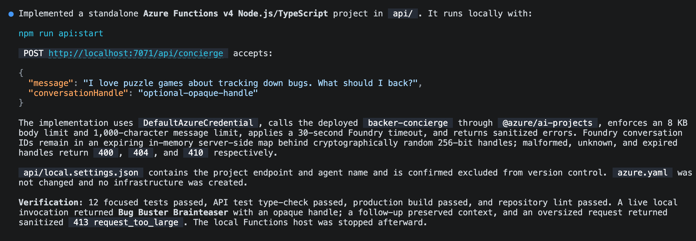
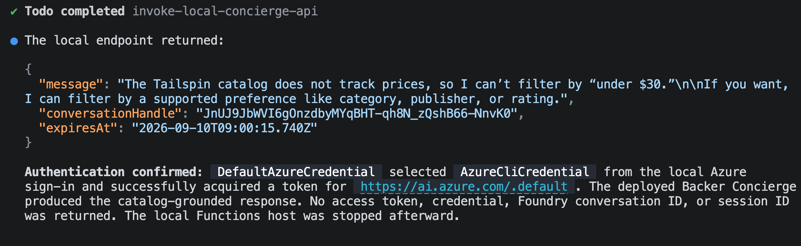
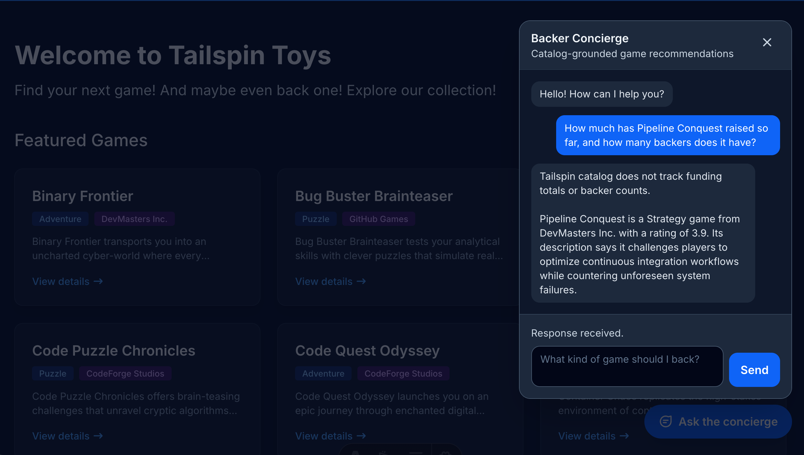

W [module 2][previous-lesson] wdrożyłeś i przetestowałeś Backer Concierge. Ten ostatni moduł [opcjonalnej serii concierge][overview] udostępnia tego agenta przez lokalną witrynę Tailspin Toys.

W tym module:

- zbudujesz lokalne proxy Azure Functions, które trzyma poświadczenia Foundry po stronie serwera.
- dodasz dostępny widżet czatu do witryny.
- zweryfikujesz pełny przepływ rozmowy i wyczyścisz zasoby.

## Scenariusz

Backerzy odkrywają gry na witrynie Tailspin Toys, a nie w terminalu dewelopera ani w portalu Azure. Zespół chce, by concierge był dostępny obok katalogu — z doświadczeniem czatu wspierającym pytania uzupełniające i chroniącym poświadczenia usługi.

## Kontynuuj z hostowanym agentem

Integracja z witryną potrzebuje wdrożonego agenta z modułu 2. Zachowasz tego agenta uruchomionego w Foundry, podczas gdy proxy i witryna działają lokalnie.

1. Wróć do Codespace, a następnie otwórz repozytorium Tailspin Toys na gałęzi `foundry-agent-cli` oraz istniejącą sesję Copilot CLI.
2. Upewnij się, że Backer Concierge jest wdrożony oraz że zdalne wywołanie z [Zbuduj i wdróż agenta][previous-lesson] przeszło. Jeśli już usunąłeś zasoby Azure, odtwórz je przez wcześniejsze moduły przed kontynuacją.

> [!IMPORTANT]
> Proxy i witryna w tym module działają lokalnie; to nie jest produkcyjne wdrożenie witryny. Model i hostowany agent pozostają rozliczanymi zasobami Azure, dopóki nie ukończysz [czyszczenia][cleanup].

## Zbuduj proxy po stronie serwera

Tailspin Toys jest w pełni wstępnie renderowane. Kod przeglądarki nigdy nie może wywoływać hostowanego agenta bezpośrednio ani otrzymywać poświadczeń Foundry. Dodasz lokalną **granicę poświadczeń po stronie serwera** Azure Functions, która uwierzytelnia się w Foundry i zwraca do przeglądarki tylko odpowiedź agenta.

Skill `microsoft-foundry` odpowiada za przepływ hostowanego agenta, a szersze skille Azure w tej samej wtyczce mogą przygotować lokalny projekt Function. Użyjesz tych skilli do zbudowania proxy, a potem sprawdzisz, że sięga do agenta bez ujawniania poświadczeń.

1. W Copilot CLI wpisz:

    ```text
    Use the Azure skills to add an Azure Functions v4 Node.js and TypeScript project in api with one POST /api/concierge endpoint that invokes my deployed Backer Concierge hosted agent. This Function will run locally only; don't add it to azure.yaml or create Azure deployment infrastructure. Use DefaultAzureCredential with my local Azure sign-in. Keep the HTTP trigger thin, isolate the Foundry client in a unit-testable module, validate and limit request bodies, set explicit timeouts, and return sanitized errors. Store the Foundry project endpoint and agent name in local server-side settings that are excluded from version control. Never return credentials or access tokens to the browser. The Astro site is `output: 'static'` with no dev proxy, so also add a local-only Vite dev-server proxy for /api to the Function's port in astro.config.mjs, so relative /api/concierge requests reach it during `astro dev`.

    For conversation state, generate a high-entropy handle on the server, map it to the Foundry conversation server-side with an expiration, and never expose a raw Foundry conversation or thread identifier. Reject malformed, expired, and unknown handles. Add focused unit tests.
    ```

    

2. Otwórz kolejny terminal, a następnie uruchom lokalną Function poleceniem podanym przez Copilota. Zostaw Function uruchomioną.
3. Wróć do Copilot CLI i poproś Copilota o przetestowanie lokalnego proxy:

    ```text
    Send a request to the local /api/concierge endpoint asking "Which games are under $30?" and show me the sanitized JSON response. Confirm that the request reaches the deployed Backer Concierge through DefaultAzureCredential.
    ```

4. Przejrzyj odpowiedź. Powinna wyjaśniać, że katalog nie zawiera cen. Nie może zawierać tokenu Foundry, poświadczenia, punktu końcowego projektu, surowego identyfikatora rozmowy Foundry ani śladu stosu.

    

## Zbuduj widżet czatu

Proxy daje przeglądarce bezpieczny sposób na dotarcie do concierge. Dodasz teraz widżet czatu do witryny i użyjesz Playwright do sprawdzenia pełnego przepływu rozmowy.

1. Poproś Copilota o utworzenie integracji z witryną:

    ```text
    Add an accessible Backer Concierge chat widget as an Astro component and render it site-wide from Layout.astro. It should POST to /api/concierge and thread the conversation using the returned opaque conversation handle, follow the dark theme in style.instructions.md, support Escape to close, and include data-testid attributes.
    ```

2. Zostaw lokalną Function uruchomioną i uruchom witrynę Astro w kolejnym terminalu poleceniem podanym przez Copilota.
3. Wróć do Copilot CLI. Serwer Playwright MCP, który sprawdziłeś lub dodałeś w [ćwiczeniu 6][playwright-lesson], jest już dostępny. Poproś Copilota o przetestowanie widżetu:

    ```text
    Use the Playwright MCP server to test the Backer Concierge widget end to end in the running Tailspin Toys site. Verify its core chat flow, conversation continuity, accessibility, error handling, grounding boundaries, and secure use of the local proxy. Report the results and include evidence for any failures.
    ```

    

4. Przejrzyj wyniki względem zgłoszonych dowodów. Jeśli któreś sprawdzenia się nie powiodą, poproś Copilota o naprawę odpowiedniego zachowania proxy lub widżetu i ponów nieudane sprawdzenia przed zakończeniem.

## Wyczyść swoje zasoby

Dotarłeś do ostatniego punktu kontrolnego: działającego concierge w lokalnej witrynie. Wspólne instrukcje czyszczenia obejmują zarówno lokalne usługi, jak i zasoby Azure utworzone w całej serii.

1. Ukończ [Wyczyść swoje zasoby][cleanup], w tym zatrzymanie lokalnych usług i potwierdzenie, że usuwanie zasobów Azure się kończy.

## Podsumowanie i kolejne kroki

Podłączyłeś hostowanego Backer Concierge do Tailspin Toys przez lokalne proxy po stronie serwera i dostępny widżet czatu. W całej serii używałeś GitHub Copilot CLI i Foundry, by przygotować model, zbudować i wdrożyć agenta oraz zweryfikować pełną integrację z witryną.

Przejdź do [Podsumowanie i kolejne kroki][review], by zamknąć warsztat CLI.

[overview]: ../
[previous-lesson]: ../2-build-and-deploy/
[review]: ../../10-review/
[playwright-lesson]: ../../6-mcp-playwright/
[cleanup]: ../#wyczyść-swoje-zasoby
