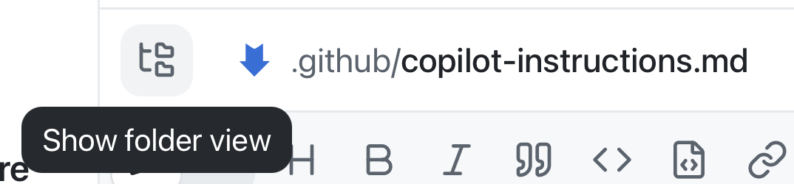
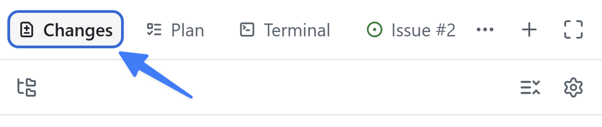

O contexto é fundamental ao trabalhar com IA generativa. Se uma tarefa precisa ser realizada de determinada maneira ou se há informações de apoio que o Copilot deve conhecer, esse contexto precisa estar disponível. Uma das ferramentas mais eficientes para isso são os [arquivos de instruções][instruction-files], que descrevem não apenas *qual* código você deseja, mas *como* ele deve ser estruturado. Nesta lição, você adicionará um padrão de documentação ao repositório. Você fará isso da mesma forma que realizará a maior parte do trabalho daqui em diante: começando por uma issue do backlog e permitindo que o agente faça a alteração.

Nesta lição, você vai:

- explorar como as instruções do repositório e os arquivos de instruções com escopo de caminho chegam ao agente.
- iniciar uma sessão a partir da issue de instruções no backlog.
- pedir ao agente que adicione um padrão de documentação específico aos arquivos de instruções adequados do repositório.
- demonstrar o padrão com uma pequena alteração real de código, validá-la e fazer o merge do PR 2.

## Cenário

Como toda boa equipe de desenvolvimento, a Tailspin Toys tem diretrizes e requisitos para as práticas de desenvolvimento. Entre eles estão:

- Os comentários devem explicar a intenção e as decisões não óbvias, em vez de repetir o código.
- As funções exportadas em `db/` e `src/lib/` devem documentar seu propósito, parâmetros e valores de retorno com TSDoc/JSDoc, incluindo um argumento `db` injetável quando presente.
- Os componentes reutilizáveis de Astro devem documentar seus contratos de `Props`, e os comentários devem ser mantidos atualizados quando o código relacionado mudar.
- As orientações existentes de formatação e lint devem ser preservadas.

Com os arquivos de instruções, você garantirá que o Copilot tenha as informações certas para executar as tarefas de acordo com as práticas destacadas.

## Arquivos de instruções

As instruções personalizadas permitem fornecer contexto e preferências ao Copilot para que ele compreenda melhor seu estilo de programação e seus requisitos. Esse recurso ajuda a orientar o Copilot para obter sugestões e trechos de código mais relevantes. Você pode especificar convenções de código, bibliotecas e até os tipos de comentários que deseja incluir no código. É possível criar instruções para todo o repositório ou para tipos de arquivo específicos, fornecendo contexto no nível da tarefa.

O projeto usa dois tipos de arquivos de instruções:

- `.github/copilot-instructions.md`, um único arquivo de instruções enviado ao Copilot em **todas** as solicitações do repositório. Esse arquivo deve conter informações no nível do projeto, ou seja, contexto relevante para a maioria das solicitações enviadas ao Copilot pelo chat ou pela CLI. Isso pode incluir a pilha de tecnologias usada, uma visão geral do que está sendo criado, boas práticas e outras orientações globais.
- Os arquivos `.github/instructions/*.instructions.md` podem ser criados para tarefas ou tipos de arquivo específicos. Você pode usá-los para fornecer diretrizes para determinadas linguagens, como TypeScript ou Astro, ou para tarefas como criar um componente de interface ou um novo conjunto de testes de unidade.

> [!NOTE]
> Outros formatos de instruções e seu suporte variam conforme o ambiente. Consulte a [referência de suporte a instruções personalizadas][custom-instructions-support] antes de depender de um formato específico.

### Boas práticas para gerenciar arquivos de instruções

Uma discussão completa sobre a criação de arquivos de instruções está fora do escopo do workshop. No entanto, os exemplos fornecidos no projeto de amostra demonstram uma abordagem representativa. Em termos gerais:

- Mantenha as instruções em `copilot-instructions.md` concentradas em orientações no nível do projeto, como uma descrição do que está sendo criado, a estrutura do projeto e os padrões globais de código.
- Use arquivos `*.instructions.md` para fornecer instruções específicas para tipos de arquivo, como testes de unidade, componentes Astro e a camada de dados, ou para tarefas específicas.
- Use linguagem natural. Mantenha as orientações claras. Forneça exemplos de como o código deve e não deve ser.

Não existe uma única maneira correta de criar arquivos de instruções, assim como não existe uma única maneira correta de usar IA. Com a experimentação, você descobrirá o que funciona melhor para seu projeto.

> [!TIP]
> Todo projeto que usa o GitHub Copilot deve ter uma coleção robusta de arquivos de instruções. Ao explorar os arquivos deste projeto, você perceberá que há instruções para vários tipos de arquivos de código.
>
> Procura modelos ou um ponto de partida? Explore o [awesome-copilot][awesome-copilot], um repositório repleto de arquivos de instruções, agentes personalizados e outros recursos.

## Explorar os arquivos de instruções personalizadas deste projeto

Reserve um momento para ler os arquivos de instruções incluídos no repositório. Há um arquivo principal `copilot-instructions.md` e uma coleção de arquivos `*.instructions.md` para várias tarefas. Abra-os no editor ou na interface Web do GitHub.

1. Se o painel de revisão ainda não estiver visível, abra-o selecionando **Toggle review panel** no canto superior direito.

   

2. Selecione **+** para adicionar um novo item ao painel de revisão.
3. Selecione **File**.
4. Pesquise `copilot-instructions.md`.
5. Selecione `copilot-instructions.md` na lista de arquivos para abri-lo.
6. Explore o arquivo. Observe a breve descrição do projeto e seções como **Agent notes**, **Code standards**, **Scripts** e **Repository Structure**. Em **Code standards**, observe a orientação aninhada **GitHub Actions Workflows**. Essas instruções se aplicam a qualquer interação com o Copilot.
7. Selecione **Show folder view** para abrir o navegador de pastas.

   

8. Acesse a pasta `.github/instructions` e explore os arquivos. Observe que há instruções para arquivos Astro, a camada de dados Drizzle, testes e muito mais.
9. Abra `.github/instructions/unit-tests.instructions.md`. Observe o campo `applyTo` na parte superior. Ele define um glob, relativo à raiz do repositório, que determina a quais arquivos as instruções se aplicam. Nesse caso, qualquer arquivo de teste TypeScript, por exemplo um arquivo correspondente a `**/*.test.ts`, será incluído.
10. Observe as instruções específicas para criar testes de unidade neste projeto.
11. Por fim, abra `.github/instructions/drizzle.instructions.md` e role até o final. Observe os links para outros arquivos de instruções, como `unit-tests.instructions.md`, e para arquivos existentes no projeto. Isso permite dividir conjuntos maiores de instruções em arquivos menores e reutilizáveis e indicar ao Copilot exemplos a serem seguidos ao gerar código. Os caminhos ali são relativos ao arquivo de instruções, e não à raiz do repositório.

> [!NOTE]
> Compare as orientações existentes com a issue real de padrões de código antes de adicionar regras. Esta lição foca em comentários que explicam intenção, documentação de funções exportadas da camada de dados e contratos de `Props` de Astro, não em cabeçalhos obrigatórios para todos os arquivos ou comentários que repetem o código.

## Começar pela issue de instruções

Confirme que o PR 1 foi integrado antes de criar esta sessão. Inicie um worktree novo para o PR 2; não continue na branch de avaliações por estrelas. A maior parte do trabalho começa com uma issue, então use a issue de padrões de código para fornecer os requisitos.

> [!NOTE]
> Como os arquivos de instruções têm grande impacto no código gerado pelo Copilot, é preciso garantir que eles orientem o Copilot com clareza. Permitir que o Copilot crie uma primeira versão, como você fará nesta lição, é uma ótima abordagem. Depois, revise o resultado para confirmar que as atualizações atendem aos requisitos.

1. Selecione **My work** na barra lateral.
2. Selecione a issue intitulada **Update our repository coding standards** para abri-la.
3. Selecione **New session** no canto superior direito, escolha **new working tree** e selecione o modo **Interactive**.

   

4. Use o prompt a seguir. Atualizar a branch da nova sessão antes de editar faz com que a versão integrada mais recente de `main` seja o ponto de partida real, mesmo se a cópia local do aplicativo estiver desatualizada:

   ```plaintext
   Antes de editar, identifique esta cópia de trabalho e a branch, confirme que é um worktree novo e limpo, busque as atualizações de origin e avance a branch desta sessão por fast-forward até origin/main. Confirme que HEAD corresponde a origin/main e inclui o PR integrado de avaliações por estrelas. Pare se houver alterações pendentes, divergências ou se esse merge estiver ausente; não redefina, não descarte trabalho nem crie outra branch.

   Leia a issue "Update our repository coding standards" e as instruções existentes do repositório. Adicione uma convenção de documentação específica: explique a intenção em vez da mecânica; documente funções exportadas em db/ e src/lib/ com TSDoc/JSDoc cobrindo propósito, parâmetros, retornos e argumentos db injetáveis quando presentes; documente os contratos de Props dos componentes reutilizáveis de Astro; e mantenha os comentários atualizados quando o código relacionado mudar.

   Coloque cada regra no arquivo de instruções existente adequado, sem duplicações ou contradições, e inclua um link ou resumo do padrão atualizado em README. Preserve as orientações existentes de formatação e lint. Não exija cabeçalhos para todos os arquivos, não migre ferramentas de formatação, não reescreva a documentação de toda a aplicação nem implemente a filtragem. Mostre o diff das instruções e pare para revisão. Não crie uma skill ou agente, não faça commit, push nem crie um PR.
   ```

O Copilot fará as atualizações.

## Revisar a alteração

Leia as orientações atualizadas e demonstre seu efeito em um arquivo real. Apenas um trecho proposto não demonstra que as instruções do repositório influenciaram uma alteração de código.

1. Selecione **Changes** no canto superior direito para abrir as alterações no código.

   

2. Revise os arquivos de instruções atualizados e a referência em README. Confirme que as regras correspondem à filosofia de comentários, à documentação de funções exportadas e aos contratos de componentes da issue, sem inventar uma exigência geral de cabeçalhos de arquivo.

> [!NOTE]
> Como a IA é probabilística, e não determinística, o texto exato pode variar.

3. Após revisar as instruções, solicite uma demonstração com escopo limitado nesta mesma sessão:

   ```plaintext
   Demonstre a convenção de documentação atualizada em uma pequena função auxiliar TypeScript exportada existente em db/ ou src/lib/, ou em um componente reutilizável de Astro. Examine o repositório para escolher um arquivo existente adequado; não presuma que existe uma função auxiliar de distribuidoras. Faça uma pequena melhoria de legibilidade que preserve o comportamento e aplique as orientações relevantes de documentação de funções ou contratos de Props. Explique intenções não óbvias sem adicionar comentários que apenas repitam o código.

   Limite a alteração a essa demonstração e aos testes diretamente relevantes. Não implemente a filtragem nem crie um recurso novo. Execute as verificações npm existentes relevantes, relate o que mudou e como a instrução afetou o código e pare para revisão. Pergunte antes de instalar qualquer coisa. Não faça commit, push nem crie um PR.
   ```

4. Revise o diff real do arquivo, não apenas a resposta do chat. Verifique se a documentação explica o comportamento real e se a melhoria de legibilidade o preserva. Revise os resultados relevantes de testes, lint e verificação de tipos; resolva falhas antes de continuar.

Você atualizou os arquivos de instruções do projeto e viu o impacto que eles terão.

## Abrir e fazer merge do pull request

Os arquivos de instruções se tornam ativos do repositório, portanto são compartilhados com o restante da equipe. Vamos criar um PR com esse trabalho, como faríamos com qualquer outro ativo.

Primeiro, autorize as instruções e a demonstração revisadas em conjunto:

```plaintext
Revise o diff completo das instruções de padrões de código, da referência em README e da demonstração de código com escopo limitado, incluindo os testes relacionados. Resuma a verificação e faça commit dessas alterações revisadas na branch desta sessão. Envie a branch e crie um único pull request destinado a main, usando o modelo de PR do repositório e vinculando a issue de padrões de código. Descreva isso como contribuição parcial, a menos que todos os critérios de aceitação da issue sejam atendidos; não use palavras-chave de fechamento para trabalho incompleto. Não faça o merge.
```

1. Abra o link do PR na sessão. Se o aplicativo apresentar uma confirmação **Create PR**, selecione-a sem criar um PR duplicado.
2. Se solicitado, selecione **Sign in with your browser** e siga as instruções para se autenticar.
3. O Copilot começará a criar o PR.

Examine o diff completo do PR em **My work**, incluindo as alterações de instruções e código. Revise os resultados de CI do repositório do participante e as revisões obrigatórias. Resolva falhas antes de selecionar **Ready to merge**; a CI não substitui a demonstração nem sua revisão.

4. Selecione **Ready to merge**.
5. Na nova caixa de diálogo, selecione **Merge pull request** para fazer o merge do pull request.

> [!NOTE]
> Confirme que o PR 2 foi integrado a `main` antes de iniciar a filtragem. Apenas um worktree novo não garante código atualizado: na Lição 4, você buscará as atualizações e avançará a branch da nova sessão por fast-forward até `origin/main`, verificando se os dois merges anteriores estão presentes antes de planejar.

## Resumo e próximos passos

Você explorou como o aplicativo obtém contexto dos arquivos de instruções e usou uma sessão para adicionar e integrar um padrão para todo o repositório. Especificamente, você:

- explorou o arquivo `copilot-instructions.md` do repositório e os arquivos `*.instructions.md` com escopo de caminho.
- iniciou uma sessão a partir da issue de instruções no backlog.
- pediu ao agente que adicionasse regras de documentação específicas aos arquivos de instruções adequados e as referenciasse em README.
- examinou o efeito do padrão em uma alteração real de código, validou o resultado e integrou ambos como PR 2.

Em seguida, você criará o recurso de filtragem em uma nova sessão e verificará se ele segue o padrão que acabou de integrar. Continue para a [Lição 4 - Criar a filtragem com Plan e Autopilot][next-lesson].

## Recursos

- [Arquivos de instruções para personalização do GitHub Copilot][instruction-files]
- [Personalizar o aplicativo GitHub Copilot][customize-app]
- [Boas práticas para criar instruções personalizadas][instructions-best-practices]
- [Awesome Copilot — uma coleção de arquivos de instruções e outros recursos][awesome-copilot]

[previous-lesson]: ../2-add-star-rating/
[next-lesson]: ../4-build-filtering/
[instruction-files]: https://docs.github.com/copilot/customizing-copilot/about-customizing-github-copilot-chat-responses
[customize-app]: https://docs.github.com/copilot/how-tos/github-copilot-app/customize-github-copilot-app
[instructions-best-practices]: https://docs.github.com/enterprise-cloud@latest/copilot/using-github-copilot/coding-agent/best-practices-for-using-copilot-to-work-on-tasks#adding-custom-instructions-to-your-repository
[awesome-copilot]: https://awesome-copilot.github.com/
[custom-instructions-support]: https://docs.github.com/copilot/reference/custom-instructions-support
[ui-instructions]: https://github.com/github-samples/tailspin-toys/blob/main/.github/instructions/ui.instructions.md
[astro-instructions]: https://github.com/github-samples/tailspin-toys/blob/main/.github/instructions/astro.instructions.md
[managing-issues-prs]: https://docs.github.com/copilot/how-tos/github-copilot-app/managing-issues-and-pull-requests