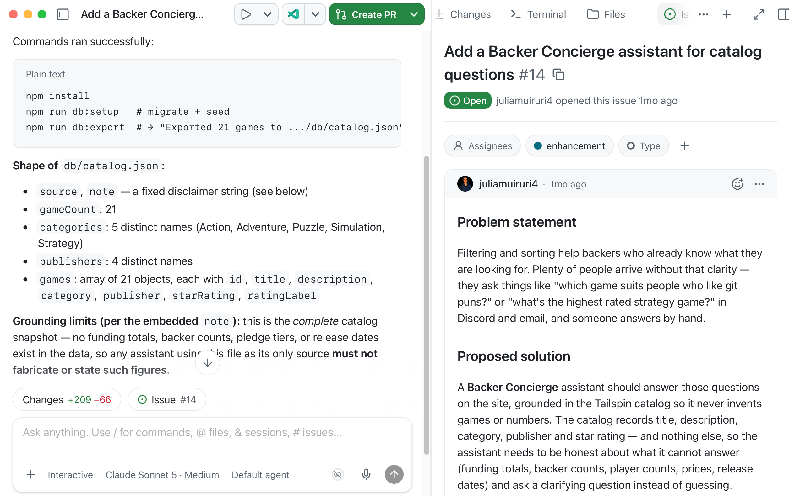
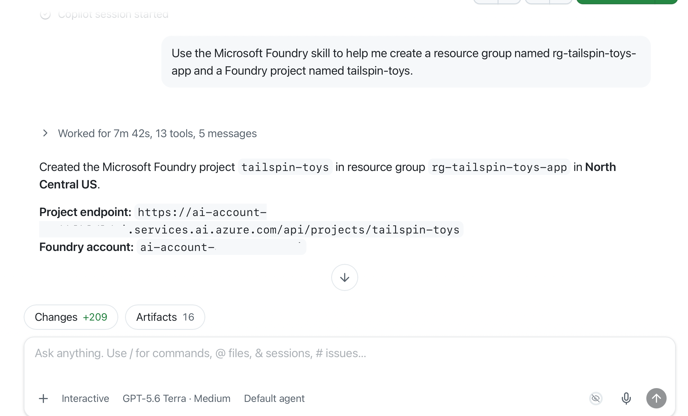
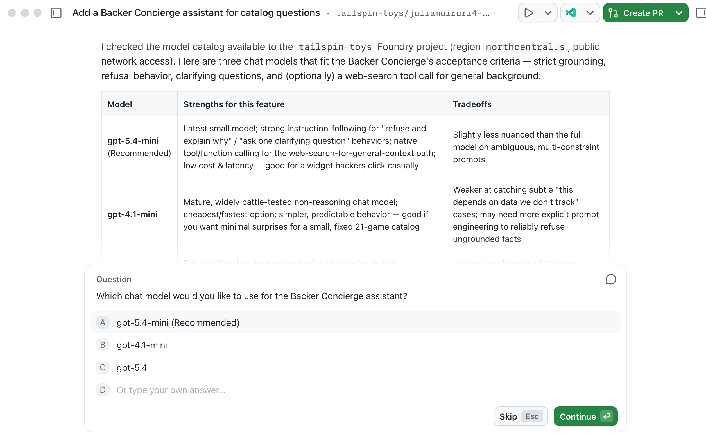

Este primeiro módulo prepara os dados e os recursos do Azure para o Backer Concierge. Ainda não é necessário ter código do agente nem uma implantação hospedada.

Ao final, você terá:

- Uma exportação do catálogo com limites explícitos para fundamentar as respostas.
- Um projeto do Foundry e uma implantação de modelo escolhida para os requisitos do recurso.
- Uma implantação validada no Canvas e uma verificação básica do modelo com respostas limitadas ao catálogo.

## Cenário

As pessoas que apoiam a Tailspin Toys podem filtrar jogos por categoria e editora, mas perguntas como *Quais jogos seriam adequados para quem adora trocadilhos com Git?* não têm respostas em menus suspensos. Um Backer Concierge deve recomendar somente jogos do catálogo da Tailspin e nunca inventar jogos, editoras, avaliações, totais arrecadados, números de apoiadores, preços, números de jogadores, durações de partidas ou datas de lançamento. Um catálogo confiável e um modelo adequado são a base dessas respostas.

## Preparar suas ferramentas e a sessão da issue

A configuração conecta o aplicativo GitHub Copilot ao Azure e mantém todo o trabalho do recurso reunido.

> [!IMPORTANT]
> O Microsoft Foundry Canvas e os agentes hospedados estão em versão prévia pública. Este módulo cria recursos do Azure que geram custos. É necessário verificar a assinatura, a região, a cota e o custo estimado antes da criação dos recursos.

1. Confirme que você tem uma assinatura do Azure, como uma [assinatura gratuita do Azure com US$ 200 de crédito][azure-free] ou o [Azure for Students com US$ 100 em créditos][azure-students], e permissão para criar os recursos do workshop.
2. Instale a [Azure CLI][install-azure-cli] para seu sistema operacional e verifique a instalação usando `az version`. A configuração da Azure Developer CLI fica para o módulo do agente hospedado.
3. Abra o aplicativo GitHub Copilot, abra **Customize** e selecione **Plugins**. Pesquise por `microsoft-foundry` e selecione **Install** para o plugin Microsoft Foundry, que inclui o Canvas e as skills do Foundry.

   

4. Em **Customize**, selecione **Plugins**, pesquise por `azure` ou selecione-o na lista **Featured** e selecione **Install** para o plugin Azure.
5. Na aba **My work**, encontre e abra a issue intitulada **Add a Backer Concierge assistant for catalog questions** no repositório Tailspin Toys. Selecione **New session** para iniciar uma sessão vinculada à issue em um novo worktree. Mantenha este repositório, branch do worktree e sessão da issue nos três módulos.
6. Digite `/microsoft-foundry` e depois `/azure` para confirmar que as duas skills estão instaladas e disponíveis; não envie prompts ainda. Se um plugin não aparecer imediatamente, reinicie o aplicativo, volte para esta mesma sessão da issue e verifique novamente.

## Gerar a exportação do catálogo

O repositório de exemplo inclui um script de exportação que fornece ao agente um arquivo que ele pode ler.

7. Nesta sessão de worktree vinculada à issue, substitua o prompt padrão `/fix-issue` na caixa de prompt por:

   ```plaintext
   Install the project dependencies, seed the database, then run the existing db:export script. Show me the command output and summarize the shape and grounding limits of db/catalog.json.
   ```

8. Revise a saída dos comandos. O Copilot deve executar o equivalente a:

   ```bash
   npm install
   npm run db:setup
   npm run db:export
   ```

   

9. Abra `db/catalog.json` e confirme que ele contém 21 jogos com título, descrição, categoria, editora e avaliação por estrelas. Verifique o campo `note`: o catálogo não contém totais arrecadados, números de apoiadores, faixas de contribuição nem datas de lançamento. Considere também como indisponíveis os preços, números de jogadores e durações de partidas ausentes, em vez de preencher as lacunas com conhecimento externo. Se a exportação falhar ou apresentar diferenças, peça ao Copilot que investigue e execute-a novamente antes de continuar.

   

## Configurar um projeto e um modelo do Foundry

Criar primeiro o projeto e a implantação no chat garante que o Canvas se conecte somente a recursos que já existem.

10. Selecione **+**, selecione **Terminal** e entre no Azure:

    ```bash
    az login
    ```

11. Confirme a assinatura selecionada, a região, a cota e o custo estimado antes de aprovar a criação dos recursos. Verifique no portal do Azure se `rg-tailspin-toys` está disponível para um grupo dedicado ao workshop. Se esse nome pertencer a recursos não relacionados ou compartilhados, pare e defina um nome dedicado antes de usar o prompt a seguir; use os nomes aprovados de forma consistente ao longo do percurso.
12. Na mesma sessão da issue, insira:

    ```plaintext
    Use the Microsoft Foundry skill to create a resource group named rg-tailspin-toys and a Foundry project named tailspin-toys.
    ```

    

13. Peça ao Copilot que recomende um modelo. Os critérios de aceitação da issue já estão no contexto porque a sessão foi iniciada a partir da issue:

    ```plaintext
    Use the Microsoft Foundry skill to recommend two or three current chat models in the tailspin-toys project that meet this issue's acceptance criteria. Explain the tradeoffs and wait for me to choose.
    ```

14. Confirme que o Copilot carrega a skill `microsoft-foundry` e escolha um modelo disponível com base nas vantagens e limitações de cada opção. O guia de início rápido de agentes hospedados do Microsoft Foundry usa atualmente `gpt-5.4-mini`, mas a disponibilidade e a cota variam de acordo com a região.

    

15. Peça ao Copilot que implante sua seleção, revisando o projeto de destino e o custo antes de aprovar:

    ```plaintext
    Deploy the model I selected to the tailspin-toys Foundry project, using the model name as the deployment name.
    ```

> [!TIP]
> A disponibilidade dos modelos muda com o tempo. A escolha adequada é o modelo que o Copilot confirma estar disponível no seu projeto, e não um modelo fixo indicado neste módulo.

## Validar e fazer uma verificação básica do modelo no Canvas

Esta verificação valida o projeto e o modelo antes de existir qualquer código do agente. Uma verificação básica do modelo não substitui os testes de fundamentação das respostas do agente hospedado no módulo 2.

16. Selecione **+**, depois **Canvas** e depois **Microsoft Foundry (Preview)**.
17. Abra o menu **More options** no canto superior direito do Canvas e selecione **Sign in**.
18. Selecione o projeto **tailspin-toys** do Foundry. Expanda **Models** e confirme que a implantação aparece com o nome e o status esperados.

    

19. Na mesma sessão da issue no aplicativo GitHub Copilot, peça ao Copilot que execute uma pequena solicitação autenticada à implantação de modelo que você confirmou no Canvas, usando seu login local existente no Azure. Peça que ele forneça duas entradas reais de `db/catalog.json` e o campo `note` do catálogo, solicite uma recomendação usando somente esse trecho e pergunte se o trecho fornece preços. Verifique se a recomendação usa as entradas fornecidas e se a resposta reconhece que os preços estão indisponíveis. Mantenha as credenciais no ambiente local ou no lado do servidor, nunca no código do navegador nem na saída do chat; não é necessário gerar a estrutura inicial de um agente.
20. Compare o título, a editora e a avaliação da resposta com as entradas fornecidas. Se não for possível testar a implantação, verifique o projeto, o status da implantação, o acesso e a cota no Canvas e envie o erro ao Copilot. Se o modelo inventar detalhes, deixe explícita a instrução de usar somente o trecho e tente novamente. Registre o resultado sem considerá-lo uma comprovação de que o agente atende a todos os critérios de aceitação.

> [!NOTE]
> O Canvas lembra o projeto selecionado quando é reaberto. Suas etapas são **Create new hosted agents**, para gerar a estrutura inicial; **Build current hosted agent**, para conectar modelos, caixas de ferramentas, skills e mecanismos de proteção; e **Deploy and test**, para executar localmente e implantar no Foundry Agent Service.

## Ponto de verificação e próximos passos

A entrega deste módulo é uma exportação do catálogo e uma implantação de modelo testada, não a estrutura inicial de um agente.

21. Registre nesta sessão o repositório Tailspin Toys, o branch atual do worktree, a sessão vinculada à issue, a ID da assinatura, o grupo de recursos dedicado, o projeto do Foundry, o nome da implantação de modelo, o resultado da exportação do catálogo e as evidências da verificação básica. Confirme o projeto selecionado antes de cada alteração posterior que gere custos.
22. Continue para [Criar e implantar o agente][next-module] neste mesmo repositório, branch do worktree, sessão da issue, projeto do Foundry e implantação de modelo — não crie outro projeto. Se encerrar aqui, siga [Limpar seus recursos][cleanup]; este ponto de encerramento não exige `azure.yaml` nem `azd`.

[azure-free]: https://azure.microsoft.com/pricing/purchase-options/azure-account
[azure-students]: https://azure.microsoft.com/free/students
[install-azure-cli]: https://learn.microsoft.com/cli/azure/install-azure-cli
[next-module]: ../2-build-and-deploy/
[cleanup]: ../#limpar-seus-recursos
