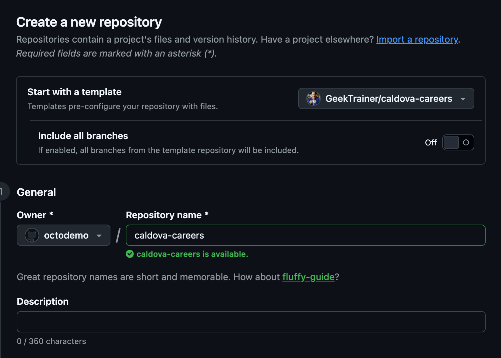
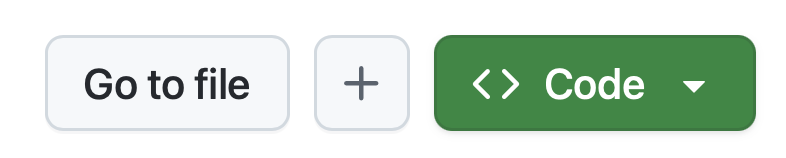
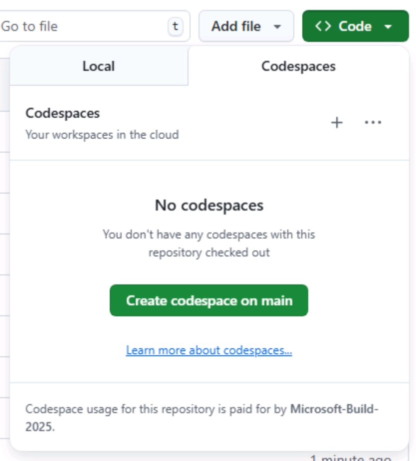

Antes de começar as lições do Copilot CLI, você precisa deixar tudo pronto. Você criará sua própria cópia do repositório Tailspin Toys e iniciará um [codespace][codespaces], cujo terminal integrado será usado para instalar e executar o Copilot CLI na próxima lição.

Nesta lição, você vai:

- criar seu próprio repositório a partir do modelo da Tailspin Toys.
- abrir um codespace e confirmar que o ambiente está pronto para configurar a CLI.

## Configurar o repositório do laboratório

Para criar uma cópia do repositório para o código que você desenvolverá, crie uma instância a partir do [modelo][template-repository]. A nova instância conterá todos os arquivos necessários para o laboratório, e você a usará ao longo das lições.

Use uma cópia nova do modelo. Ele inclui instruções do repositório, código da aplicação, testes e CI, mas não agentes personalizados ou skills. Você criará esses ativos. Se estiver voltando a uma cópia antiga, examine as personalizações existentes antes de alterá-las; não sobrescreva seu trabalho.

1. Em uma nova janela do navegador, acesse o repositório do GitHub deste laboratório: `https://github.com/github-samples/tailspin-toys`.
2. Crie sua própria cópia do repositório selecionando o botão **Use this template** na página do repositório do laboratório. Em seguida, selecione **Create a new repository**.

    

3. Se você estiver fazendo o workshop como parte de um evento conduzido pelo GitHub ou pela Microsoft, siga as instruções fornecidas pelas pessoas mentoras. Caso contrário, crie o novo repositório em uma organização na qual você tenha acesso ao GitHub Copilot.

    

4. Anote o caminho do repositório que você criou (**organization-or-user-name/repository-name**), pois você o usará mais adiante no laboratório.

> [!NOTE]
> **Seu backlog já está pronto**
>
> Quando você cria o repositório a partir do modelo, um backlog de issues do GitHub é criado automaticamente. Você trabalhará com essas issues durante todo o workshop e não precisará criar nada por conta própria.

Aguarde o término do fluxo de criação inicial de issues e verifique na aba **Issues** se aparecem **Allow users to filter games by category and publisher** e **Update our repository coding standards**. Use seus títulos e URLs reais nas lições, não números de issue presumidos. Se o backlog estiver ausente, examine o resultado do fluxo antes de prosseguir.

## Criar um codespace

Agora, você usará um codespace para concluir as lições do laboratório.

O [GitHub Codespaces][codespaces] é um ambiente de desenvolvimento baseado em nuvem que permite escrever, executar e depurar código diretamente no navegador. Ele oferece um IDE completo com suporte a várias linguagens de programação, extensões e ferramentas.

1. Acesse o repositório que você acabou de criar.
2. Selecione o botão verde **Code**.

    

3. Selecione a guia **Codespaces** e depois selecione o botão **+** para criar um novo codespace.

    

A criação do codespace levará alguns minutos, embora ainda seja muito mais rápida do que instalar todos os serviços manualmente. Enquanto isso, você pode explorar outros recursos do GitHub Copilot, que veremos a seguir.

> [!CAUTION]
> Você voltará a esse codespace em uma lição futura. Por enquanto, mantenha-o aberto em uma guia do navegador.

> [!NOTE]
> Este workshop foi criado para ser executado em um codespace ou em um [dev container][dev-containers] local. Ambos garantem que o ambiente tenha todos os pré-requisitos necessários instalados para uma experiência tranquila. Se preferir executar tudo localmente, abra o repositório clonado no VS Code e selecione **Reopen in Container** quando solicitado — o VS Code criará o mesmo dev container usado pelo codespace.

[codespaces]: https://github.com/features/codespaces
[dev-containers]: https://code.visualstudio.com/docs/devcontainers/containers

Quando o codespace estiver pronto, a [Lição 1][next-lesson] abrirá o terminal e verificará o repositório, o ambiente de execução e a autenticação antes de instalar o Copilot CLI.

## Resumo

Parabéns, você criou uma cópia do repositório do laboratório! Você também iniciou a criação do seu codespace, que será usado quando começar a trabalhar com o Copilot CLI.

## Próxima etapa

Vamos instalar o Copilot CLI e autenticá-lo com sua conta do GitHub. Continue para a [Lição 1 - Instalar o GitHub Copilot CLI][next-lesson].

## Recursos

- [Visão geral do GitHub Codespaces][codespaces]
- [Criar um repositório a partir de um modelo][template-repository]
- [Introdução ao Codespaces][codespaces-quickstart]

[template-repository]: https://docs.github.com/repositories/creating-and-managing-repositories/creating-a-template-repository
[codespaces-quickstart]: https://docs.github.com/codespaces/getting-started/quickstart
[next-lesson]: ../1-install-copilot-cli/
