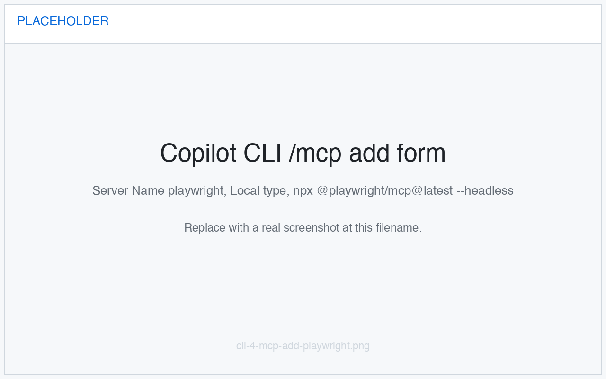

import { Aside } from '@astrojs/starlight/components';
import CalloutStartCopilotCliAllowAll from '@shared/callout-start-copilot-cli-allow-all.mdx';
import SectionMcpOverview from '@shared/section-mcp-overview.mdx';
import SectionPlaywrightMcpTest from '@shared/section-playwright-mcp-test.mdx';

You just generated the filtering feature with Copilot CLI. Before you open a pull request, you should confirm it works in the browser. Rather than click through the app yourself, you'll connect the **Playwright MCP server** and let Copilot drive a real browser to test the feature for you.

In this exercise, you will:

- understand what Model Context Protocol (MCP) is and how MCP servers extend Copilot CLI.
- add the Playwright MCP server to Copilot CLI.
- ask Copilot to use it to manually test your filtering feature in a browser.

## What is Model Context Protocol (MCP)?

<SectionMcpOverview />

<Aside type="note">
  The [GitHub MCP server][github-mcp-server] is **built in** to Copilot CLI — it's already available without any setup, which is how Copilot has been reading and writing to your repository throughout the workshop. In this exercise you'll add a *second* server, Playwright, to give Copilot a browser.
</Aside>

## Add the Playwright MCP server

The quickest way to add a server is the interactive `/mcp add` command. You'll register the [Playwright MCP server][playwright-mcp-server], which gives Copilot a browser it can control.

<CalloutStartCopilotCliAllowAll />

1. In your Copilot CLI session, enter:

    ```text
    /mcp add
    ```

2. A configuration form appears. Use <kbd>Tab</kbd> to move between fields and fill it in as follows:

    - **Server Name**: `playwright`
    - **Server Type**: select **Local** (also labelled **STDIO**)
    - **Command**: `npx @playwright/mcp@latest --headless`
    - **Tools**: leave as `*` to allow all of the server's tools

3. Press <kbd>Ctrl</kbd>+<kbd>S</kbd> to save. The server is added and available immediately — no restart required.

    

The `--headless` flag tells Playwright to run the browser without a visible window, which is required inside a codespace where there's no desktop to display it. Behind the scenes, this writes the server to your `~/.copilot/mcp-config.json` file:

```json
{
  "mcpServers": {
    "playwright": {
      "type": "local",
      "command": "npx",
      "args": ["@playwright/mcp@latest", "--headless"],
      "tools": ["*"]
    }
  }
}
```

4. Confirm the server is registered and active by listing your MCP servers:

    ```text
    /mcp show
    ```

5. You should see `playwright` listed alongside the built-in `github` server.

<Aside type="note">
  The Tailspin Toys project already uses Playwright for its end-to-end tests, so the browser Playwright needs is typically already installed. If Copilot later reports that a browser is missing, have it run `npx playwright install chromium` and try again.
</Aside>

## Start the website

The Playwright MCP server needs a running app to test against. Start the Astro dev server in a **separate** terminal so it keeps running while you work in Copilot CLI.

1. Open a new terminal in your codespace by selecting <kbd>Ctrl</kbd>+<kbd>\`</kbd>.
2. Start the website:

    ```bash
    npm run dev
    ```

3. Leave this terminal running. Once you see the `Astro server: http://localhost:4321` banner, the app is ready.

## Test the filtering feature

Return to your Copilot CLI session and ask Copilot to test the feature.

<SectionPlaywrightMcpTest />

## Summary and next steps

Congratulations, you used the Playwright MCP server to manually test your feature with Copilot CLI! To recap, you:

- learned what Model Context Protocol (MCP) is and how MCP servers extend Copilot CLI.
- added the Playwright MCP server with `/mcp add`.
- asked Copilot to drive a browser and verify your filtering feature before shipping it.

Now that you've confirmed the feature works, you can continue to the next exercise, where you'll [open a pull request with the help of an agent skill][next-lesson].

## Resources

- [What the heck is MCP and why is everyone talking about it?][mcp-blog-post]
- [Microsoft Playwright MCP Server][playwright-mcp-server]
- [Adding MCP servers for Copilot CLI][cli-add-mcp]
- [GitHub MCP Server][github-mcp-server]

[previous-lesson]: ../3-generating-code/
[next-lesson]: ../5-agent-skills/
[mcp-blog-post]: https://github.blog/ai-and-ml/llms/what-the-heck-is-mcp-and-why-is-everyone-talking-about-it/
[playwright-mcp-server]: https://github.com/microsoft/playwright-mcp
[github-mcp-server]: https://github.com/github/github-mcp-server
[cli-add-mcp]: https://docs.github.com/copilot/how-tos/copilot-cli/customize-copilot/add-mcp-servers
