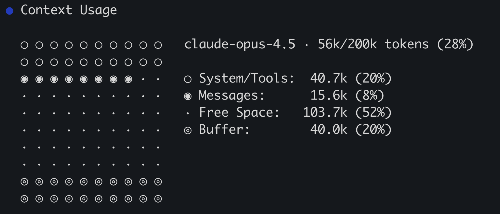

import { Aside } from '@astrojs/starlight/components';
import CalloutStartCopilotCliAllowAll from '@partials/callout-start-copilot-cli-allow-all.mdx';

Like any good CLI tool, GitHub Copilot CLI includes many slash commands to interact with it. These commands expose advanced functionality, "behind-the-scenes" information, or additional configuration options. You've already explored a couple with `/clear` to clear context and `/mcp` to register MCP servers. Let's explore a couple of other powerful ones, including `/context`, `/models`, `/share`, and `/delegate`.

## Scenario

You've wrapped the core CLI flows. Now let's look at a few additional capabilities — sharing sessions, switching models, and delegating tasks to [Copilot cloud agent][about-cloud-agent].

In this exercise you will use:

- `/share` to create a GitHub gist to share your session with the team.
- `/context` to see the context Copilot CLI is currently using.
- `/models` to explore the list of available models and select a new one if you so desire.
- `/delegate` to optionally hand off a task to cloud agent. This requires Copilot Pro+, Business, or Enterprise with cloud agent enabled.

## Sharing a session

Using any tool, including an AI tool, is a skill. Working together as a team, sharing learnings with each other, is the best way to help improve everyone's experience and generate higher quality code. To support this, Copilot CLI provides a `/share` command. The `/share` command can generate a markdown file or GitHub gist with the details of the session, including the prompts used and logic Copilot followed.

Let's create a GitHub gist we could share with our team.

<CalloutStartCopilotCliAllowAll />

1. In the prompt window for Copilot CLI, send the following command:

    ```
    /share gist
    ```

2. In just a couple of moments, Copilot will create a gist and display the link.
3. Copy the link text.
4. In a new browser tab, paste the link to explore the gist. Note how the gist highlights the prompts sent, skills and agents used, Copilot's thought process, and even the code and results from locally run commands.

The gists and markdown files generated by `/share` can be used for documentation purposes of how code was generated, or to share with your team about how certain actions were performed that generated the desired results from Copilot.

## Exploring Copilot CLI's context

When working on larger or more complex tasks you may bump into the maximum context window for the model. The exact size of the window will vary based on the model being used and the version of Copilot CLI. When the context window is maxed out, Copilot CLI will automatically compact it, summarizing information and removing anything it deems isn't relevant to the current task. You can both see the current state of the context and manually compact the context by using slash commands. Let's explore the context window.

1. In the prompt window for Copilot CLI, send the following command:

    ```
    /context
    ```

2. In just a couple of moments, Copilot CLI will generate a visual representation of its current context:

    

3. Note the model displayed (which may be different than the one in the image), and the current percentage of tokens used. The rest of the information highlights:

    | Title        | Description                                            |
    | ------------ | ------------------------------------------------------ |
    | System/Tools | Instructions files, file contents and tool definitions |
    | Messages     | Conversation history between you and Copilot           |
    | Buffer       | Reserved space by Copilot CLI for generating responses |
    | Free space   | Remaining free space                                   |

4. Compact the conversation history by sending the following slash command to Copilot CLI:

    ```
    /compact
    ```

5. Once completed, send the following command to display the current context stats again:

    ```
    /context
    ```

6. Note the change in context. There might not be a drastic change as the context window is likely relatively small at the moment.

<Aside type="note">
  Copilot CLI will automatically compact when it becomes full. As it approaches 100% capacity it will display the percentage just above the prompt window. Normally it will compact asynchronously, allowing you to continue interacting with Copilot while it does its work. It may however block a running operation for several seconds while performing its work.
</Aside>

### Best practices with context

In most sessions with Copilot context will be managed efficiently by Copilot itself without any specific guidance. However, there may be instances when you decide to manually instruct Copilot to either clear or compact its history:

- If you are changing to a different part of the application, or to an unrelated task, you can use `/clear` to start new to avoid confusing Copilot with older, unrelated context.
- If you are approaching the maximum context window, you can manually `/compact` your context to control when it happens.

<Aside type="caution">
  Again, the majority of the time, Copilot will manage its context without direct interaction from you. If you notice Copilot is a bit confused by older information, or are about to switch to an unrelated task, then you might consider using the manual commands.
</Aside>

## Choosing your model

Different models have different strengths, and different developers have different preferences. Copilot CLI allows you to list and select the model you wish to use!

1. Display the list of models by sending the following slash command to Copilot CLI:

    ```
    /models
    ```

2. Note the list of models. Each model will have both its name and cost-per-request modifier listed next to it.
3. If you wish, select a new model! Or select <kbd>Esc</kbd> to exit the model list.

<Aside type="caution">
  Model selection persists in Copilot CLI.
</Aside>

## Delegating to cloud agent (optional)

There are times when you want to keep working in your terminal but hand off a longer-running task to Copilot cloud agent. The `/delegate` command sends the current Copilot CLI session to GitHub.com, where cloud agent picks it up, works asynchronously, and opens a pull request when done.

<Aside type="note">
  `/delegate` requires Copilot Pro+, Business, or Enterprise with cloud agent enabled. If you don't have access, read through this section and skip the hands-on steps.
</Aside>

1. Clear the current session first so accumulated workshop context isn't delegated:

    ```
    /clear
    ```

2. Send a small, well-scoped prompt. For example, you could delegate the stretch-goal pagination from the backlog you created in Exercise 3:

    ```
    Implement pagination on the games list page. Add support for page and pageSize query parameters on the games API, update the frontend to render pagination controls, and add tests.
    ```

3. Send the following slash command to hand the session to cloud agent, and confirm the prompt you want to delegate:

    ```
    /delegate
    ```

4. Open [Copilot agents](https://github.com/copilot/agents) in a browser to monitor progress.
5. You don't need to wait for the pull request to complete in this path; you can return to it later. If you want to dig deeper into managing asynchronous agent work, continue with the [Cloud path](../../cloud/).

## Summary and next steps

Using slash commands in Copilot CLI allows you to configure it, share sessions, and get internal information about how Copilot's working. In this lesson you used or explored:

- `/share` to create a GitHub gist to share your session with the team.
- `/context` to see the context Copilot CLI is currently using.
- `/models` to explore the list of available models and select a new one if you so desire.
- Learned about `/delegate` as an optional bridge to cloud agent.

There are of course more slash commands available, and more to explore with Copilot CLI! Let's close out our journey by [reviewing what we've learned][next-lesson] and some next steps to continue learning.

## Resources

- [Using Copilot CLI][using-copilot-cli]
- [About Copilot CLI][about-copilot-cli]
- [Context Management in Copilot CLI][context-management]
- [Share Sessions with Copilot CLI][share-sessions]
- [Selecting Models in Copilot CLI][selecting-models]

[previous-lesson]: ../6-custom-agents/
[next-lesson]: ../8-review/
[using-copilot-cli]: https://docs.github.com/copilot/how-tos/use-copilot-agents/use-copilot-cli
[about-copilot-cli]: https://docs.github.com/copilot/concepts/agents/about-copilot-cli
[about-cloud-agent]: https://docs.github.com/copilot/concepts/agents/cloud-agent/about-cloud-agent
[context-management]: https://docs.github.com/copilot/how-tos/use-copilot-agents/use-copilot-cli#context-management
[share-sessions]: https://docs.github.com/copilot/how-tos/use-copilot-agents/use-copilot-cli#share-sessions
[selecting-models]: https://docs.github.com/copilot/how-tos/use-copilot-agents/use-copilot-cli#select-an-llm
