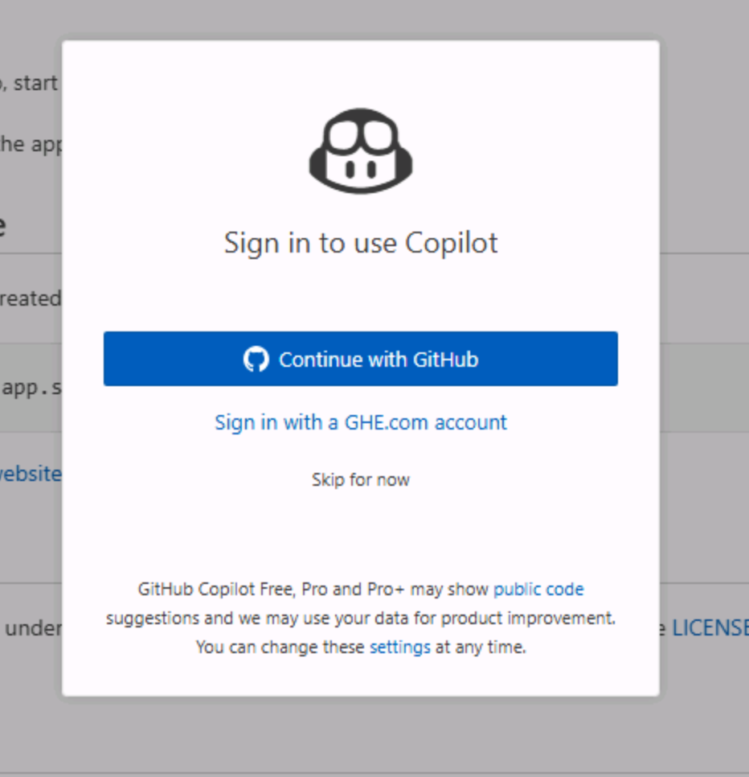

import { Aside } from '@astrojs/starlight/components';
import ExerciseCreateTemplateRepo from '@shared/exercise-create-template-repo.mdx';
import ExerciseCreateCodespace from '@shared/exercise-create-codespace.mdx';
import CalloutTemplateSeedsBacklog from '@shared/callout-template-seeds-backlog.mdx';

Before you start the VS Code exercises, you need to get everything ready. You'll create your own copy of the Tailspin Toys repository, spin up a [codespace][codespaces] to work in, and confirm GitHub Copilot Chat is up and running in your editor.

## Setting up the lab repository

To create a copy of the repository for the code you'll create, you'll make an instance from the [template][template-repository]. The new instance will contain all of the necessary files for the lab, and you'll use it as you work through the exercises.

<ExerciseCreateTemplateRepo />

<CalloutTemplateSeedsBacklog />

## Creating a codespace

Next up, you'll use a codespace to complete the lab exercises.

<ExerciseCreateCodespace />

## Using GitHub Copilot Chat and agent mode

To access GitHub Copilot Chat agent mode, you need to have the GitHub Copilot Chat extension installed in your IDE, which should already be the case if you are using a GitHub Codespace.

<Aside type="tip">
  If you do not have the GitHub Copilot Chat extension installed, you can [install it from the Visual Studio Code Marketplace][copilot-chat-extension]. Or open the Extensions view in Visual Studio Code, search for **GitHub Copilot Chat**, and select **Install**.
</Aside>

Once you have the extension installed, you may need to authenticate with your GitHub account to enable it.

1. Return to your codespace.
2. If you don't already see Copilot Chat on the right side of your editor, select the **Copilot Chat** icon at the top of your codespace.
3. Type a message like "Hello world" in the Copilot Chat window and press enter. This should activate Copilot Chat.
4. Alternatively, if you are not authenticated you will be prompted to sign in to your GitHub account. Follow the instructions to authenticate.

    

5. After authentication, you should see the Copilot Chat window appear.

## Summary

Congratulations, you have created a copy of the lab repository! You also began the creation process of your codespace, which you'll use when you begin writing code.

## Next step

Let's start putting Copilot to work. Continue to [Exercise 1 - Custom instructions][next-lesson], where you'll teach Copilot your project's conventions.

## Resources

- [GitHub Codespaces overview][codespaces]
- [Creating a repository from a template][template-repository]
- [Getting started with Codespaces][codespaces-quickstart]

[codespaces]: https://github.com/features/codespaces
[template-repository]: https://docs.github.com/repositories/creating-and-managing-repositories/creating-a-template-repository
[codespaces-quickstart]: https://docs.github.com/codespaces/getting-started/quickstart
[copilot-chat-extension]: https://marketplace.visualstudio.com/items?itemName=GitHub.copilot-chat
[next-lesson]: ../1-custom-instructions/
