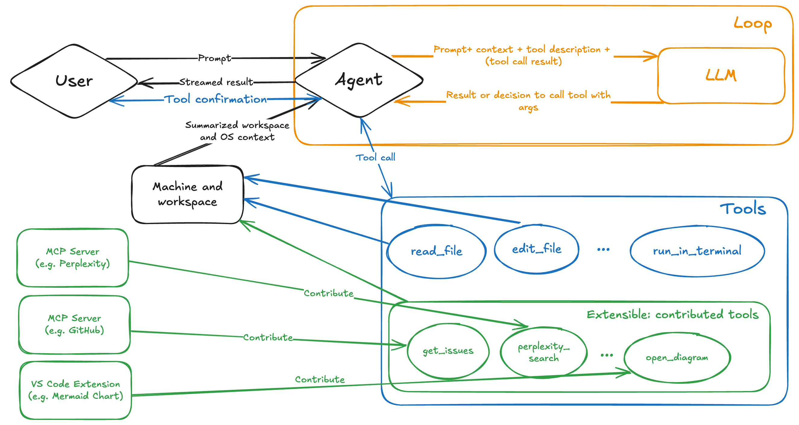
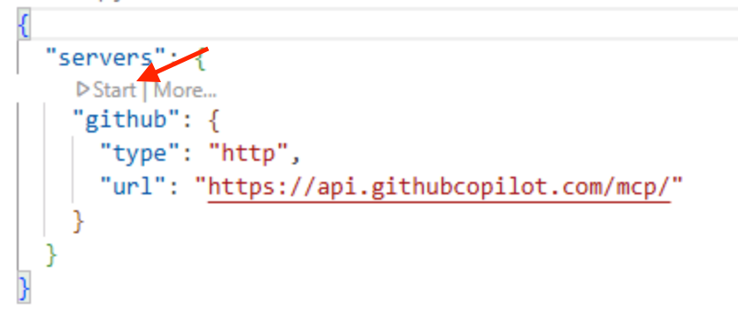
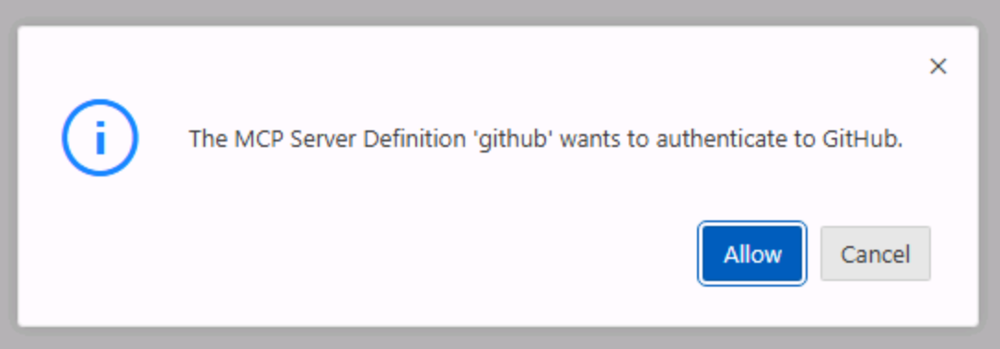
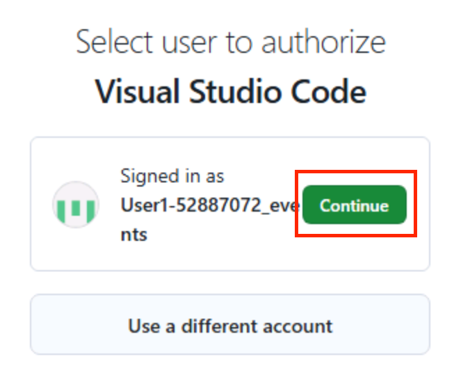
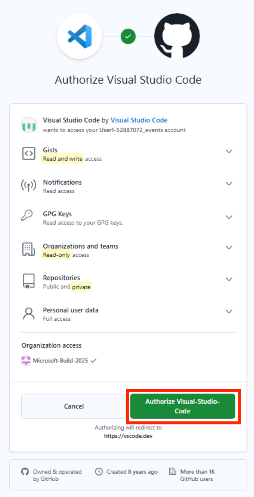
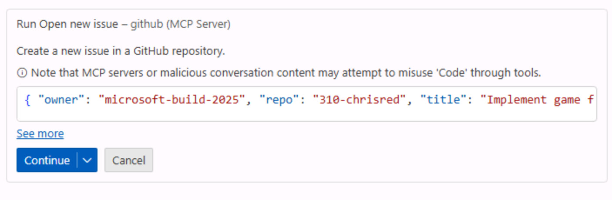
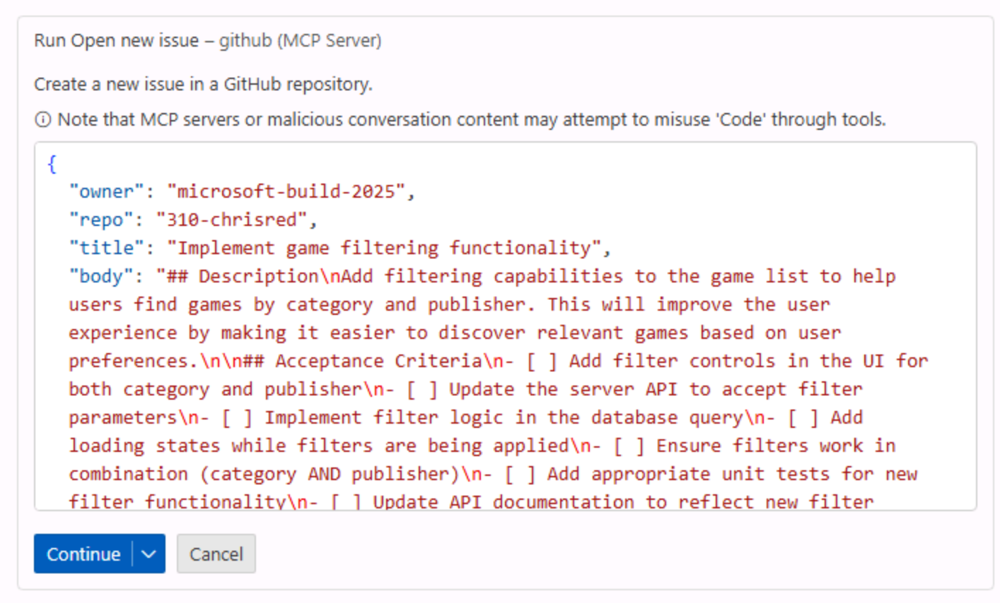
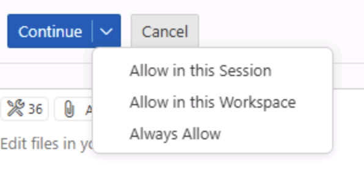
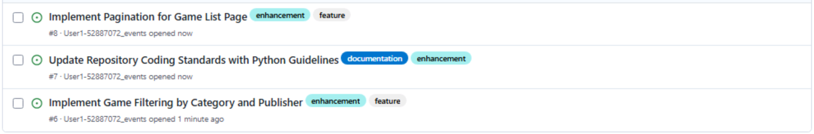

import { Aside } from '@astrojs/starlight/components';
import SectionMcpOverview from '@shared/section-mcp-overview.mdx';

There's more to writing code than just writing code. Issues need to be filed, external services need to be called, and information needs to be gathered. Typically this involves interacting with external tools, which can break a developer's flow. Through the power of Model Context Protocol (MCP), you can access all of this functionality right from Copilot!

## Scenario

You've been assigned various tasks to introduce new functionality to the website. Being a good team member, you want to file issues to track your work. To help future you, you've decided to enlist the help of Copilot. You will set up your backlog of work for the rest of the lab, using GitHub Copilot Chat agent mode and the GitHub Model Context Protocol (MCP) server to create the issues for you. 

In this exercise, you will:

- use Model Context Protocol (MCP), which provides access to external tools and capabilities.
- set up the GitHub MCP server in your repository.
- use GitHub Copilot Chat agent mode to create issues in your repository.

By the end of this exercise, you will have created a backlog of GitHub issues for use throughout the remainder of the lab.

## What is agent mode and Model Context Protocol (MCP)?

Agent mode in GitHub Copilot Chat transforms Copilot into an AI agent that can perform actions on your behalf. This mode allows you to interact with Copilot in a more dynamic way, enabling it to use tools and execute tasks, like running tests or terminal commands, reading problems from the editor, and using those insights to update your code. This allows for a more interactive and collaborative workflow, enabling you to leverage the capabilities of AI in your development process.



<SectionMcpOverview />

## Setting up the GitHub MCP server

The `.vscode/mcp.json` file is used to configure the MCP servers that are available in this Visual Studio Code workspace. The MCP servers provide access to external tools and resources that GitHub Copilot can use to perform actions on your behalf.

1. Open `.vscode/mcp.json` in your repository.
2. You should see a JSON structure similar to the following:

    ```json
    {
      "servers": {
        "github": {
          "type": "http",
          "url": "https://api.githubcopilot.com/mcp/"
        }
      }
    }
    ```

This configuration provides GitHub Copilot access to several additional tools so that it can interact with GitHub repositories, issues, pull requests, and more. This particular configuration uses the [remote GitHub MCP server][remote-github-mcp-server]. By using this approach, you don't need to worry about running the MCP server locally (and the associated management, like keeping it up to date), and you can authenticate to the remote server using OAuth 2.0 instead of a personal access token (PAT).

The MCP server configuration is defined in the `servers` section of the `mcp.json` file. Each MCP server is defined by a unique name (in this case, `github`) and its type (in this case, `http`). When using local MCP servers, the type may be `stdio` and have a `command` and `args` field to specify how to start the MCP server. You can find out more about the configuration format in the [VS Code documentation][vscode-mcp-config]. In some configurations (not for the remote GitHub MCP server with OAuth), you may also see an `inputs` section. This defines any inputs (like sensitive tokens) that the MCP server may require. You can read more about the configuration properties in the [VS Code documentation][vscode-mcp-config]

## Starting the MCP server

To utilize an MCP server it needs to be "started". This will allow GitHub Copilot to communicate with the server and perform the tasks you request. Let's start the GitHub MCP server listed in the `mcp.json` file.

1. Inside VS Code, open `.vscode/mcp.json`.
2. To start the GitHub MCP server, select **Start** above the GitHub server.

    

3. You should see a popup asking you to authenticate to GitHub.

    

4. Select **Continue** on the user account that you're using for this lab.

    

5. If the page appears, select **Authorize visual-studio-code** to allow the GitHub MCP server to login as your selected user account. Once complete, the page should say "You can now close the window.".

    

6. After navigating back to the GitHub Codespace, you should see that the GitHub MCP server has started. You can check this in two places:
    - The line in `.vscode/mcp.json` which previously said start should now present several options, and show a number of tools available. 
    - Select the tools icon in the Copilot Chat pane to see the tools available. Scroll down the list that appears at the top of the screen, and you should see a list of tools from the GitHub MCP server.

That's it! You can now use Copilot Chat in agent mode to create issues, manage pull requests, and more.

## Creating a backlog of tasks

Now that you have set up the GitHub MCP server, you can use Copilot Agent mode to create a backlog of tasks for use in the rest of the lab.

1. Return to the Copilot Chat pane and place the cursor inside the dialog.
2. Press <kbd>Control</kbd>+<kbd>Command</kbd>+<kbd>I</kbd> (Mac) or <kbd>Ctrl</kbd>+<kbd>Alt</kbd>+<kbd>I</kbd> (Windows/Linux) to open the Copilot Chat view, then select **Agent** from the agents dropdown in the Chat view.

   

3. Type or paste the following prompt to create the issues you'll be working on in the lab:

    ```markdown
    In my GitHub repo, create GitHub issues for our Tailspin Toys backlog. Each issue should include:
    - A clear title
    - A brief description of the task and why it is important to the project
    - A checkbox list of acceptance criteria

    From our recent planning meeting, the upcoming backlog includes the following tasks:

    1. Allow users to filter games by category and publisher
    2. Add a custom instructions standard so generated Python code includes clear module and function docstrings
    3. Improve accessibility by adding a high-contrast mode with a persistent user toggle
    4. Stretch Goal: Implement pagination on the game list page
    ```

4. Press <kbd>Enter</kbd> or select the **Send** button to send the prompt to Copilot.
5. GitHub Copilot should process the request and respond with a dialog box asking you to confirm the creation of the issues.

    

<Aside type="caution">
  Remember, AI can make mistakes, so make sure to review the issues before confirming.
</Aside>

6. Select **see more** in **Run open new issue** box to see the details of the issue that will be created.
7. Ensure the details in the **owner** and **repo**, **title** and **body** of the issue look correct. You can make any desired edits by double clicking the body and updating the content with the correct information.
8. After reviewing the generated content, select **Continue** to create the issue.

    

9. Repeat steps 6-8 for the remainder of the issues. Alternatively, if you are comfortable with Copilot automatically creating the issues you can select the down-arrow next to **Continue** and select **Allow in this session** to allow Copilot to create the issues for this session (the current chat).

    

<Aside type="caution">
  Ensure you are comfortable with Copilot automatically performing tasks on your behalf before you selecting **Allow in this session** or a similar option.
</Aside>

10. In a separate browser tab, navigate to your GitHub repository and select the issues tab.
11. You should see a list of issues that have been created by Copilot. Each issue should include a clear title and a checkbox list of acceptance criteria.

You should notice that the issues are fairly detailed. This is where you benefit from the power of Large Language Models (LLMs) and Model Context Protocol (MCP), as it has been able to create a clear initial issue description.



## Summary and next steps

Congratulations, you have created issues on GitHub using Copilot Chat and MCP!

To recap, in this exercise you:

- used Model Context Protocol (MCP), which provides access to external tools and capabilities.
- set up the GitHub MCP server in your repository.
- used GitHub Copilot Chat agent mode to create issues in your repository.

With the GitHub MCP server configured, you can now use GitHub Copilot Chat Agent Mode to perform additional actions on your behalf, like creating new repositories, managing pull requests, and searching for information across your repositories.

You can now continue to the next exercise, where you will [provide custom instructions][next-lesson] so Copilot follows your project's conventions.

### Optional exploration exercise – Set up the Microsoft Playwright MCP server

If you are feeling adventurous, you can try installing and configuring another MCP server, such as the [Microsoft Playwright MCP server][playwright-mcp-server]. This will allow you to use GitHub Copilot Chat Agent Mode to perform browser automation tasks, such as navigating to web pages, filling out forms, and clicking buttons.

You can find the instructions for installing and configuring the Playwright MCP server in the [Playwright MCP repository][playwright-mcp-server].

Notice that the setup process is similar to the GitHub MCP server, but you do not need to provide any credentials like the GitHub Personal Access Token. This is because the Playwright MCP server does not require authentication to access its capabilities.

## Resources

- [What the heck is MCP and why is everyone talking about it?][mcp-blog-post]
- [GitHub MCP Server][github-mcp-server]
- [Microsoft Playwright MCP Server][playwright-mcp-server]
- [GitHub MCP Registry][mcp-registry]
- [VS Code Extensions][vscode-extensions]
- [GitHub Copilot Chat Extension][copilot-chat-extension]

[previous-lesson]: ../../prereqs/
[next-lesson]: ../2-custom-instructions/
[prereqs-lesson]: ../../prereqs/
[mcp-blog-post]: https://github.blog/ai-and-ml/llms/what-the-heck-is-mcp-and-why-is-everyone-talking-about-it/
[github-mcp-server]: https://github.com/github/github-mcp-server
[playwright-mcp-server]: https://github.com/microsoft/playwright-mcp
[mcp-registry]: https://github.com/mcp
[vscode-extensions]: https://code.visualstudio.com/docs/configure/extensions/extension-marketplace
[copilot-chat-extension]: https://marketplace.visualstudio.com/items?itemName=GitHub.copilot
[remote-github-mcp-server]: https://github.blog/changelog/2025-06-12-remote-github-mcp-server-is-now-available-in-public-preview/
[vscode-mcp-config]: https://code.visualstudio.com/docs/copilot/chat/mcp-servers#_configuration-format
