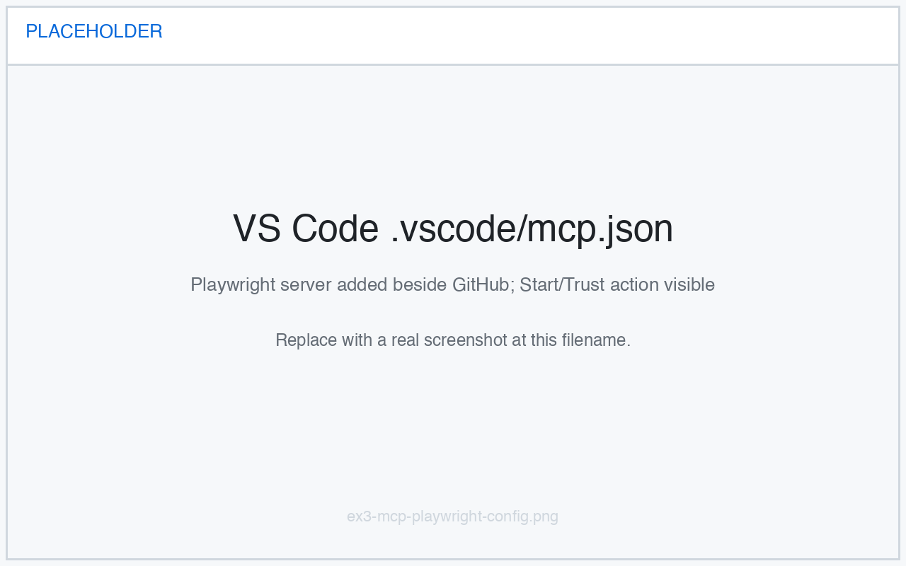
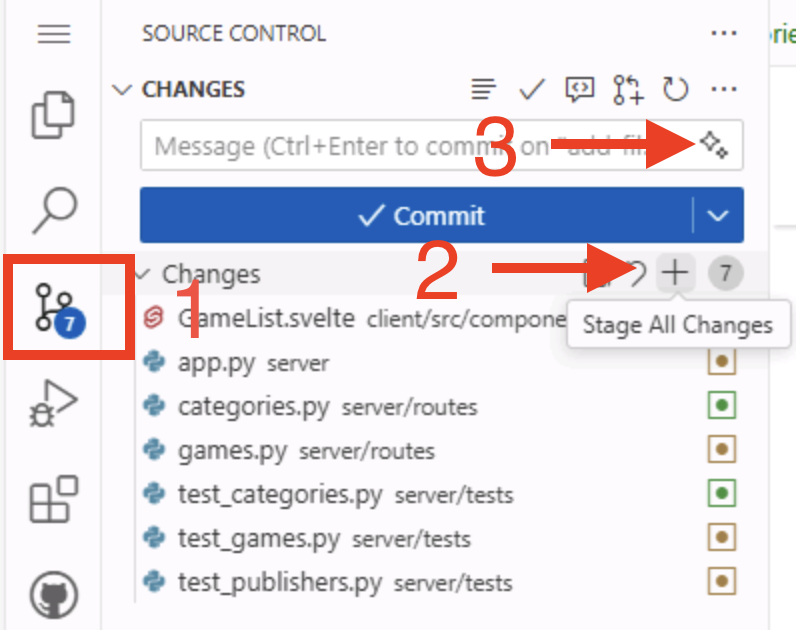

import { Aside } from '@astrojs/starlight/components';
import SectionMcpOverview from '@shared/section-mcp-overview.mdx';
import SectionPlaywrightMcpTest from '@shared/section-playwright-mcp-test.mdx';

[← Previous lesson: Agent mode][previous-lesson] · [Next lesson: Custom agents →][next-lesson]

You just built the filtering feature with agent mode. Before you open a pull request, you should confirm it actually works in the browser. Rather than click through the app yourself, you'll connect the **Playwright MCP server** and let Copilot drive a real browser to test the feature for you — then publish your branch and open the PR.

In this exercise, you will:

- learn what Model Context Protocol (MCP) is and how MCP servers extend Copilot with new tools,
- add the Playwright MCP server to your workspace,
- ask Copilot to use it to manually test your filtering feature in a browser,
- publish your branch and open a pull request for the filtering work.

## What is Model Context Protocol (MCP)?

Agent mode becomes far more powerful when it can reach beyond your editor. Model Context Protocol (MCP) is how Copilot does that — it's a standard way for the agent to talk to external tools and services.


<SectionMcpOverview />

## Review the MCP configuration

The `.vscode/mcp.json` file configures the MCP servers available in this VS Code workspace.

1. Open `.vscode/mcp.json` in your codespace.
2. You should see a `github` server already configured for you:

    ```json
    {
      "servers": {
        "github": {
          "type": "http",
          "url": "https://api.githubcopilot.com/mcp/"
        }
      }
    }
    ```

This `github` entry ships with the project template, which is why Copilot was able to read your backlog of issues in the previous exercise. It uses the [remote GitHub MCP server][remote-github-mcp-server], so there's nothing to install locally — VS Code connects to it over HTTP and you authenticate with GitHub the first time Copilot uses one of its tools.

## Add the Playwright MCP server

Now you'll add a second server. The [Playwright MCP server][playwright-mcp-server] gives Copilot a browser it can control, which is exactly what you need to test your feature.

1. In `.vscode/mcp.json`, add a `playwright` entry alongside `github` so the file looks like this:

    ```json
    {
      "servers": {
        "github": {
          "type": "http",
          "url": "https://api.githubcopilot.com/mcp/"
        },
        "playwright": {
          "command": "npx",
          "args": ["@playwright/mcp@latest", "--headless"]
        }
      }
    }
    ```

2. Save the file.

    

Unlike the remote `github` server, `playwright` is a **local** server: VS Code starts it on your machine by running `npx @playwright/mcp@latest`. The `--headless` flag tells Playwright to run the browser without a visible window, which is required inside a codespace where there's no desktop to display it.

<Aside type="note">
  The Tailspin Toys project already uses Playwright for its end-to-end tests, so the browser Playwright needs is typically already installed. If Copilot later reports that a browser is missing, have it run `npx playwright install chromium` and try again.
</Aside>

## Start and trust the server

VS Code starts MCP servers **on demand** — the first time Copilot needs a server's tools, VS Code starts it and asks you to confirm that you trust it.

1. In `.vscode/mcp.json`, a **Start** action appears above the `playwright` entry. Select it to start the server now and confirm the configuration is correct.
2. If VS Code asks you to confirm that you trust the server, review the configuration and choose to trust it so the server can start.

Starting it by hand is optional — if you skip it, VS Code starts the server (and prompts you to trust it) the first time Copilot needs its tools in the next step.

## Test the filtering feature

<SectionPlaywrightMcpTest />

## Publish the branch and create a pull request

Now that you've confirmed the feature works, you're ready to open a pull request (PR) so your team can review it. The first step is to publish the `filtering-vscode` branch.

1. Navigate to the **Source Control** panel in the codespace and review the changes made by Copilot.
2. Stage the changes by selecting the **+** icon.
3. Generate a commit message using the **Sparkle** button.

   

4. Select **Publish** to push the branch to your repository.

## Create the pull request

There are several ways to create a pull request, including through github.com and the GitHub command-line interface (CLI). But since you're already working with GitHub Copilot, let's let it create the PR for you! It can find the relevant issue and create the PR with an association to it.

1. Navigate to the Copilot Chat panel and select **New Chat** to start a new session.
2. Ensure **Agent** is selected from the agents dropdown so Copilot can use the GitHub tools.
3. Ask Copilot to create a PR for you:

   ```plaintext
   Find the issue in the repo related to filtering by category and publisher. Create a new pull request for the current branch, and associate it with the correct issue.
   ```

4. As needed, select **Continue** to allow Copilot to perform the tasks necessary to gather information and perform operations. The first time it uses a GitHub tool, you may be prompted to authenticate with GitHub — follow the prompts to allow it.
5. Notice how Copilot searches through the issues, finds the right one, and creates the PR.
6. Select the link generated by Copilot to review your pull request, but please **don't merge it yet**.

## Summary and next steps

Congratulations! In this exercise you:

- learned what Model Context Protocol (MCP) is and how MCP servers extend Copilot with new tools,
- added the Playwright MCP server to your workspace,
- used it to manually test your filtering feature in a browser before shipping it,
- published your branch and opened a pull request for the filtering work.

You used an MCP server to *test* a feature — but MCP is just one way to extend Copilot. Next, let's [create a custom agent][next-lesson] to streamline focused tasks like accessibility reviews.

## Resources

- [What the heck is MCP and why is everyone talking about it?][mcp-blog-post]
- [Microsoft Playwright MCP Server][playwright-mcp-server]
- [GitHub MCP Server][github-mcp-server]
- [GitHub MCP Registry][mcp-registry]
- [MCP servers in VS Code][vscode-mcp-config]

[previous-lesson]: ../2-agent-mode/
[next-lesson]: ../4-custom-agents/
[mcp-blog-post]: https://github.blog/ai-and-ml/llms/what-the-heck-is-mcp-and-why-is-everyone-talking-about-it/
[github-mcp-server]: https://github.com/github/github-mcp-server
[playwright-mcp-server]: https://github.com/microsoft/playwright-mcp
[mcp-registry]: https://github.com/mcp
[remote-github-mcp-server]: https://github.blog/changelog/2025-06-12-remote-github-mcp-server-is-now-available-in-public-preview/
[vscode-mcp-config]: https://code.visualstudio.com/docs/agents/reference/mcp-configuration
