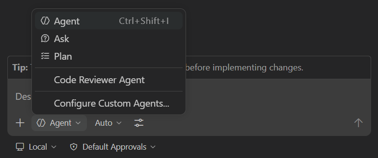

You've built and tested filtering with Copilot Chat. Now define a reusable specialist role to guide accessibility work.

In this exercise, you will:

- create and review an accessibility custom agent.
- use the accessibility agent in Copilot Chat to implement a high-contrast mode.

## Scenario

Tailspin Toys is committed to ensuring their crowdfunding platform is accessible to all users, regardless of their visual abilities or preferences. Recent user feedback has highlighted that some users find the current dark theme difficult to read due to insufficient contrast between text and background colors. To address this accessibility concern, the design team has requested the implementation of a high-contrast mode that users can toggle on and off.

Because accessibility is critical, you want to ensure this is implemented as quickly as possible. You're going to utilize a custom agent to generate the functionality.

## What are custom agents?

[Custom agents][custom-agents-concept] in GitHub Copilot allow you to create specialized AI assistants tailored to specific tasks or domains within your development workflow. By defining agents through markdown files in the `.github/agents` folder of your repository, you can provide Copilot with focused instructions, best practices, coding patterns, and domain-specific knowledge that guide it to perform particular types of work more effectively. Teams can codify their expertise into reusable agents — an accessibility agent that enforces [WCAG][wcag] compliance, a security agent that follows secure coding practices, or a testing agent that maintains consistent test patterns.

Custom agents are defined by `.agent.md` files in the `.github/agents` folder of your project. Each file has YAML frontmatter with a required `description`, followed by a Markdown prompt that defines the agent's behavior, expertise, and instructions. This exercise also supplies an optional, readable `name` so you can recognize the agent in the picker.

### Custom agents compared with agent skills

There's some logical overlap between custom agents and [agent skills][agent-skills-concept]. A **custom agent** defines a specialized role, instructions, and available tools. A **skill** packages task-specific instructions and can include scripts and supporting resources.

Agents can run scripts directly through available tools, or follow a skill when one is available. Selecting a custom agent does not inherently create a separate context window or require orchestration of other agents. In this lab, you'll create an accessibility profile and use the project's existing npm checks directly; no skill from another workshop harness is required.

> [!NOTE]
> There's no single "right" way to author a custom agent. As with anything in AI, test and iterate to find what works for your environments and scenarios.

[custom-agents-concept]: https://docs.github.com/copilot/concepts/agents/cloud-agent/about-custom-agents
[agent-skills-concept]: https://docs.github.com/copilot/concepts/agents/about-agent-skills
[wcag]: https://www.w3.org/WAI/standards-guidelines/wcag/
## Creating and reviewing the accessibility custom agent

The template does not supply custom agents or skills. You'll generate an accessibility profile, review its instructions, then select it for the implementation task.

Return to your codespace, then open a terminal and switch to a fresh branch off `main` for the accessibility work (you'll keep the filtering PR from Exercise 3 separate):

```bash
git checkout main
git pull
git checkout -b accessibility-vscode
```

1. Open Copilot Chat and select the built-in **Agent** from the agents dropdown.
2. Send this creation prompt:

   ```plaintext
   Create an accessibility custom agent at .github/agents/accessibility.agent.md. Inspect the repository instructions, package.json, existing components, styles, and tests first. Give it valid YAML frontmatter with name: Accessibility agent and a description explaining when to use it. Omit model and tools so it uses the selected model and available tools.

   Write reusable instructions for implementing and reviewing accessible Astro UI changes: semantic HTML, keyboard access, visible focus, accessible control names and states, and WCAG contrast guidance. Follow the user's requirements and repository conventions, make focused changes, and add or update relevant tests. Require direct execution of npm run lint, npm run test:unit, npm run test:e2e, and npm run typecheck:all, with accurate pass/fail/blocked results and explicit reporting of any browser checks not performed. Do not depend on supplied agents or skills. Ask before installing dependencies or stopping an existing server.

   Create only this profile and stop for my review. Do not implement high-contrast mode yet, change branches, commit, push, or create a pull request.
   ```

3. Open `.github/agents/accessibility.agent.md` and review its YAML and instructions. Confirm the `description` explains its purpose and the `name` is `Accessibility agent`. Check that it covers the accessibility practices and direct npm checks requested above, without adding unrelated workflows.
4. Review and save any necessary corrections before continuing. Keep this profile and the upcoming feature changes on `accessibility-vscode`.

> [!NOTE]
> `description` is required; `name` is optional, but intentionally provided here. Omitting `tools` allows the available tools rather than restricting them; your normal tool permissions still apply.

## Using the custom agent in Copilot Chat

VS Code discovers workspace custom agents in `.github/agents`. Use the agents dropdown in Copilot Chat to select the saved profile, as described in the [VS Code custom-agent documentation][custom-agents-vscode].

> [!TIP]
> **Open Copilot Chat**
>
> Before you start the exercises below, return to your codespace, open the Copilot Chat panel, and select **New Chat** to start a clean conversation. Mode and model selection vary per exercise — each step calls those out where it matters.

1. Stay in the same codespace and on `accessibility-vscode`; do not create another branch for agent selection.

   

2. Open the agents dropdown in the Chat view.
3. Select **Accessibility agent** and confirm that the picker now shows it as the active agent before sending the task.

   If it is missing, confirm the file is saved in this workspace at `.github/agents/accessibility.agent.md`, review its frontmatter, and check **Configure Custom Agents** in the dropdown. Do not continue until you can select it. Asking the default agent to read the file does not activate the custom agent.

4. Send the following prompt to the accessibility agent:

    ```plaintext
    Add a high-contrast mode to the site. There should be a toggle for high contrast which the user can set, and the setting should persist across page reloads using local storage on the browser.
    ```

5. Copilot Chat will get to work — it'll explore the codebase, propose changes, and apply edits to your project files. Each edit will appear inline in the chat with the file path and a diff you can review.
6. As edits land, the **Files changed** indicator updates so you can see the working set the agent has modified.

> [!NOTE]
> This process will likely take a few minutes. Copilot is making real changes to your repository — it'll edit existing files such as the Astro components, CSS, and any related tests as it works.

You'll review and steer this in-flight work in the next exercise.

## Summary and next steps

This lesson explored [custom agents][custom-agents] in GitHub Copilot, specialized AI assistants tailored to specific tasks and domains. With custom agents you can codify your team's expertise and standards into reusable agents that guide Copilot to perform particular types of work more effectively.

You explored these concepts:

- creating and reviewing a custom-agent profile.
- using a custom agent in Copilot Chat agent mode.

Next, you'll [monitor and steer the agent's work][next-lesson] — reviewing the changes as they happen and adding a light-mode toggle to the same session.

## Resources

- [About custom agents][custom-agents]
- [Creating custom agents in your IDE][creating-custom-agents-ide]
- [Custom agents in VS Code][custom-agents-vscode]
- [Custom agents configuration][custom-agents-config]
- [Custom agents on awesome-copilot][awesome-copilot-agents]

---

| [← Previous lesson: Testing your feature with the Playwright MCP server][previous-lesson] | [Next lesson: Monitoring and managing agents →][next-lesson] |
|:--|--:|

[previous-lesson]: ../3-mcp/
[next-lesson]: ../5-managing-agents/
[custom-agents]: https://docs.github.com/copilot/concepts/agents/cloud-agent/about-custom-agents
[creating-custom-agents-ide]: https://docs.github.com/copilot/how-tos/use-copilot-agents/cloud-agent/create-custom-agents-in-your-ide
[custom-agents-vscode]: https://code.visualstudio.com/docs/agent-customization/custom-agents
[custom-agents-config]: https://docs.github.com/copilot/reference/custom-agents-configuration
[awesome-copilot-agents]: https://github.com/github/awesome-copilot/tree/main/agents
