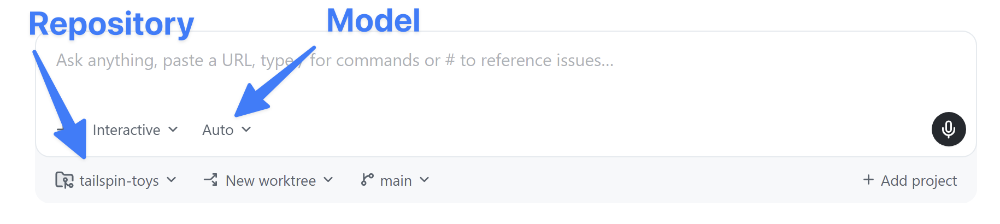
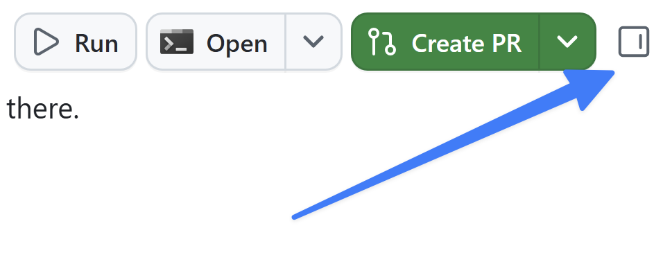

在上一课中，你介绍了工作区并使用了快速聊天。现在可以启动**智能体会话**，对项目进行第一次更改。此次改动很小：游戏数据中已有星级评分，但主页上的游戏卡片尚未显示。你将要求智能体显示评分、审查更改，并通过第一个拉取请求合并更改。

本课将介绍如何：

- 启动智能体会话，并了解会话的结构。
- 要求智能体对项目进行一项范围明确的小改动。
- 在工作区差异视图中审查更改。
- 在本地运行应用，并在浏览器中确认更改。
- 打开并合并第一个拉取请求。

## 场景

Tailspin Toys 中的每款游戏都可以有星级评分，该评分已显示在游戏详情页上。但主页的游戏卡片只显示标题、类别、发行商和说明。作为热身，你将让智能体在每张卡片上显示现有评分。这项小型、独立的更改非常适合作为第一个会话任务。

## 会话剖析

**会话**是与智能体的对话。本研讨会选择 **new working tree**，为会话提供专用的检出目录和分支。这样可以隔离每个 PR 里程碑，而无需为每课单独创建分支。会话按存储库分组显示在侧边栏中，选择任一会话即可切换。

会话中包含三类内容：与智能体的**对话**、智能体探索和编辑文件时的**工具活动**，以及带有差异的**已更改文件**列表。

## 启动会话并请求更改

现在启动新会话，探索项目并实现功能。在[上一课][prior-lesson]中，你从 GitHub 存储库添加了项目。接下来为该存储库创建新会话并请求更改。

1. 返回（或打开）GitHub Copilot app。
2. 选择 **Home screen**。
3. 确保为存储库选择了 `tailspin-toys`。

   

4. 在提示框下方选择 **new working tree** 和 **Interactive** 模式。使用以下提示词请求更改：

   ```plaintext
   编辑前，确定当前检出目录和分支，确认这是一个干净的新工作树，获取 origin，并将当前会话分支快进到 origin/main。确认 HEAD 与 origin/main 一致。如果工作树不干净、已发生分叉或无法更新，停止并说明原因；不要重置或丢弃工作。

   在游戏卡片上显示每款游戏的星级评分。Game 类型已包含 starRating 字段，表示满分为 5 的评分，游戏尚未评分时为 null。在 src/components/GameCard.astro 的每张卡片上显示评分；当 starRating 为 null 时，改为显示 "No rating yet"。保持改动小，不要重构卡片布局或更改数据模型。

   遵循存储库指令，添加或更新适当的测试，并运行相关的现有 npm 检查。检查先决条件，并在安装任何内容前先询问。报告更改的文件和检查结果，然后停止，供我审查。不要提交、推送、打开拉取请求或实现其他功能。
   ```

> [!NOTE]
> 请注意，提示词包含了 Copilot 要更新的文件名。虽然不要求指定 Copilot 应在工作中包含哪些文件，但指出正确方向既能帮助 Copilot 快速生成代码，也能减少令牌用量。

5. 按 <kbd>Enter</kbd> 将提示词发送给 Copilot。

Copilot app 首先创建新的工作树，即项目的隔离副本。随后，它会探索项目，找到添加新功能所需更新的文件，然后创建必要的代码。现在，你已经使用 Copilot app 添加了一项新功能。

## 审查差异

所有 AI 生成的更改在合并前都应接受审查，即使改动很小。接下来直接在 Copilot app 中探索这些更改。

1. 在应用右上角选择 **Toggle review panel**。差异屏幕会打开，显示 Copilot 所做的所有待处理更改。

   

2. 应会看到核心游戏详情显示文件 `GameCard.astro` 中新增了代码。代码应与以下示例类似：一个小代码块，在评分存在时呈现评分，在 `starRating` 为 `null` 时回退到 "No rating yet"：

   ```astro
   {game.starRating !== null ? (
       <span class="text-xs font-medium px-2.5 py-0.5 rounded bg-amber-900/60 text-amber-300" data-testid="game-rating">
           ★ {game.starRating} / 5
       </span>
   ) : (
       <span class="text-xs font-medium text-slate-500" data-testid="game-rating-empty">
           No rating yet
       </span>
   )}
   ```

> [!NOTE]
> Copilot 与所有生成式 AI 工具一样，具有概率性而非确定性，因此实际代码可能与以上示例不同，但应大致相似。

## 检查更改

打开浏览器前，先审查智能体的自动化检查结果。确认测试覆盖数值类型的 `starRating` 和 `null` 回退状态，并使用项目现有的 npm 脚本，而不是尚未创建的技能。缺少先决条件或跳过检查不算通过。

然后使用会话内置的终端手动检查应用。启动服务器前先确定工作树，不要复用其他检出目录的服务器。

1. 在 Copilot app 右侧的审查面板中选择 **Terminal**。如果没有 **Terminal** 按钮，请选择 **+**（标记为 **Open in panel**），再选择 **Terminal**。

   

2. 在终端窗口中输入以下命令，启动 Web 应用的开发服务器：

   ```shell
   npm run dev
   ```

3. 服务器启动后（只需片刻），打开浏览器窗口。
4. 打开服务器输出的本地 URL，通常是 `http://localhost:4321`。如果端口已被占用，应先确认其归属，而不是停止无关进程。
5. 确认已评分的游戏卡片显示满分为五分的评分值。如果有未评分数据，确认显示 **No rating yet**；否则，使用自动化测试验证空值情况，不要声称已亲眼观察到它。
6. 返回终端窗口。
7. 按 <kbd>Control</kbd>+<kbd>C</kbd>（Mac）或 <kbd>Ctrl</kbd>+<kbd>C</kbd>（Windows/Linux），停止自己启动的开发服务器。

## 打开并合并第一个拉取请求

更改看起来没有问题，现在可以交付 PR 1。先单独授权提交和创建 PR，不要与实现授权混在一起：

```plaintext
审查星级评分改动及其测试的完整差异，汇总验证结果，并在当前会话分支上提交已审查的更改。推送分支，并使用存储库的 PR 模板创建以 main 为目标的拉取请求。不要合并。
```

1. 打开会话中已创建的 PR 链接。如果应用显示 **Create PR** 确认提示，选择它以批准请求，不要创建第二个 PR。
2. 如果系统提示，请选择 **Sign in with your browser**，并按照提示完成身份验证。
3. Copilot 开始创建 PR。

PR 创建后，在 **My work** 中检查完整的 PR 差异和检查结果。阅读练习存储库的工作流结果，等待必需的检查和审查完成，并在合并前解决失败项。**Ready to merge** 不能替代对更改或本地验证证据的审查。

4. 选择聊天上方的 **PR** 气泡，在审查窗格中打开并查看拉取请求。可根据需要在此审查 PR。
5. 准备好后，选择 **Ready to merge**。
6. 在新对话框窗口中选择 **Merge pull request**，合并拉取请求。

确认 PR 1 已合并到 `main` 后再继续。合并练习存储库本身并不会部署网站。下一课会创建新工作树，并从 `origin/main` 更新，以包含此 PR。

## 总结与后续步骤

你已启动第一个智能体会话，并交付了第一次更改。具体而言，你：

- 启动了智能体会话，并了解了会话的结构。
- 指示智能体对游戏卡片进行一项范围明确的小改动。
- 在工作区差异视图中审查了更改。
- 在本地运行应用，并在浏览器中确认了星级评分。
- 打开了 PR 1，审查了检查结果，并明确执行了合并。

接下来，你将从待办事项中的一个议题开始，使用应用向存储库添加自定义指令标准。继续学习[第 3 课 - 使用自定义指令引导 Copilot][next-lesson]。

## 资源

- [在 GitHub Copilot app 中使用智能体会话][agent-sessions]
- [关于 GitHub Copilot app][about-copilot-app]
- [使用 GitHub Copilot app 管理议题和拉取请求][managing-issues-prs]

[prior-lesson]: ../1-install-copilot-app/#安装并配置-github-copilot-app
[previous-lesson]: ../1-install-copilot-app/
[next-lesson]: ../3-custom-instructions/
[agent-sessions]: https://docs.github.com/copilot/how-tos/github-copilot-app/agent-sessions
[about-copilot-app]: https://docs.github.com/copilot/concepts/agents/github-copilot-app
[managing-issues-prs]: https://docs.github.com/copilot/how-tos/github-copilot-app/managing-issues-and-pull-requests