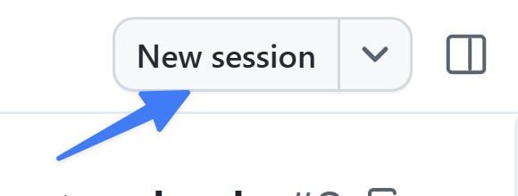

你已合并星级评分、文档标准及其代码示例。现在开始构建筛选功能。这是一个较大 PR 里程碑的起点：第 4–8 课始终沿用同一会话、工作树和分支。

本课将介绍如何：

- 从更新后的 `main` 开始，并阅读实际的筛选议题。
- 在 **Plan** 模式中明确需求，再明确批准 **Autopilot**。
- 审查筛选功能和测试，然后运行四项现有 npm 检查。
- 在浏览器中手动检查功能，并保存检查点。

技能、MCP 验证、QA 配置文件及功能 PR 将在后续模块中完成。不要在此实现步骤中提前创建它们。

## 场景

Tailspin Toys 的游戏目录不断扩大，访客需要按类别和发行商缩小游戏范围。待办 issue 描述了功能，但类别如何组合等细节需要在编码前达成共识。你将使用 Plan 模式确定这些决策，然后授权 Autopilot 在明确范围内实现功能。

## 会话模式

提示框下方的模式选择器控制智能体的自主程度：

- **Interactive** 让你在智能体工作和请求输入时持续参与。
- **Plan** 在实现前准备计划，供你审查。
- **Autopilot** 在批准的范围和权限内自主实现并迭代。

先规划，再明确批准，创建可复用的自定义配置前切回 Interactive。

## 从更新后的 main 开始

确认 PR 1 和 PR 2 已在 GitHub 上合并。为筛选功能创建新工作树，不要继续使用之前的任一分支。

1. 选择 **My work**，按标题找到 **Allow users to filter games by category and publisher**。打开议题并复制其实际 URL；不同存储库中的议题编号可能不同。
2. 选择 **New session**，再选择 **new working tree**。更新基线时保持 **Interactive** 模式。

   

3. 在规划或编辑前发送以下准备请求：

   ```plaintext
   准备这个新的筛选会话，不要实现任何内容。确定检出目录和分支，确认工作树干净，获取 origin，并将当前会话分支快进到 origin/main。确认 HEAD 与 origin/main 一致，并包含已合并的星级评分和编码标准 PR。

   如果检出目录不干净、已发生分叉或缺少任一合并，停止并说明原因。不要重置或丢弃工作、切换分支、创建其他分支或编辑应用文件。报告基线修订版本。
   ```

4. 检查报告中的基线。仅获取更新不会更新工作树：工作开始前，当前会话分支必须完成快进，且其 `HEAD` 必须与获取后的 `origin/main` 一致。

## 规划筛选功能

将模式选择器切换为 **Plan**。把下方的议题占位符替换为刚复制的 URL。

```plaintext
根据此议题规划筛选功能：<filtering-issue-URL>。阅读完整验收标准和存储库指令，然后检查当前的静态 Astro 应用、现有数据访问辅助函数及测试。暂时不要实现。

涵盖议题要求的多类别选择、发行商筛选、类别与发行商组合筛选、适当的数据访问辅助函数、无障碍控件，以及单元测试和端到端测试覆盖。对于未明确的行为，例如多个类别如何组合、清除筛选和空结果，请让我决定，不要悄悄编造需求。除非需求和现有架构确有依据，否则不要引入服务器 API。

提出范围明确的实现和验证计划，遵循存储库文档约定，并添加或更新必要的单元测试和端到端测试。在 package.json 中确认命令后，计划使用项目现有工具运行 npm run lint、npm run test:unit、npm run test:e2e 和 npm run typecheck:all。将议题 URL 和我批准的澄清内容记录在计划中，以便用于 QA。

在我批准前，将以下执行保障纳入计划：确定被测检出目录和服务器；运行检查前检查先决条件；安装软件、依赖项或浏览器前先询问；不要复用其他工作树的服务器；仅停止自己启动的服务器；报告其他端口冲突，不要停止无关进程。必须将缺少先决条件和跳过检查报告为阻塞项，而不是通过。

将以下实现边界纳入计划：在我明确批准 Autopilot 后，仅在同一工作树和分支上实现约定的筛选功能及其测试，运行四项检查，报告实现情况和全部检查结果，包括失败或阻塞项，然后停止，供我审查并进行手动浏览器检查。实现期间不要创建技能或自定义智能体、配置 MCP、更改分支、提交、推送或打开 PR。手动浏览器检查和检查点提交将在之后由我单独指示。

目前保持 Plan 模式，完成计划后停止，供我审查。不要实现、创建技能或自定义智能体、配置 MCP、更改分支、提交、推送或打开 PR。
```

回答澄清问题，并根据议题审查计划。检查其中是否包含数据访问改动、无障碍控件和测试，不要接受仅实现 UI 的方案。保存计划中的实际议题 URL 和批准的澄清内容，以供第 6 课和第 7 课使用；如果无需附加标准，使用 `none`。

批准前，确认计划本身包含四项检查、文档约定、先决条件和服务器保障、保持同一工作树及分支的要求，以及实现和验证后停止的边界。计划必须禁止在实现期间提前创建技能、智能体、设置 MCP、提交、推送和创建 PR。如果缺少任何边界，保持 **Plan** 模式请求修订计划，检查修订版后再批准。

## 明确批准 Autopilot

只有经过审查的计划已包含需求和全部执行边界，才能在计划批准控件中选择 **Approve and implement with autopilot**，或当前版本中等效的明确 Autopilot 选项。确认模式指示器显示 **Autopilot**。

批准后可能立即开始执行。因此，所有实现范围、安全规则和停止边界都必须在批准前写入已审查的计划；不要依赖执行开始后再通过后续消息补充。

Autopilot 可以编写代码和测试，并针对失败进行迭代，但这并不意味着获准完成后续研讨会模块。缺少先决条件是需要获批后解决的阻塞项，不是通过了检查。

## 审查并验证实现

1. 打开 **Changes**，检查筛选实现和测试。
2. 对照议题和批准的澄清内容检查结果，包括多类别及发行商组合。检查新增或修改的辅助函数是否遵循第 3 课的文档标准。
3. 查看全部四项 npm 检查的实际命令输出。此时直接运行命令，因为尚未创建 quality-checks 技能。
4. 接受实现前，解决失败项并重新运行受影响的检查。Playwright 的 E2E 配置会构建并提供预览服务，且可能复用本地服务器；确保被测服务器属于此工作树，而不是之前的课程。

## 手动检查功能

手动审查前，将会话切回 **Interactive** 模式，并在第 5 课中保持该模式。

1. 在此会话的审查面板中打开 **Terminal**。如有需要，选择 **+**，再选择 **Terminal**。
2. 确认终端位于筛选工作树中，然后运行：

   ```shell
   npm run dev
   ```

3. 在浏览器中打开此服务器输出的 URL，通常是 `http://localhost:4321`。如果端口已被占用，应先确定其归属，不要停止无关进程，也不要假定现有服务器包含本次更改。
4. 按批准的行为测试类别选择、发行商选择及两者组合。检查键盘访问，以及约定的清除筛选和空结果行为。
5. 如果发现失败，请求针对性修正，审查差异，重新运行受影响的自动化检查，再重复相关浏览器检查。
6. 返回终端，按 <kbd>Control</kbd>+<kbd>C</kbd>（Mac）或 <kbd>Ctrl</kbd>+<kbd>C</kbd>（Windows/Linux），停止自己启动的服务器。下一模块运行 E2E 前，确认服务器已停止。

这是你的手动浏览器观察。第 6 课才会通过 MCP 由智能体观察浏览器。

## 保存检查点

审查更改和验证结果后，授权创建本地提交：

```plaintext
审查当前差异，为筛选实现及其测试创建检查点提交。保持同一筛选分支和工作树。不要创建技能或智能体、配置 MCP、推送或打开拉取请求。
```

## 总结与后续步骤

你已明确筛选需求、审查实现和测试，并手动检查功能。此检查点属于 PR 3，而不是单独的 PR。保持 **Interactive** 模式，在同一会话中继续学习[第 5 课 - 创建并使用 quality-checks 技能][next-lesson]。

## 资源

- [在 GitHub Copilot app 中使用智能体会话][agent-sessions]
- [关于 GitHub Copilot 的云沙盒和本地沙盒][sandboxes]

[previous-lesson]: ../3-custom-instructions/
[next-lesson]: ../5-agent-skills/
[agent-sessions]: https://docs.github.com/copilot/how-tos/github-copilot-app/agent-sessions
[sandboxes]: https://docs.github.com/copilot/concepts/about-cloud-and-local-sandboxes
